# Caffe on Aarch64

## 1-环境搭建

环境搭建参考链接：[caffe-installation](https://caffe.berkeleyvision.org/installation.html)

### Step1：安装依赖包

#### **dnf install**

编译安装caffe之前，需要通过dnf install来安装一些软件依赖包，如下：

```
//编译caffe所需的prerequisites
dnf install leveldb-devel snappy-devel opencv.aarch64 boost-devel hdf5-devel gflags-devel glog-devel lmdb-devel openblas.aarch64
//环境搭建中需要的基础软件包
dnf install git wget tar gcc-g++ unzip automake libtool autoconf
```

#### **从源码编译安装protobuf**

protobuf在GitHub上有[开源仓库](https://github.com/protocolbuffers/protobuf/tree/3.9.x)，这里选择从源码编译安装3.9.x版本的protobuf，[编译参考链接](https://github.com/protocolbuffers/protobuf/blob/3.9.x/src/README.md)，具体步骤如下：

```
//从github上clone仓库并切换到3.9.x分支，从而进行编译
git clone https://github.com/protocolbuffers/protobuf.git
cd protobuf
git checkout 3.9.x
./autogen.sh
./configure --prefix=/home/caffe/file/protobuf-install
make-j16
make install -j16
//添加环境变量到~/.bashrc
export PROTOBUF="/home/caffe/file/protobuf-install"
export PATH="PROTOBUF/bin:PATH"
export LD_LIBRARY_PATH="PROTOBUF/lib:LD_LIBRARY_PATH"
```

通过 `protoc --version`命令来查看protobuf版本号，以此确认是否安装成功。

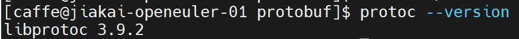

### Step2：编译caffe

caffe在GitHub上有开源仓库，这里直接选择在master上进行编译即可，具体步骤如下：

```
git clone https://github.com/BVLC/caffe.git
cd caffe
cp Makefile.config.example Makefile.config
```

编译caffe之前需要根据实际情况来修改Makefile.config文件来进行适配，具体修改如下：

* CPU-only caffe：将第8行 `CPU_ONLY := 1`取消注释；
* 选择BLAS：将第53行 `BLAS := atlas`改为 `BLAS := open`；
* 修改INCLUDE路径：将第97行 `INCLUDE_DIRS := $(PYTHON_INCLUDE) /usr/local/include`改为 `INCLUDE_DIRS := $(PYTHON_INCLUDE) /usr/local/include /usr/include/opencv4 /usr/include/openblas /home/caffe/file/protobuf-install/include`；
* 修改LIBRARY路径：将第98行 `LIBRARY_DIRS := $(PYTHON_LIB) /usr/local/lib /usr/lib`改为 `LIBRARY_DIRS := $(PYTHON_LIB) /usr/local/lib /usr/lib /home/caffe/file/protobuf-install/lib`；
* 添加LIBRARIES：在第98行后面添加一行 `LIBRARIES += opencv_core opencv_highgui opencv_imgproc opencv_imgcodecs opencv_videoio`。

为了将OpenCV4.x适配caffe，需要对caffe的源码做出如下修改：

```
//工作路径为caffe仓库的根目录
sed -i 's/CV_LOAD_IMAGE_COLOR/cv::IMREAD_COLOR/g' src/caffe/layers/window_data_layer.cpp
sed -i 's/CV_LOAD_IMAGE_COLOR/cv::IMREAD_COLOR/g' src/caffe/util/io.cpp
sed -i 's/CV_LOAD_IMAGE_GRAYSCALE/cv::ImreadModes::IMREAD_GRAYSCALE/g' src/caffe/util/io.cpp
sed -i 's/CV_LOAD_IMAGE_COLOR/cv::IMREAD_COLOR/g' src/caffe/test/test_io.cpp
sed -i 's/CV_LOAD_IMAGE_GRAYSCALE/cv::ImreadModes::IMREAD_GRAYSCALE/g' src/caffe/test/test_io.cpp
```

至此，对于caffe的适配已经完成，接下来进行编译：

```
//编译
make all -j16
make test -j16
make runtest -j16
//添加环境变量到~/.bashrc
export CAFFE="/home/caffe/file/caffe"
export PATH="$CAFFE/build/tools:$PATH"
```

通过 `caffe --version`命令来查看caffe版本号，以此确认是否安装成功。

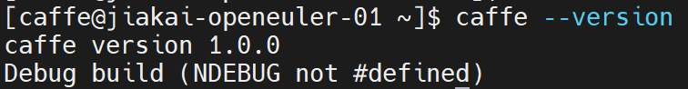

**注：以上内容中使用的的路径，需要根据实际环境进行修改，不可以直接复制使用！**

## 2-问题解决

### protobuf的版本选择

编译caffe需要用到protobuf，通过 `dnf install protobuf-devel`可以获得3.19版本。如果使用3.19版本的protobuf，在后续编译caffe时会出现下图报错。报错原因：[https://github.com/onnx/onnx/issues/2678](https://github.com/onnx/onnx/issues/2678)，故而需要安装3.6~3.10版本的protobuf。

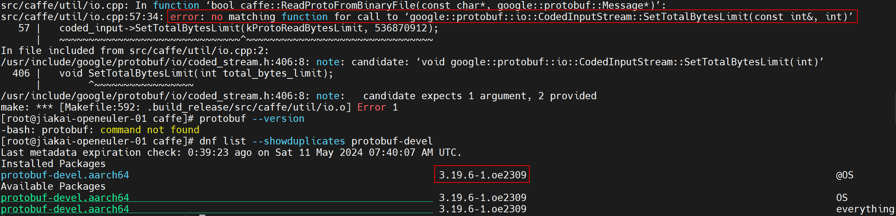

### BLAS的选择

caffe官网中提到BLAS可以从ALTAS、Intel MKL和OpenBLAS中三选一，选择好之后只需要在Makefile.config文件中指出即可。这里选用OpenBLAS的原因是其可以直接通过dnf install来安装，方便。

### OpenCV的版本选择

caffe官网中提到的OpenCV适配版本是2.4~3.0，通过 `dnf install opencv.aarch64`安装的是4.x版本。采用4.x的OpenCV，在后续的caffe编译中会出现如下图报错。所以需要把caffe源码中的 `CV_LOAD_IMAGE_GRAYSCALE`和 `CV_LOAD_IMAGE_COLOR`替换为 `cv::ImreadModes::IMREAD_GRAYSCALE`和 `cv::IMREAD_COLOR`。

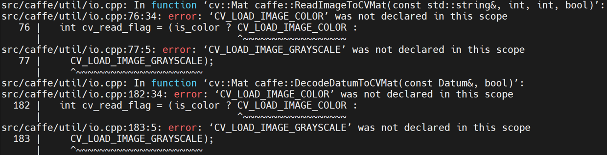

### INCLUDE、LIBRARY和LIBRARIES的修改

因为采用的BLAS和OpenCV不是官方默认的选择，protobuf是从源码编译安装而非通过dnf install，所以在编译的时候会出现找不到文件等错误，需要在Makefile.config文件中添加INCLUDE路径。比如下图所示error，可以使用 `find / -name cblas.h`找一下cblas.h文件的位置，然后把路径加入到INCLUDE里面，其他类似情况也是同理。

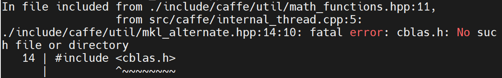

另外，还需要把protobuf的动态链接库添加到LIBRARY里面，否则会出现如下报错。

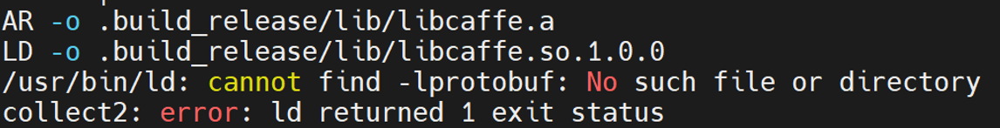

为了解决下图所示问题，需要添加LIBRARIES变量。

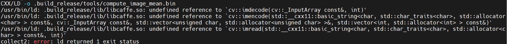

## 3-用例运行

caffe的interface一共有四个，如下图所示，这里采用time。caffe的GitHub官方维护了一个[Model Zoo](https://github.com/BVLC/caffe/wiki/Model-Zoo)，其中包含许多model，每个model会提供deploy.prototxt或train_val.prototxt，两个文件都可以用来进行benchmark，但是后者需要将数据集下载到本地，前者所使用的数据是caffe随机初始化的输入数据。

如果一个model自带deploy.prototxt，那么可以直接 `caffe time -model deploy.prototxt`来进行benchmark；如果没有deploy.prototxt，但是数据集的下载比较方便，那么可以先下载数据集到本地，然后再用 `caffe time -model train_val.prototxt`来进行benchmark；但如果数据集的下载比较麻烦或者数据集比较大，那么可以通过修改train_val.prototxt来获得deploy.prototxt然后再进行benchmark，做法可以[参考链接](https://blog.csdn.net/u010682375/article/details/77508790)。

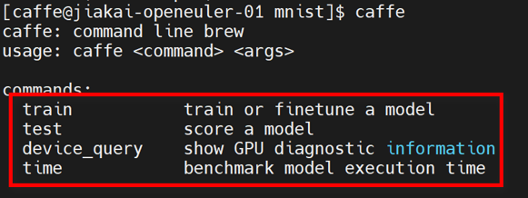

所以接下来通过三个模型来说明以上三种情境的具体处理方式。

### **VGG_CNN_S**

[VGG_CNN_S](https://gist.github.com/ksimonyan/fd8800eeb36e276cd6f9#file-readme-md)自带deploy.prototxt，所以可以通过 `caffe time -model deploy.prototxt`来直接进行测试，具体操作为：

```
caffe time -model VGG_CNN_S_deploy.prototxt
```

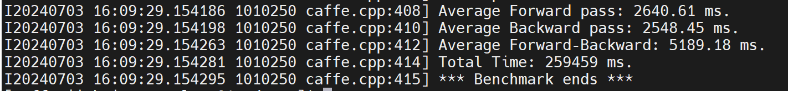

### The All Convolutional Net

[The All Convolutional Net](https://github.com/mateuszbuda/ALL-CNN)没有deploy.prototxt，但是可以方便地下载数据集，所以可以先下载[数据集](https://drive.google.com/file/d/0B0a9KYriPdN4eUxScnQwZWxRQjA/view?resourcekey=0-nUKxLlzIdoyMW5qsLVrQ1Q)，然后再用train_val.prototxt来进行测试，具体操作为：

```
git clone https://github.com/mateuszbuda/ALL-CNN.git
cd ALL-CNN
//下载cifar-10_train_lmdb.zip并解压(model的github上有数据集的下载地址)
caffe time -model ALL_CNN_C_train_val.prototxt
```

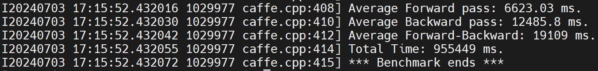

### Deep Hand: How to Train a CNN on 1 Million Hand Images When Your Data Is Continuous and Weakly Labelled

[Deep Hand](https://www-i6.informatik.rwth-aachen.de/~koller/1miohands/)没有deploy.prototxt，并且数据集的下载并不是十分方便，所以需要将train_val.prototxt修改为deploy.prototxt，然后再进行测试，具体的操作如下：

***step1：***添加data层：shape包含4个dim，第一个表示对待识别样本进行数据增广的数量，一般设置为5，可以自行定义；第二个表示处理的图像的通道数，RGB图像为3、灰度图为1；第三个和第四个是图像的长度和宽度，即crop_size的值，[参考链接](https://blog.csdn.net/u010417185/article/details/52619593)。

```
layer {
  name: "data"
  type: "Input"
  top: "data"
  input_param { shape: { dim: 5 dim: 3 dim: 224 dim: 224 } }
}
```

***step2：***删除带有 `TEST`和 `TRAIN`的layer：可以全局先后搜索 `TEST`和 `TRAIN`，然后把对应的layer删除。

***step3：***删除type为SoftmaxWithLoss的layer。

至此，已经得到了可以用于测试的deploy.prototxt。

```
caffe time -model submit-net_deploy.prototxt
```

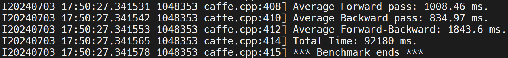
