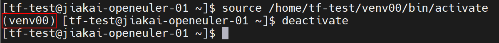
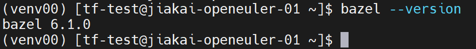
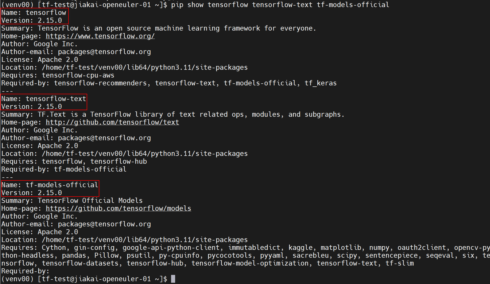
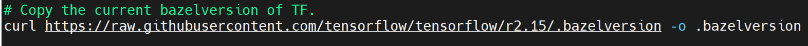
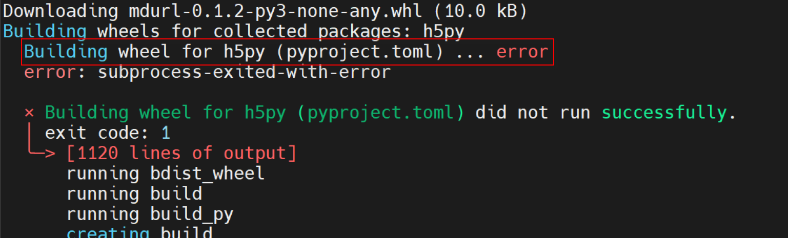
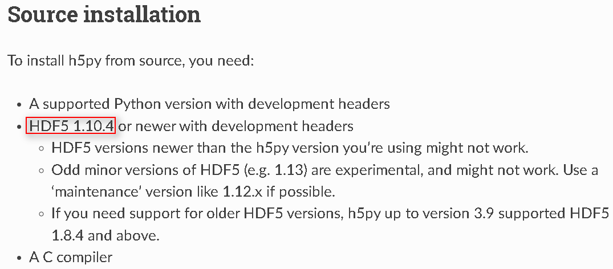
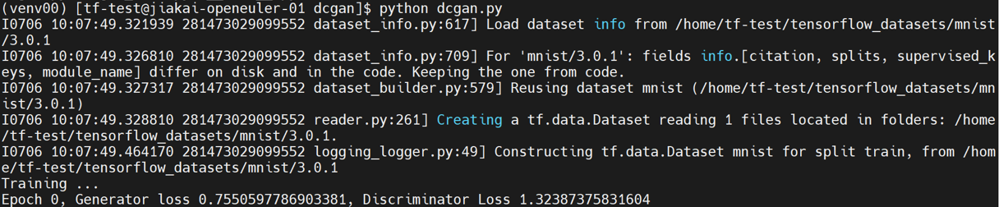
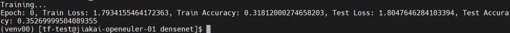
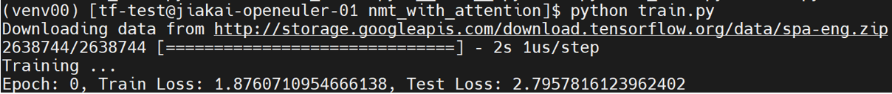
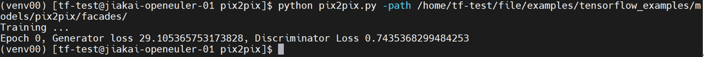

# Tensorflow on Aarch64

## 1-环境搭建

测试tensorflow中的models需要安装 `tensorflow`、`tensorflow-text`、`tf-models-official`，为了方便管理python环境，所有的操作都在venv中进行。

### venv

python虚拟环境的基本使用方法如下：

```
//创建
python -m venv /home/tf-test/venv00
//激活
source /home/tf-test/venv00/bin/activate
//退出
deactivate
```

激活后，出现如下图红圈所示，即为进入python虚拟环境，然后就可以开始操作了。



### tensorflow

* github：https://github.com/tensorflow/tensorflow
* version：2.15.0
* method：pip install tensorflow==2.15.0

tensorflow是pypi中的一个包，可以直接通过 `pip install tensorflow==2.15.0`来安装。

### tensorflow-text

* github：https://github.com/tensorflow/text
* version：2.15.0
* method：build from source

#### step1-bazel 6.1.0

编译tensorflow-text 2.15.0需要bazel 6.1.0。

```
//从github下载bazel 6.1.0的release
wget https://github.com/bazelbuild/bazel/releases/download/6.1.0/bazel-6.1.0-linux-arm64
//修改权限
chmod +x bazel-6.1.0-linux-arm64
//修改名字
mv bazel-6.1.0-linux-arm64 bazel
//初始化
./bazel
//将bazel可执行文件的路径添加到PATH环境变量中
export PATH="$PATH:PathToBazel"
```

运行 `bazel --version`命令查看是否安装并配置成功。



#### step2-text 2.15.0

tensorflow-text的github仓库有从源码构建的[步骤](https://github.com/tensorflow/text?tab=readme-ov-file#build-from-source-steps)，具体如下：

```
//从github下载text源码
git clone https://github.com/tensorflow/text
cd text
//切换到2.15分支
git checkout 2.15
//运行脚本，构建wheel
./oss_scripts/run_build.sh
//安装text 2.15.0
pip install tensorflow_text-2.15.0-cp311-cp311-linux_aarch64.whl
```

### tensorflow-models

* github：https://github.com/tensorflow/models
* version：2.15.0
* method：pip install tf-models-official==2.15.0

tensorflow-models是pypi中的一个包，可以直接通过 `pip install tf-models-official==2.15.0`来安装。

### 环境检查

通过 `pip show tensorflow tensorflow-text tf-models-official`命令检查环境是否搭建完毕。



## 2-问题解决

### tf、tf-text、tf-models的版本选择

为了三者适配，版本号必须统一。

在pypi中，结合tf-models和tf支持的release版本号，最新的即为2.15.0；tf-text只有x86-64架构的wheel，所以只能从源码构建。

### bazel的版本选择

从源码构建tf-text需要bazel，且两者版本号需要适配。

在text/oss_scripts/configure.sh文件中搜索bazelversion可以定位到获取bazel版本号的代码块，如下图，访问链接即可得到具体的版本号6.1.0。



通过 `dnf install bazel`的方法只能得到5.3.0版本的bazel，在bazel的[github仓库](https://github.com/bazelbuild/bazel)里有6.1.0版本的[可执行文件](https://github.com/bazelbuild/bazel/releases/download/6.1.0/bazel-6.1.0-linux-arm64)，下载并配置环境变量即可。

### h5py的构建问题

在 `pip install tensorflow==2.15.0`时可能会遇到如下图所示error。



查阅[h5py手册](https://docs.h5py.org/en/stable/build.html)，发现需要安装hdf5作为依赖。



解决方法如下：

```
dnf install python3-devel hdf5-devel.aarch64
```

## 3-用例运行

### examples

> github：https://github.com/tensorflow/examples

该仓库在tensorflow_examples/models/路径下有dcgan、densenet、nmt_with_attention和pix2pix共四个模型，下面分别进行测试。

首先克隆仓库并设置环境变量 `PYTHONPATH`，如下：

```
//克隆仓库
git clone https://github.com/tensorflow/examples
//把examples仓库添加到PYTHONPATH环境变量中
export PYTHONPATH="$PYTHONPATH:/home/tf-test/file/examples"
```

#### dcgan

[dcgan](https://github.com/tensorflow/examples/tree/master/tensorflow_examples/models/dcgan)有train和eval的文件，这里进行train。

```
python dcgan.py
```



#### densenet

[densenet](https://github.com/tensorflow/examples/tree/master/tensorflow_examples/models/densenet)有train和eval的文件，这里进行train。

```
python train.py
```



#### nmt_with_attention

[nmt_with_attention](https://github.com/tensorflow/examples/tree/master/tensorflow_examples/models/nmt_with_attention)有train和eval的文件，这里进行train。

```
python train.py
```



#### pix2pix

[pix2pix](https://github.com/tensorflow/examples/tree/master/tensorflow_examples/models/pix2pix)有train和eval的文件，这里进行train。

下载数据集[facades](https://www.kaggle.com/datasets/vikramtiwari/pix2pix-dataset?resource=download-directory&select=facades)到tensorflow_examples/models/pix2pix/路径下，并解压facades.tar。

```
python pix2pix.py -path /home/tf-test/file/examples/tensorflow_examples/models/pix2pix/facades/
```



### benchmark

> github:https://github.com/tensorflow/benchmarks

### models

> github:https://github.com/tensorflow/models

### others
