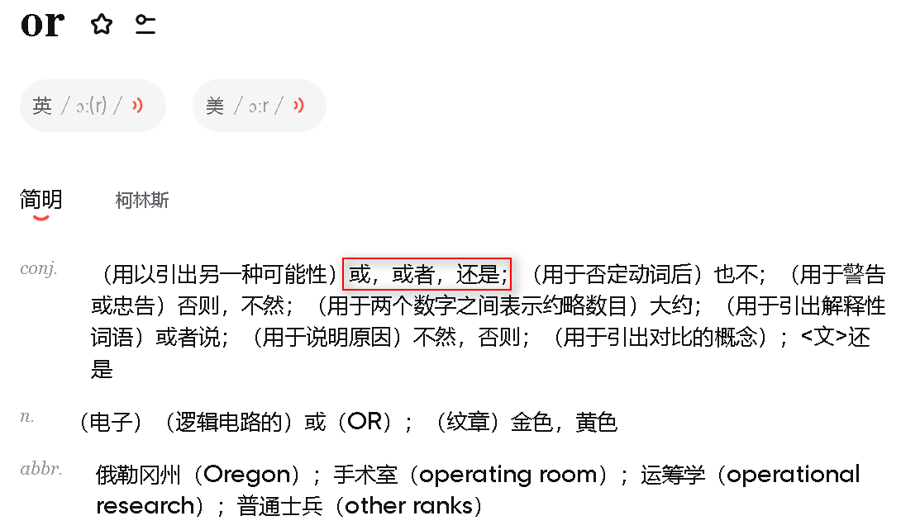
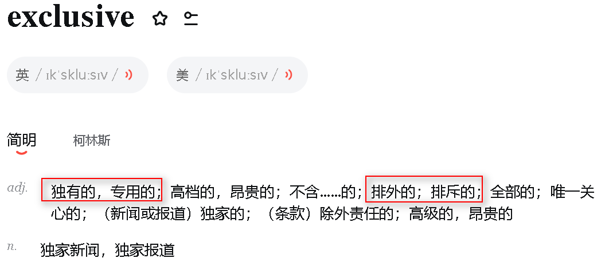

# Exclusive OR and OR

## 真值表

| Input A | Input B | Output(A OR B) |
| :-----: | :-----: | :------------: |
|    0    |    0    |       0       |
|    0    |    1    |       1       |
|    1    |    0    |       1       |
|    1    |    1    |     **1**     |

| Input A | Input B | Output(A XOR B) |
| :-----: | :-----: | :-------------: |
|    0    |    0    |        0        |
|    0    |    1    |        1        |
|    1    |    0    |        1        |
|    1    |    1    |     **0**     |

区别仅在于1or1=1 1xor1=0

## 英语含义

## 个人理解

OR:要么A要么B,两者之间没关系,只要有一个成立,则A OR B成立

XOR:要么A要么B,但是两者之间互斥,即要么A成立要么B成立,但是A和B不能同时成立,否则A XOR B不成立

---

**one or the other but not both**
