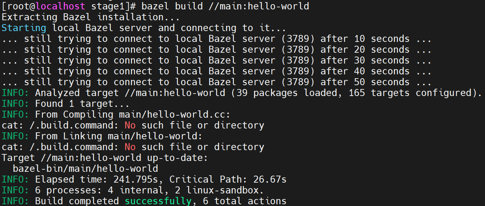
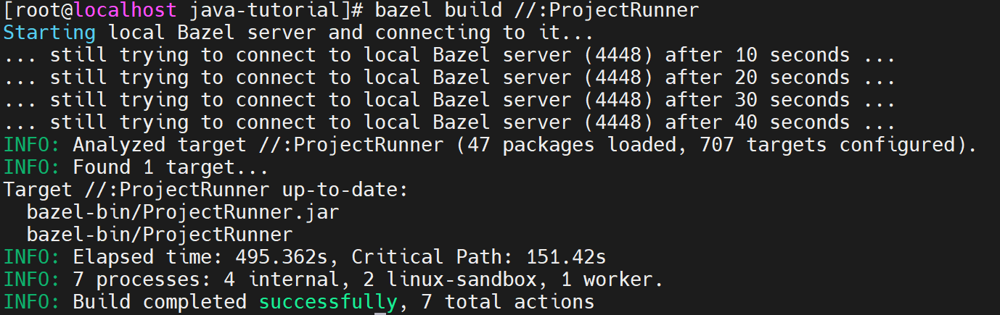

# Build Bazel on RISC-V

## 5.3.0

目前Bazel的官方[Github仓库](https://github.com/bazelbuild/bazel)并不支持RISC-V架构；openEuler的[软件包仓](https://gitee.com/src-openeuler)里面有相应的[Bazel库](https://gitee.com/src-openeuler/bazel)可供使用。

在oerv24.03中通过 `dnf install bazel`安装的是5.3.0版本，但运行时会出现 `Illegal instruction`的报错，需要参考[pr](https://gitee.com/src-openeuler/bazel/pulls/29)来做修改。

如果想要构建出Bazel5.3.0，可以参考obs的[仓库](https://build.tarsier-infra.isrc.ac.cn/package/show/home:6eanut:branches:home:laokz:branches:openEuler:24.03/bazel)，具体的osc使用方法如下*（需要提前注册obs账号）*：

```
dnf install osc.noarch obs-build.noarch
mkdir ~/my_obs; cd ~/my_obs
osc co home:6eanut:branches:home:laokz:branches:openEuler:24.03/bazel
cd home\:6eanut\:branches\:home\:laokz\:branches\:openEuler\:24.03/bazel/
osc up -S
rm -f _service;for file in `ls | grep -v .osc`;do new_file=${file##*:};mv $file $new_file;done
rm 02-use-riscv64-jdk.patch
wget https://raw.githubusercontent.com/6eanut/NOTEBOOK/main/24-Q3/bazel/5.3.0/02-use-riscv64-jdk.patch
osc build
dnf install /var/tmp/build-root/mainline_riscv64-riscv64/home/abuild/rpmbuild/RPMS/riscv64/bazel-5.3.0-2.oe2403.riscv64.rpm
```

注：obs原仓库中的jdk使用的是本地jdk，当用bazel构建java项目时会报错，所以这里改成了从线上拉取jdk

## 6.1.0

在RISC-V上构建6.1.0版本的Bazel时，可以按照5.3.0的补丁对6.1.0-dist进行手动修改，这样可以正确编译cpp项目，但是如果想要编译java项目，则不能只按照5.3.0的方式来修改，因为Bazel的源码发生了[变化1](https://github.com/bazelbuild/bazel/commit/b74111671713f132869b94cf3686cc427c67663a?diff=split&w=1#diff-71b1b422b92a8ed8ad51762a6f203632dddcff633df7f4bf3328adaa2d961a08)和[变化2](https://github.com/bazelbuild/bazel/commit/d5559c16ac008b86345fbbade5d600181a2fce6f?diff=split&w=1)。

按照构建bazel5.3.0的方式，拉取obs仓库，然后将bazel.spec文件改为[这样](https://github.com/6eanut/NOTEBOOK/blob/main/24-Q3/bazel/6.1.0/bazel.spec)，然后从Github官网拉取bazel-6.1.0-dist[文件](https://github.com/bazelbuild/bazel/releases/download/6.1.0/bazel-6.1.0-dist.zip)，然后打上[补丁](https://github.com/6eanut/NOTEBOOK/blob/main/24-Q3/bazel/6.1.0/bazel610-riscv64.patch)，然后 `osc build`即可。

## 6.5.0

在RISC-V上构建6.5.0的Bazel时，其Bazel的源码修改与6.1.0相类似，但是Bazel调用的外部库abseil-cpp在6.1.0中采用的是20211102.0版而6.5.0采用的是20230802.0版，所以需要制作20230802.0版的补丁以解决rdcycle问题。

按照构建bazel5.3.0的方式，拉取obs仓库，然后将bazel.spec文件改为这样，然后从Github官网拉取bazel-6.5.0-dist[文件](https://github.com/bazelbuild/bazel/releases/download/6.5.0/bazel-6.5.0-dist.zip)，然后打上[补丁](https://github.com/6eanut/NOTEBOOK/blob/main/24-Q3/bazel/6.5.0/bazel650.patch)，还需要下载abseil-cpp的补丁[文件](https://github.com/6eanut/NOTEBOOK/blob/main/24-Q3/bazel/6.5.0/abseil-cpp-riscv-01.patch)，还有更新过后的04-riscv-distdir_deps-01补丁[文件](https://github.com/6eanut/NOTEBOOK/blob/main/24-Q3/bazel/6.5.0/04-riscv-distdir_deps-01.patch)，然后 `osc build`即可。

## 验证

下载bazel的examples[仓库](https://github.com/bazelbuild/examples)，然后分别测试cpp和java。



## obs环境搭建

### 注册obs账号

https://build.tarsier-infra.isrc.ac.cn/

### 本地obs环境构建

#### osc

```
dnf install osc
```

#### obs

https://download.opensuse.org/repositories/openSUSE:/Tools/Fedora_Rawhide/noarch/

```
# 在上方链接中下载obs-build-mkbaselibs和obs-build的rpm包
dnf install obs-build-mkbaselibs obs-build
vi ~/.oscrc
# 写入以下内容：
[general]
apiurl = https://build.tarsier-infra.isrc.ac.cn/
no_verify = 1

[https://build.tarsier-infra.isrc.ac.cn/]
user=username
pass=passwd
```
