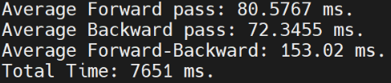

# Caffe on Aarch64

## 1-环境搭建

环境搭建参考链接：[caffe-installation](https://caffe.berkeleyvision.org/installation.html)

### Step1：安装依赖包

#### **dnf install**

编译安装caffe之前，需要通过dnf install来安装一些软件依赖包，如下：

```
//编译caffe所需的prerequisites
dnf install leveldb-devel snappy-devel opencv.aarch64 boost-devel hdf5-devel gflags-devel glog-devel lmdb-devel openblas.aarch64
//环境搭建中需要的基础软件包
dnf install git wget tar gcc-g++ unzip automake libtool autoconf
```

#### **从源码编译安装protobuf**

protobuf在GitHub上有[开源仓库](https://github.com/protocolbuffers/protobuf/tree/3.9.x)，这里选择从源码编译安装3.9.x版本的protobuf，[编译参考链接](https://github.com/protocolbuffers/protobuf/blob/3.9.x/src/README.md)，具体步骤如下：

```
//从github上克隆仓库并切换到3.9.x分支，从而进行编译
git clone https://github.com/protocolbuffers/protobuf.git
cd protobuf
git checkout 3.9.x
./autogen.sh
./configure --prefix=/home/caffe/file/protobuf-install
make-j16
make install -j16
//添加环境变量到~/.bashrc
export PROTOBUF="/home/caffe/file/protobuf-install"
export PATH="$PROTOBUF/bin:PATH"
export LD_LIBRARY_PATH="$PROTOBUF/lib:LD_LIBRARY_PATH"
```

通过 `protoc --version`命令来查看protobuf版本号，以此确认是否安装成功。


### Step2：编译caffe

caffe在GitHub上有开源仓库，这里直接选择在master上进行编译即可，具体步骤如下：

```
git clone https://github.com/BVLC/caffe.git
cd caffe
cp Makefile.config.example Makefile.config
```

编译caffe之前需要根据实际情况来修改Makefile.config文件来进行适配，具体修改如下：

* CPU-only caffe：将第8行 `CPU_ONLY := 1`取消注释；
* 选择BLAS：将第53行 `BLAS := atlas`改为 `BLAS := open`；
* 修改INCLUDE路径：将第97行 `INCLUDE_DIRS := $(PYTHON_INCLUDE) /usr/local/include`改为 `INCLUDE_DIRS := $(PYTHON_INCLUDE) /usr/local/include /usr/include/opencv4 /usr/include/openblas /home/caffe/file/protobuf-install/include`；
* 修改LIBRARY路径：将第98行 `LIBRARY_DIRS := $(PYTHON_LIB) /usr/local/lib /usr/lib`改为 `LIBRARY_DIRS := $(PYTHON_LIB) /usr/local/lib /usr/lib /home/caffe/file/protobuf-install/lib`；
* 添加LIBRARIES：在第98行后面添加一行 `LIBRARIES += opencv_core opencv_highgui opencv_imgproc opencv_imgcodecs opencv_videoio`。

为了将OpenCV4.x适配caffe，需要对caffe的源码做出如下修改：

```
//工作路径为caffe仓库的根目录
sed -i 's/CV_LOAD_IMAGE_COLOR/cv::IMREAD_COLOR/g' src/caffe/layers/window_data_layer.cpp
sed -i 's/CV_LOAD_IMAGE_COLOR/cv::IMREAD_COLOR/g' src/caffe/util/io.cpp
sed -i 's/CV_LOAD_IMAGE_GRAYSCALE/cv::ImreadModes::IMREAD_GRAYSCALE/g' src/caffe/util/io.cpp
sed -i 's/CV_LOAD_IMAGE_COLOR/cv::IMREAD_COLOR/g' src/caffe/test/test_io.cpp
sed -i 's/CV_LOAD_IMAGE_GRAYSCALE/cv::ImreadModes::IMREAD_GRAYSCALE/g' src/caffe/test/test_io.cpp
```

至此，对于caffe的适配已经完成，接下来进行编译：

```
//编译
make all -j16
make test -j16
make runtest -j16
//添加环境变量到~/.bashrc
export CAFFE="/home/caffe/file/caffe"
export PATH="$CAFFE/build/tools:$PATH"
```

通过 `caffe --version`命令来查看caffe版本号，以此确认是否安装成功。


**注：以上内容中使用的的路径，需要根据实际环境进行修改，不可以直接复制使用！**

## 2-问题解决

### protobuf的版本选择

编译caffe需要用到protobuf，通过 `dnf install protobuf-devel`可以获得3.19版本。如果使用3.19版本的protobuf，在后续编译caffe时会出现下图报错。报错原因：[https://github.com/onnx/onnx/issues/2678](https://github.com/onnx/onnx/issues/2678)，故而需要安装3.6~3.10版本的protobuf。


### BLAS的选择

caffe官网中提到BLAS可以从ALTAS、Intel MKL和OpenBLAS中三选一，选择好之后只需要在Makefile.config文件中指出即可。这里选用OpenBLAS的原因是其可以直接通过dnf install来安装，方便。

### OpenCV的版本选择

caffe官网中提到的OpenCV适配版本是2.4~3.0，通过 `dnf install opencv.aarch64`安装的是4.x版本。采用4.x的OpenCV，在后续的caffe编译中会出现如下图报错。所以需要把caffe源码中的 `CV_LOAD_IMAGE_GRAYSCALE`和 `CV_LOAD_IMAGE_COLOR`替换为 `cv::ImreadModes::IMREAD_GRAYSCALE`和 `cv::IMREAD_COLOR`。


### INCLUDE、LIBRARY和LIBRARIES的修改

因为采用的BLAS和OpenCV不是官方默认的选择，protobuf是从源码编译安装而非通过dnf install，所以在编译的时候会出现找不到文件等错误，需要在Makefile.config文件中添加INCLUDE路径。比如下图所示error，可以使用 `find / -name cblas.h`找一下cblas.h文件的位置，然后把路径加入到INCLUDE里面，其他类似情况也是同理。


另外，还需要把protobuf的动态链接库添加到LIBRARY里面，否则会出现如下报错。


为了解决下图所示问题，需要添加LIBRARIES变量。


## 3-用例运行

caffe的interface一共有四个，如下图所示，这里采用time。caffe的GitHub官方维护了一个[Model Zoo](https://github.com/BVLC/caffe/wiki/Model-Zoo)，其中包含许多model，每个model会提供deploy.prototxt或train_val.prototxt，两个文件都可以用来进行benchmark，但是后者需要将数据集下载到本地，前者所使用的数据是caffe随机初始化的输入数据。

**注：在不同的model中，deploy.prototxt和train_val.prototxt两类文件的命名可能不同，后文中deploy.prototxt统一代指使用非实际数据集的文件，train_val.prototxt统一代指使用实际数据集的文件。**


### 典型用例

情景1：如果一个model自带deploy.prototxt，那么可以直接 `caffe time -model deploy.prototxt`来进行benchmark；

情景2：如果没有deploy.prototxt，但是数据集的下载比较方便，那么可以先下载数据集到本地，然后再用 `caffe time -model train_val.prototxt`来进行benchmark；

情境3：但如果数据集的下载比较麻烦或者数据集比较大，那么可以通过修改train_val.prototxt来获得deploy.prototxt然后再进行benchmark，做法可以[参考链接](https://blog.csdn.net/u010682375/article/details/77508790)。

所以接下来通过三个模型来说明以上三种情境的具体处理方式。

#### **VGG_CNN_S**

[VGG_CNN_S](https://gist.github.com/ksimonyan/fd8800eeb36e276cd6f9#file-readme-md)自带deploy.prototxt，所以可以通过 `caffe time -model deploy.prototxt`来直接进行测试，具体操作为：

```
caffe time -model VGG_CNN_S_deploy.prototxt
```


#### The All Convolutional Net

[The All Convolutional Net](https://github.com/mateuszbuda/ALL-CNN)没有deploy.prototxt，但是可以方便地下载数据集，所以可以先下载[数据集](https://drive.google.com/file/d/0B0a9KYriPdN4eUxScnQwZWxRQjA/view?resourcekey=0-nUKxLlzIdoyMW5qsLVrQ1Q)，然后再用train_val.prototxt来进行测试，具体操作为：

```
git clone https://github.com/mateuszbuda/ALL-CNN.git
cd ALL-CNN
//下载cifar-10_train_lmdb.zip并解压(model的github上有数据集的下载地址)
caffe time -model ALL_CNN_C_train_val.prototxt
```


#### Deep Hand: How to Train a CNN on 1 Million Hand Images When Your Data Is Continuous and Weakly Labelled

[Deep Hand](https://www-i6.informatik.rwth-aachen.de/~koller/1miohands/)没有deploy.prototxt，并且数据集的下载并不是十分方便，所以需要将train_val.prototxt修改为deploy.prototxt，然后再进行测试，具体的操作如下：

step1-添加input：把input放在 `name: "GoogleNet"`的下面。shape包含4个dim，第一个表示对待识别样本进行数据增广的数量，一般设置为5，可以自行定义；第二个表示处理的图像的通道数，RGB图像为3、灰度图为1；第三个和第四个是图像的长度和宽度，即crop_size的值，[参考链接](https://blog.csdn.net/u010417185/article/details/52619593)。

```
input: "data"
input_shape {
  dim: 10
  dim: 3
  dim: 224
  dim: 224
}
```

step2-删除带有 `TEST`和 `TRAIN`的layer：可以全局先后搜索 `TEST`和 `TRAIN`，然后把对应的layer删除。

step3-删除type为 `SoftmaxWithLoss`的layer。

至此，已经得到了可以用于测试的deploy.prototxt。

```
caffe time -model submit-net_deploy.prototxt
```


### 其他用例

在Model Zoo中，目前可以跑通50个用例，下面将分别说明用例运行的方法。

#### finetune_flickr_style

在caffe/models/finetune_flickr_style路径下，自带deploy.prototxt。

```
caffe time -model models/finetune_flickr_style/deploy.prototxt
```


#### bvlc_googlenet

在caffe/models/bvlc_googlenet路径下，自带deploy.prototxt。

```
caffe time -model models/bvlc_googlenet/deploy.prototxt
```


#### NIN-Imagenet

[deploy.prototxt](https://gist.github.com/tzutalin/0e3fd793a5b13dd7f647)

```
caffe time -model my_models/NIN-Imagenet/deploy.protxt
```


#### NIN-CIFAR10

自带[train_val.prototxt](https://gist.github.com/mavenlin/e56253735ef32c3c296d)，需要修改得到deploy.prototxt。

step1-添加input：dim的设置参考NIN-Imagenet。

```
input: "data"
input_shape {
  dim: 10
  dim: 3
  dim: 224
  dim: 224
}
```

step2-删除带有 `TEST`和 `TRAIN`的layer。

step3-删除type为 `SOFTMAX_LOSS`的layer。

```
caffe time -model my_models/NIN-CIFAR10/deploy.prototxt
```


#### VGG_CNN_S

自带[deploy.prototxt](https://gist.github.com/ksimonyan/fd8800eeb36e276cd6f9#file-readme-md)文件。

```
caffe time -model my_models/VGG_CNN_S/VGG_CNN_S_deploy.prototxt
```


#### VGG_CNN_M

自带[deploy.prototxt](https://gist.github.com/ksimonyan/f194575702fae63b2829#file-readme-md)文件。

```
caffe time -model my_models/VGG_CNN_M/VGG_CNN_M_deploy.prototxt
```


#### VGG_CNN_M_2048

自带[deploy.prototxt](https://gist.github.com/ksimonyan/78047f3591446d1d7b91#file-readme-md)文件。

```
caffe time -model my_models/VGG_CNN_M_2048/VGG_CNN_M_2048_deploy.prototxt
```


#### VGG_CNN_M_1024

自带[deploy.prototxt](https://gist.github.com/ksimonyan/f0f3d010e6d5f0100274#file-readme-md)文件。

```
caffe time -model my_models/VGG_CNN_M_1024/VGG_CNN_M_1024_deploy.prototxt
```


#### VGG_CNN_M_128

自带[deploy.prototxt](https://gist.github.com/ksimonyan/976847408258292576a1#file-readme-md)文件。

```
caffe time -model my_models/VGG_CNN_M_128/deploy.prototxt
```


#### VGG_CNN_F

自带[deploy.prototxt](https://gist.github.com/ksimonyan/a32c9063ec8e1118221a#file-readme-md)文件。

```
caffe time -model my_models/VGG_CNN_F/deploy.prototxt
```


#### VGG_ILSVRC_16

自带[deploy.prototxt](https://gist.github.com/ksimonyan/211839e770f7b538e2d8#file-readme-md)文件。

```
caffe time -model my_models/VGG_ILSVRC_16_layers_deploy.prototxt
```


#### VGG_ILSVRC_19

自带[deploy.prototxt](https://gist.github.com/ksimonyan/3785162f95cd2d5fee77#file-readme-md)文件。

```
caffe time -model my_models/VGG_ILSVRC_19_layers_deploy.prototxt
```


#### places205CNN

自带[deploy.prototxt](http://places.csail.mit.edu/model/placesCNN.tar.gz)文件。

```
caffe time -model my_models/placesCNN/places205CNN_deploy.prototxt
```


#### places205CNN_FC7

自带[deploy.prototxt](http://places.csail.mit.edu/model/placesCNN.tar.gz)文件。

```
caffe time -model my_models/placesCNN/places205CNN_deploy_FC7.prototxt
```


#### hybridCNN

自带[deploy.prototxt](http://places.csail.mit.edu/model/hybridCNN.tar.gz)文件。

```
caffe time -model my_models/hybridCNN/hybridCNN_deploy.prototxt
```


#### hybridCNN_FC7

自带[deploy.prototxt](http://places.csail.mit.edu/model/hybridCNN.tar.gz)文件。

```
caffe time -model my_models/hybridCNN/hybridCNN_deploy_FC7.prototxt
```


#### googlenet_places205

自带[deploy.prototxt](http://places.csail.mit.edu/model/googlenet_places205.tar.gz)文件。

```
caffe time -model my_models/googlenet_places205/deploy_places205.protxt
```


#### ImageNet

自带[train_val.prototxt](https://3dvision.princeton.edu/pvt/GoogLeNet/ImageNet/)，需要修改得到deploy.prototxt。

step1-添加input：dim的设置为5，3，224，224。

```
input: "data"
input_shape {
  dim: 5
  dim: 3
  dim: 224
  dim: 224
}
```

step2-删除带有 `TEST`和 `TRAIN`的layer。

step3-删除type为 `SOFTMAX_LOSS`的layer。

```
caffe time -model my_models/ImageNet/deploy.prototxt
```


#### Places

自带[train_val.prototxt](https://3dvision.princeton.edu/pvt/GoogLeNet/Places/)，需要修改得到deploy.prototxt。

step1-添加input：dim的设置为5，3，224，224。

```
input: "data"
input_shape {
  dim: 5
  dim: 3
  dim: 224
  dim: 224
}
```

step2-删除带有 `TEST`和 `TRAIN`的layer。

step3-删除type为 `SOFTMAX_LOSS`的layer。

```
caffe time -model my_models/Places/deploy.prototxt
```


#### oxford102

自带[train_val.prototxt](https://gist.github.com/jimgoo/0179e52305ca768a601f)，需要修改得到deploy.prototxt。

step1-添加input：dim的设置为5，3，227，227。

```
input: "data"
input_shape {
  dim: 5
  dim: 3
  dim: 227
  dim: 227
}
```

step2-删除带有 `TEST`和 `TRAIN`的layer。

step3-删除type为 `SOFTMAX_LOSS`的layer。

```
caffe time -model my_models/oxford102/deploy.prototxt
```


#### GoogleNet_SOS

自带[deploy.prototxt](https://gist.github.com/jimmie33/7ea9f8ac0da259866b854460f4526034)文件。

```
caffe time -model my_models/GoogleNet_SOS/deploy.prototxt
```


#### AlexNet_SalObjSub

自带[deploy.prototxt](https://gist.github.com/jimmie33/0585ed9428dc5222981f)文件。

```
caffe time -model my_models/AlexNet_SalObjSub/deploy.prototxt
```


#### VGG16_SalObjSub

自带[deploy.prototxt](https://gist.github.com/jimmie33/27c1c0a7736ba66c2395)文件。

```
caffe time -model my_models/VGG16_SalObjSub/deploy.prototxt
```


#### Places_CNDS_model

自带[deploy.prototxt](https://github.com/lwwang/Places_CNDS_model)文件。

```
caffe time -model my_models/Places_CNDS_model/deploy.prototxt
```


#### deploy_age

自带[deploy.prototxt](https://gist.github.com/GilLevi/c9e99062283c719c03de)文件。

```
caffe time -model my_models/deploy_age.prototxt
```


#### deploy_gender

自带[deploy.prototxt](https://gist.github.com/GilLevi/c9e99062283c719c03de)文件。

```
caffe time -model my_models/deploy_gender.prototxt
```



#### GoogLeNet_cars

自带[deploy.prototxt](https://gist.github.com/bogger/b90eb88e31cd745525ae)文件。

```
caffe time -model my_models/GoogLeNet_cars/deploy.prototxt
```


#### VGG_ILSVRC_16_layers_fc_reduced

自带[deploy.prototxt](https://gist.github.com/weiliu89/2ed6e13bfd5b57cf81d6)文件。

```
caffe time -model my_models/VGG_ILSVRC_16_layers_fc_reduced/deploy.prototxt
```


#### hed_pretrained_bsds

自带[deploy.prototxt](https://gist.github.com/s9xie/c6bd432f7347548b0187)文件。

```
caffe time -model my_models/hed_pretrained_bsds/deploy.prototxt
```


#### Emotion_Classification_CNN

自带[train_val.prototxt](https://gist.github.com/GilLevi/54aee1b8b0397721aa4b)，需要修改得到deploy.prototxt。

step1-添加input：dim的设置为5，3，224，224。

```
input: "data"
input_shape {
  dim: 5
  dim: 3
  dim: 224
  dim: 224
}
```

step2-删除带有 `TEST`和 `TRAIN`的layer。

step3-删除type为 `SOFTMAX_LOSS`的layer。

```
caffe time -model my_models/Emotion_Classification_CNN/deploy.prototxt
```


#### vanillaCNN

自带[deploy.prototxt](https://gist.github.com/ishay2b/58248e5f3c3bf575ac40?refer=bvlczoo)文件。

```
caffe time -model my_models/vanillaCNN/deploy.prototxt
```


#### Pascal_VOC

自带[deploy.prototxt](http://heatmapping.org/files/bvlc_model_zoo/pascal_voc_2012_multilabel/deploy_x30.prototxt)文件。

```
caffe time -model my_models/Pascal_VOC/deploy.prototxt
```


#### SqueezeNet

自带[deploy.prototxt](https://github.com/forresti/SqueezeNet/tree/master/SqueezeNet_v1.1)文件。

```
caffe time -model my_models/SqueezeNet/SqueezeNet_v1.1/deploy.prototxt
```


#### GoogleNet_cub

自带[train_val.prototxt](https://github.com/zongyuange/MixDCNN)，需要修改得到deploy.prototxt。

step1-添加input：dim的设置为5，3，226，226。

```
input: "data"
input_shape {
  dim: 5
  dim: 3
  dim: 226
  dim: 226
}
```

step2-删除带有 `TEST`和 `TRAIN`的layer。

step3-删除type为 `SOFTMAX_LOSS`的layer。

```
caffe time -model my_models/MixDCNN/GoogleNet_cub_2011_4.prototxt
```


#### GoogleNet_birdsnap

自带[train_val.prototxt](https://github.com/zongyuange/MixDCNN)，需要修改得到deploy.prototxt。

step1-添加input：dim的设置为5，3，226，226。

```
input: "data"
input_shape {
  dim: 5
  dim: 3
  dim: 226
  dim: 226
}
```

step2-删除带有 `TEST`和 `TRAIN`的layer。

step3-删除type为 `SOFTMAX_LOSS`的layer。

```
caffe time -model my_models/MixDCNN/GoogleNet_birdsnap_6.prototxt
```


#### GoogleNet_clef_flower

自带[train_val.prototxt](https://github.com/zongyuange/MixDCNN)，需要修改得到deploy.prototxt。

step1-添加input：dim的设置为5，3，226，226。

```
input: "data"
input_shape {
  dim: 5
  dim: 3
  dim: 226
  dim: 226
}
```

step2-删除带有 `TEST`和 `TRAIN`的layer。

step3-删除type为 `SOFTMAX_LOSS`的layer。

```
caffe time -model my_models/MixDCNN/GoogleNet_clef_flower_4.prototxt
```


#### VGGdeploy

自带[deploy.prototxt](https://gist.github.com/jimmie33/509111f8a00a9ece2c3d5dde6a750129)文件。

```
caffe time -model my_models/CNN_Object_Proposal/VGGdeploy.prototxt
```


#### Googledeploy

自带[deploy.prototxt](https://gist.github.com/jimmie33/339fd0a938ed026692267a60b44c0c58)文件。

```
caffe time -model my_models/CNN_Object_Proposal/Googledeploy.prototxt
```


#### 1miohands-modelzoo-v2

自带[train_val.prototxt](https://www-i6.informatik.rwth-aachen.de/ftp/pub/rwth-phoenix/2016/1miohands-modelzoo-v2.tar.gz)，需要修改得到deploy.prototxt。

step1-添加input：dim的设置为5，3，224，224。

```
input: "data"
input_shape {
  dim: 5
  dim: 3
  dim: 224
  dim: 224
}
```

step2-删除带有 `TEST`和 `TRAIN`的layer。

step3-删除type为 `SoftmaxWithLoss`的layer。

```
caffe time -model my_models/1miohands-modelzoo-v2/deploy.prototxt
```


#### InceptionBN-21K-for-Caffe

自带[deploy.prototxt](https://github.com/pertusa/InceptionBN-21K-for-Caffe)文件。

```
caffe time -model my_models/InceptionBN-21K-for-Caffe/deploy.prototxt
```


#### AlexNet_cvgj

自带[deploy.prototxt](https://github.com/cvjena/cnn-models/tree/master/AlexNet_cvgj)文件。

```
caffe time -model my_models/cnn-models-master/AlexNet_cvgj/deploy.prototxt
```


#### VGG19_cvgj

自带[deploy.prototxt](https://github.com/cvjena/cnn-models/tree/master/VGG19_cvgj)文件。

```
caffe time -model my_models/cnn-models-master/VGG19_cvgj/deploy.prototxt
```


#### ResNet10_cvgj

自带[deploy.prototxt](https://github.com/cvjena/cnn-models/tree/master/ResNet_preact/ResNet10_cvgj)文件。

```
caffe time -model my_models/cnn-models-master/ResNet_preact/ResNet10_cvgj/deploy.prototxt
```


#### ResNet50_cvgj

自带[deploy.prototxt](https://github.com/cvjena/cnn-models/tree/master/ResNet_preact/ResNet50_cvgj)文件。

```
caffe time -model my_models/cnn-models-master/ResNet_preact/ResNet50_cvgj/deploy.prototxt
```


#### 3DMM_CNN

自带[deploy.prototxt](https://drive.google.com/file/d/0BzkHndh8dgoATDZ5TnVRQk5qSkU/view?resourcekey=0-rTC40uO3k71zZPNzH-pYEg)文件。

```
caffe time -model my_models/3DMM_CNN/deploy_network.prototxt
```


#### cascadedfcn_step1

自带[deploy.prototxt](https://github.com/IBBM/Cascaded-FCN/tree/master/models/cascadedfcn/step1)文件。

```
caffe time -model my_models/Cascaded-FCN/models/cascadedfcn/step1/step1_deploy.prototxt
```


#### cascadedfcn_step2

自带[deploy.prototxt](https://github.com/IBBM/Cascaded-FCN/tree/master/models/cascadedfcn/step2)文件。

```
caffe time -model my_models/Cascaded-FCN/models/cascadedfcn/step2/step2_deploy.prototxt
```


#### ALL_CNN_C_train_val

自带[train_val.prototxt](https://github.com/mateuszbuda/ALL-CNN)和[数据集](https://drive.google.com/file/d/0B0a9KYriPdN4eUxScnQwZWxRQjA/view?resourcekey=0-nUKxLlzIdoyMW5qsLVrQ1Q)，下载好数据集后，用train_val.prototxt来测试。

```
caffe time -model ALL_CNN_C_train_val.prototxt
```


#### channel_pruning_VGG-16_3C4x

自带[train_val.prototxt](https://github.com/ethanhe42/channel-pruning/releases/tag/VGG-16_3C4x)，需要修改得到deploy.prototxt。

step1-添加input：dim的设置为5，3，224，224。

```
input: "data"
input_shape {
  dim: 5
  dim: 3
  dim: 224
  dim: 224
}
```

step2-删除带有 `TEST`和 `TRAIN`的layer。

step3-删除type为 `SoftmaxWithLoss`和 `Accuracy`的ler。

```
caffe time -model /home/caffe/file/caffe/my_models/channel_pruning_VGG-16_3C4x/deploy.prototxt
```


#### basic_16to66

自带[deploy.prototxt](https://github.com/RankingCNN/Using-Ranking-CNN-for-Age-Estimation)文件。

```
caffe time -model my_models/Using-Ranking-CNN-for-Age-Estimation/basic_16to66/deploy_basic.prototxt
```


## 4-附件

50个models的[deploy文件](https://github.com/6eanut/NOTEBOOK/tree/main/24-07/caffe/deploy)

caffe在aarch64（鲲鹏920）上的自动化构建[脚本](https://github.com/6eanut/NOTEBOOK/blob/main/24-07/caffe/shell/caffe-aarch64.sh)
