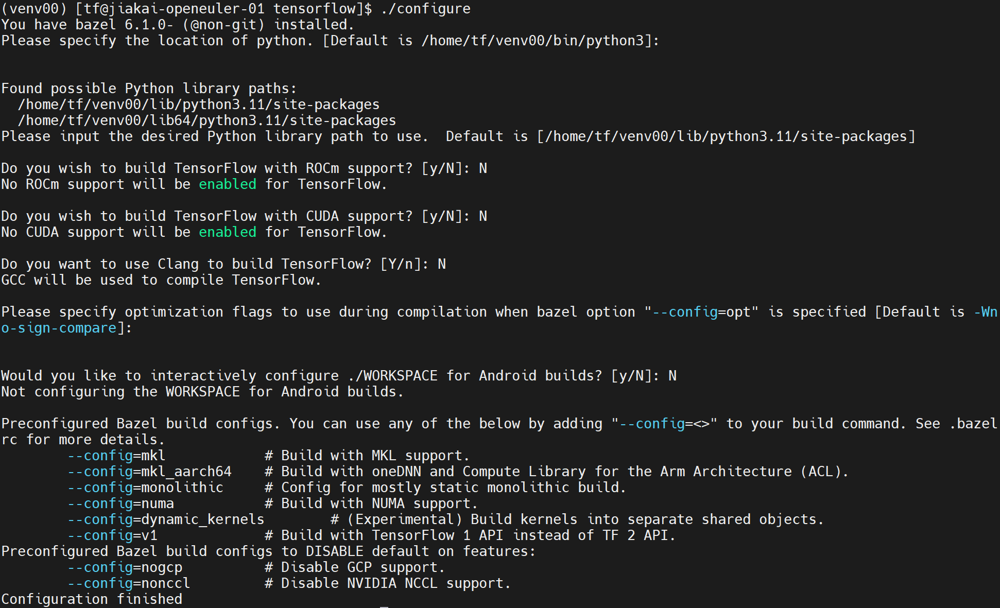

# Tensorflow on Aarch64(Build from Source)

```
# 安装 Python 和 TensorFlow 软件包依赖项
sudo dnf install python3-devel python3-pip
# 安装 bazel 软件包依赖项
sudo dnf install build-essential python zip unzip java-11-openjdk-devel

# 创建虚拟环境
python -m venv venv00
source venv00/bin/activate

# 安装 TensorFlow pip 软件包依赖项
pip install -U pip numpy wheel
pip install -U keras_preprocessing --no-deps

# 安装 bazel 6.1.0 , TensorFlow 需要
mkdir bazel-source; cd bazel-source
wget https://github.com/bazelbuild/bazel/releases/download/6.1.0/bazel-6.1.0-dist.zip
unzip bazel-6.1.0-dist.zip
rm bazel-6.1.0-dist.zip
./compile.sh
./output/bazel
BAZEL=$(pwd)/output
PATH="$BAZEL:$PATH"
echo "# bazel" >> ~/.bashrc
echo "export BAZEL=$(pwd)/output" >> ~/.bashrc
echo "export PATH="$BAZEL:$PATH" >> ~/.bashrc
source ~/.bashrc

cd ..

# 下载 TensorFlow 源码
git clone https://github.com/tensorflow/tensorflow.git
cd tensorflow
git checkout tags/v2.15.0
```


