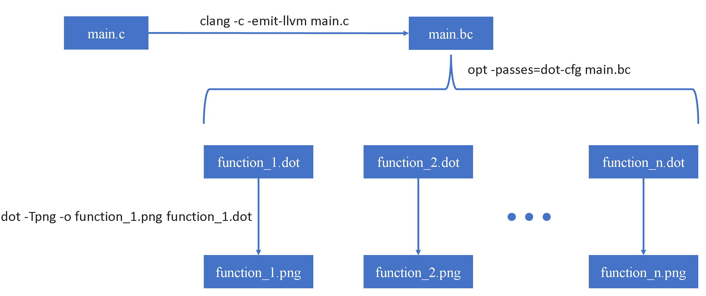
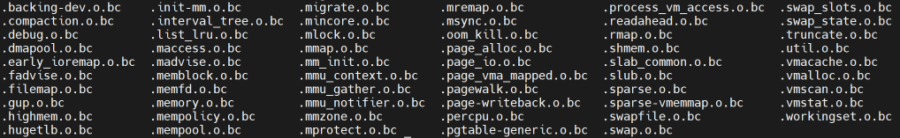

# Linux Config Analyze

本篇内容：

1. 编译Linux
2. 获取Linux的Control Flow Graph
3. 统计CFG的BasicBlock

## 0-编译Linux

Linux源码tarball下载[地址](https://kernel.org/)

```shell
# 安装基本工具
apt install llvm lld clang graphviz build-essential python-is-python3 python3-pip python3.12-venv flex bison libelf-dev libssl-dev

# 下载Linux源码
wget https://cdn.kernel.org/pub/linux/kernel/v5.x/linux-5.4.285.tar.xz
tar -xvf linux-5.4.285.tar.xz

# 配置及编译
cd linux-5.4.285
make defconfig
make
```

编译成果即为linux-5.4.285目录下的vmlinux文件

## 1-获取Linux的Control Flow Graph

### 1-1 获取单个C语言程序的CFG



### 1-2 获取Linux的CFG

借助[wllvm](https://github.com/travitch/whole-program-llvm)工具

```shell
# 配置python虚拟环境并安装wllvm
python -m venv ~/venv00
source ~/venv00/bin/activate
pip install wllvm

# wllvm编译Linux
cd linux-5.4.284
export LLVM_COMPILER=clang
make CC=wllvm defconfig
make CC=wllvm LLVM=1

# 获取vmlinux.bc
extract-bc vmlinux

# 获取vmlinux.ll
llvm-dis vmlinux.bc

# 获取dot文件
opt -passes=dot-cfg vmlinux.bc
```

在wllvm编译Linux这一步之后，就可以在各个目录下看到bc文件，然后可以对某个bc文件进行opt从而得到dot文件



## 2-统计CFG的BasicBlock

把bc文件整理到目的文件夹下：[copy_bc_files.sh](02_linux-config/script/01_copy_bc_files.sh) /pathto/linux-5.4.284 /pathto/bcfiles

把bc文件转换成方便阅读的ll文件：[convert_bc_to_ll.sh](02_linux-config/script/02_convert_bc_to_ll.sh) /pathto/bcfiles

将所有bc文件转换成dot文件：[generate_dot_files.sh	](02_linux-config/script/03_generate_dot_files.sh)/pathto/bcfiles

统计cfg的基本块情况：[process_dot_files.sh](02_linux-config/script/04_process_dot_files.sh) /pathto/bcfiles
