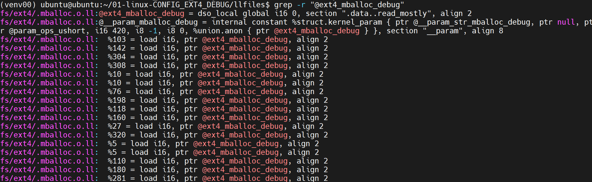

# Linux Config Analyze

本篇内容：

1. 编译Linux
2. 获取Linux的Control Flow Graph
3. 统计CFG的BasicBlock
4. 为Linux内核编译添加配置项
5. 分析配置项带来的变化

## 0-编译Linux

Linux源码tarball下载[地址](https://kernel.org/)

```shell
# 安装基本工具
apt install llvm lld clang graphviz build-essential python-is-python3 python3-pip python3.12-venv flex bison libelf-dev libssl-dev

# 下载Linux源码
wget https://cdn.kernel.org/pub/linux/kernel/v5.x/linux-5.4.285.tar.xz
tar -xvf linux-5.4.285.tar.xz

# 配置及编译
cd linux-5.4.285
make defconfig
make
```

编译成果即为linux-5.4.285目录下的vmlinux文件

## 1-获取Linux的Control Flow Graph

### 1-1 获取单个C语言程序的CFG


### 1-2 获取Linux的CFG

借助[wllvm](https://github.com/travitch/whole-program-llvm)工具

```shell
# 配置python虚拟环境并安装wllvm
python -m venv ~/venv00
source ~/venv00/bin/activate
pip install wllvm

# wllvm编译Linux
cd linux-5.4.284
export LLVM_COMPILER=clang
make CC=wllvm defconfig
make CC=wllvm LLVM=1

# 获取vmlinux.bc
extract-bc vmlinux

# 获取vmlinux.ll
llvm-dis vmlinux.bc

# 获取dot文件
opt -passes=dot-cfg vmlinux.bc
```

在wllvm编译Linux这一步之后，就可以在各个目录下看到bc文件，然后可以对某个bc文件进行opt从而得到dot文件


## 2-统计CFG的BasicBlock

把bc文件整理到目的文件夹下：[copy_bc_files.sh](02_linux-config/script/01_copy_bc_files.sh) /pathto/linux-5.4.284 /pathto/bcfiles

把bc文件转换成方便阅读的ll文件：[convert_bc_to_ll.sh](02_linux-config/script/02_convert_bc_to_ll.sh) /pathto/bcfiles

将所有bc文件转换成dot文件：[generate_dot_files.sh	](02_linux-config/script/03_generate_dot_files.sh)/pathto/bcfiles

统计cfg的基本块情况：[process_dot_files.sh](02_linux-config/script/04_process_dot_files.sh) /pathto/bcfiles

## 3-为Linux内核编译添加配置项

这里以EXT4_DEBUG和FRONTSWAP为例

### 3-1 EXT4_DEBUG

在menuconfig界面键盘Y选中File systems->The Extended 4 (ext4) filesystem->Ext4 debugging support，而后编译Linux，并分别执行copy_bc_files.sh、convert_bc_to_ll.sh、generate_dot_files.sh、process_dot_files.sh脚本，生成bc文件、ll文件、dot文件和basicblock统计结果文件

比较Linux在添加配置项前后的basicblock统计结果文件，得出该配置项在CFG中新增了多少代码块、整个内核CFG块数是多少和新增块数所占总块数比例

在Linux源码下全局搜索CONFIG_EXT4_DEBUG，查看其所管理的源代码，查找是否有新定义的全局变量，或为全局结构体类型添加了新的成员

```c
// 定义了全局变量ext4_mballoc_debug
#ifdef CONFIG_EXT4_DEBUG
ushort ext4_mballoc_debug __read_mostly;

module_param_named(mballoc_debug, ext4_mballoc_debug, ushort, 0644);
MODULE_PARM_DESC(mballoc_debug, "Debugging level for ext4's mballoc");
#endif
```

在ll文件中，全局变量表示为@标识符，在该配置项中，即为@ext4_mballoc_debug，故在生成的Linux的所有ll文件下 `grep -r "@ext4_mballoc_debug"`,得出查找结果



发现这些内容在fs/ext4/.mballoc.o.ll文件下，故在该文件下全局搜索@ext4_mballoc_debug，查看load/store的语句存在于多少个基本块，例如下所示

```
; 以下为fs/ext4/.mballoc.o.ll文件中的一个基本块，该基本块包含对@ext4_mballoc_debug的load操作
101:                                              ; preds = %89
  %102 = icmp ne i32 %98, 0
  %103 = load i16, ptr @ext4_mballoc_debug, align 2
  %104 = icmp ne i16 %103, 0
  %105 = select i1 %102, i1 %104, i1 false
  br i1 %105, label %106, label %108
```

由此，便可计算出包含读写语句的代码块为多少和包含读写语句的代码块占新增代码块的比例

### 3-2 FRONTSWAP

FRONTSWAP与EXT4_DEBUG的不同之处在于，其在已有的全局结构体类型中添加了新的成员

```c
struct swap_info_struct {
	unsigned long	flags;		/* SWP_USED etc: see above */
	signed short	prio;		/* swap priority of this type */
	struct plist_node list;		/* entry in swap_active_head */
	signed char	type;		/* strange name for an index */
	unsigned int	max;		/* extent of the swap_map */
	unsigned char *swap_map;	/* vmalloc'ed array of usage counts */
	struct swap_cluster_info *cluster_info; /* cluster info. Only for SSD */
	struct swap_cluster_list free_clusters; /* free clusters list */
	unsigned int lowest_bit;	/* index of first free in swap_map */
	unsigned int highest_bit;	/* index of last free in swap_map */
	unsigned int pages;		/* total of usable pages of swap */
	unsigned int inuse_pages;	/* number of those currently in use */
	unsigned int cluster_next;	/* likely index for next allocation */
	unsigned int cluster_nr;	/* countdown to next cluster search */
	struct percpu_cluster __percpu *percpu_cluster; /* per cpu's swap location */
	struct rb_root swap_extent_root;/* root of the swap extent rbtree */
	struct block_device *bdev;	/* swap device or bdev of swap file */
	struct file *swap_file;		/* seldom referenced */
	unsigned int old_block_size;	/* seldom referenced */
#ifdef CONFIG_FRONTSWAP
	unsigned long *frontswap_map;	/* frontswap in-use, one bit per page */
	atomic_t frontswap_pages;	/* frontswap pages in-use counter */
#endif
	spinlock_t lock;		/*
					 * protect map scan related fields like
					 * swap_map, lowest_bit, highest_bit,
					 * inuse_pages, cluster_next,
					 * cluster_nr, lowest_alloc,
					 * highest_alloc, free/discard cluster
					 * list. other fields are only changed
					 * at swapon/swapoff, so are protected
					 * by swap_lock. changing flags need
					 * hold this lock and swap_lock. If
					 * both locks need hold, hold swap_lock
					 * first.
					 */
	spinlock_t cont_lock;		/*
					 * protect swap count continuation page
					 * list.
					 */
	struct work_struct discard_work; /* discard worker */
	struct swap_cluster_list discard_clusters; /* discard clusters list */
	struct plist_node avail_lists[0]; /*
					   * entries in swap_avail_heads, one
					   * entry per node.
					   * Must be last as the number of the
					   * array is nr_node_ids, which is not
					   * a fixed value so have to allocate
					   * dynamically.
					   * And it has to be an array so that
					   * plist_for_each_* can work.
					   */
};
```

在ll文件中，结构体类型的定义为%struct.标识符，在该配置项中，即为%struct.swap_info_struct，故在生成的Linux的所有ll文件下 `grep -r "%struct.swap_info_struct"`,得出查找结果


发现这些内容在fs/iomap/.swapfile.o.ll、fs/nfs/.file.o.ll、mm/.swap_state.o.ll、mm/.frontswap.o.ll、mm/.page_io.o.ll、mm/.swapfile.o.ll文件下，故在这些文件下分别全局搜索%struct.swap_info_struct，对于结构体变量的读写需要通过getelementptr指令，第一个参数为结构体类型，第二个参数为结构体变量，第三个参数为索引初始值，第四个参数为从初始值开始的第几个索引。该配置项新添加了第19、20个索引，所以需要查找读写了该索引号的操作所占的基本块个数

```
getelementptr inbounds %struct.swap_info_struct, ptr %0, i64 0, i32 9
; 类型：%struct.swap_info_struct
; 变量：ptr %0
; 初始索引值：i64 0
; 索引号：i32 9
```

比如下面这段代码，是mm/.frontswap.o.ll文件中的一部分，其中`%19 = getelementptr inbounds %struct.swap_info_struct, ptr %4, i64 0, i32 20`语句就是对新的成员进行的读操作，所以该基本块就应该被统计

```
18:                                               ; preds = %11, %8
  %19 = getelementptr inbounds %struct.swap_info_struct, ptr %4, i64 0, i32 20
  store volatile i32 0, ptr %19, align 4
  %20 = load ptr, ptr %5, align 8
  %21 = getelementptr inbounds %struct.swap_info_struct, ptr %4, i64 0, i32 4
  %22 = load i32, ptr %21, align 4
  %23 = add i32 %22, 63
  %24 = lshr i32 %23, 3
  %25 = and i32 %24, 536870904
  %26 = zext nneg i32 %25 to i64
  tail call void @llvm.memset.p0.i64(ptr align 8 %20, i8 0, i64 %26, i1 false)
  br label %27
```
