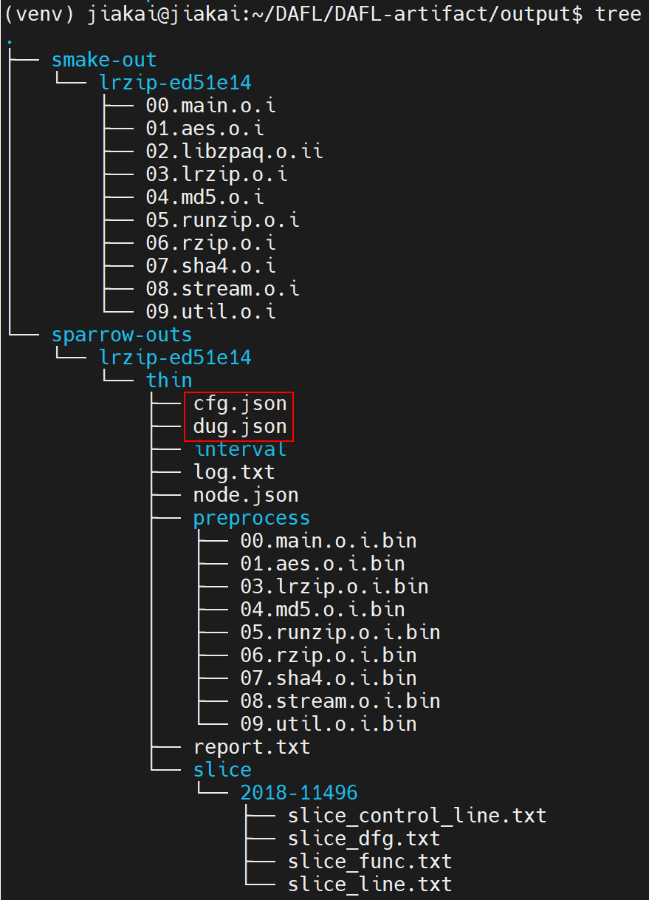
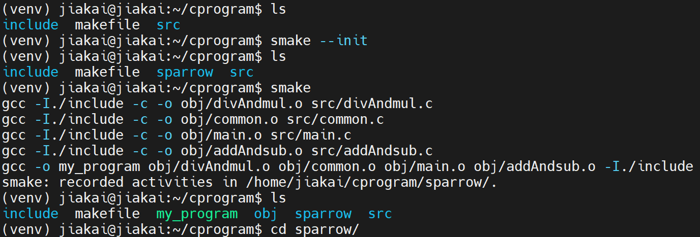
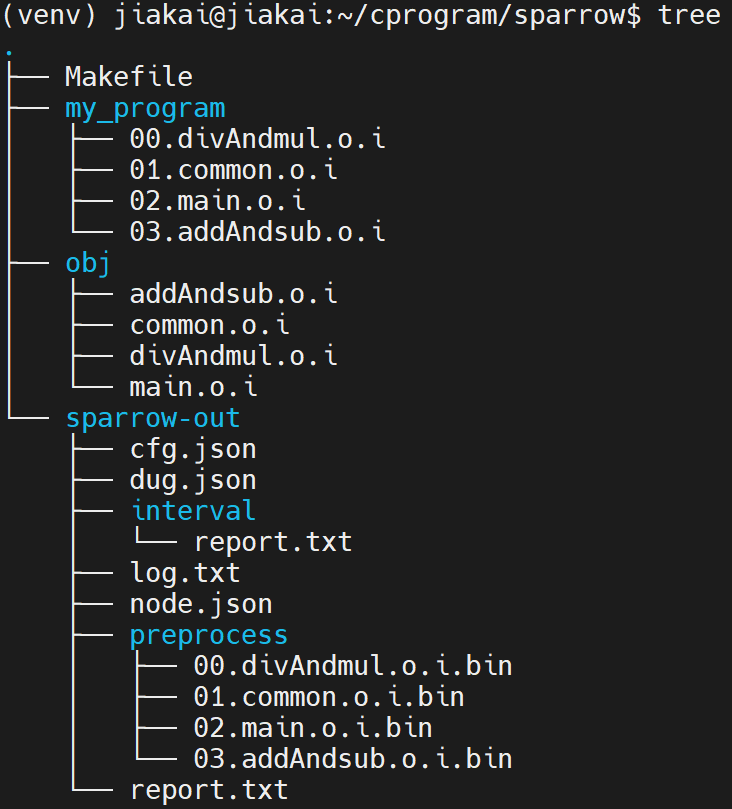
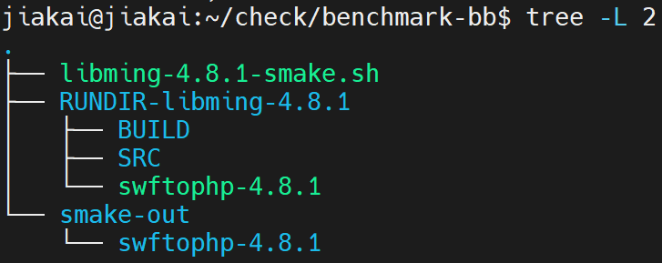
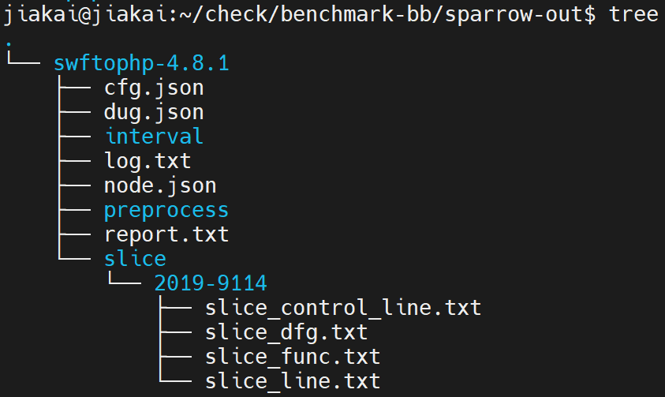
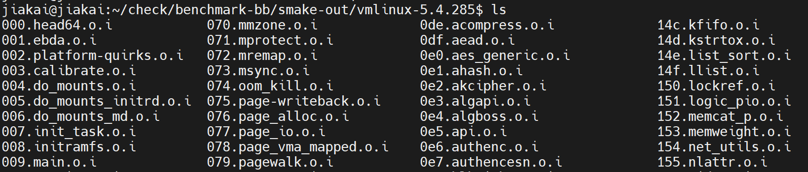
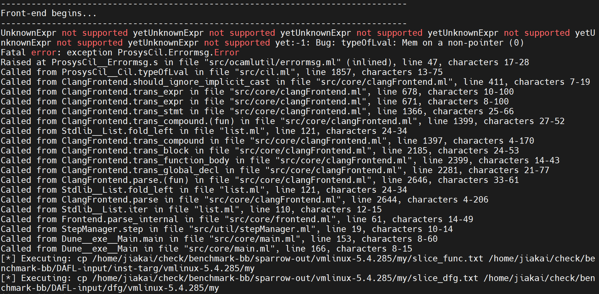

# DAFL的静态分析

## 1 环境搭建

### 1-1 DAFL

```
sudo apt install python3 python-is-python3 python3.8-venv

python -m venv ~/venv
source ~/venv/bin/activate

git clone https://github.com/prosyslab/DAFL-artifact.git
cd DAFL-artifact

yes | pip3 install -r requirements.txt

echo core | sudo tee /proc/sys/kernel/core_pattern
sudo apt install docker.io -y
sudo usermod -aG docker username
echo '{
"registry-mirrors": [
  "https://docker.registry.cyou",
  "https://docker-cf.registry.cyou",
  "https://dockercf.jsdelivr.fyi",
  "https://docker.jsdelivr.fyi",
  "https://dockertest.jsdelivr.fyi",
  "https://mirror.aliyuncs.com",
  "https://dockerproxy.com",
  "https://mirror.baidubce.com",
  "https://docker.m.daocloud.io",
  "https://docker.nju.edu.cn",
  "https://docker.mirrors.sjtug.sjtu.edu.cn",
  "https://docker.mirrors.ustc.edu.cn",
  "https://mirror.iscas.ac.cn",
  "https://docker.rainbond.cc"
]
}' | sudo tee /etc/docker/daemon.json > /dev/null
sudo systemctl restart docker

docker pull prosyslab/dafl-artifact:usenix23
# 修改scripts/common.sh下的cpu数量
python3 ./scripts/reproduce.py run lrzip-ed51e14-2018-11496 60 40 "AFL AFLGo WindRanger Beacon DAFL"
```

可以通过修改reproduce.py脚本的参数来复现论文中的结果

### 1-2 sparrow

```
git clone https://github.com/prosyslab/sparrow.git
git clone https://github.com/prosyslab/cil.git
git clone https://github.com/prosyslab/claml.git

sudo apt install opa
sudo apt install autoconf libgmp-dev pkg-config libmpfr-dev llvm-12-dev libclang-12-dev zlib1g-dev
# 修改build.sh中的cil和claml换成本地路径
./build.sh
```

输入：.i文件，即smake的输出

输出：DUG、CFG等

### 1-3 smake

```
git clone https://github.com/prosyslab/smake.git
```

输入：通过make工具构建的C项目

输出：预处理后的.i文件，用于sparrow的输入

## 2 DAFL提取出的DUG文件存在哪里？

1. 修改DAFL-artifact/scripts/run_sparrow_local.py中的内容，以保存DUG和CFG文件
2. 把1-2构建好的sparrow放在DAFL-artifact下面
3. 以lrzip-ed51e14为例，运行./scripts/run_sparrow_local.py lrzip-ed51e14 thin
4. 查看output文件夹



## 3 利用smake、sparrow来处理自己的C项目



然后运行make all，得到结果



## 4 按照DAFL的方式处理libming-4.8.1

### 4-1 smake

输入：libming-4.8.1源码

输出：预处理后的.i代码

shell脚本说明：

1. 功能：观察libming-4.8.1的make过程，生成.i文件
2. 脚本内容来源：阅读DAFL-artifact代码，梳理静态分析中“Run smake on benchmark to prepare input for sparrow”这一过程，把对libming-4.8.1程序的处理过程提取出来

```
set -x
mkdir -p ~/check/benchmark-bb/smake-out
export CC="clang"
export CXX="clang++"
export CMAKE_EXPORT_COMPILE_COMMANDS=1
program="libming-4.8.1"
binaries="swftophp"
DEFAULT_FLAGS="-g -fno-omit-frame-pointer -Wno-error -fcommon"
export CFLAGS=$DEFAULT_FLAGS
export CXXFLAGS=$DEFAULT_FLAGS
RUNDIR="RUNDIR-libming-4.8.1"
mkdir -p $RUNDIR
cd $RUNDIR
GIT_URL="https://gitee.com/peeanut/libming"
TAG_NAME="50098023446a5412efcfbd40552821a8cba983a6"
RELEVANT_BINARIES="swftophp"
build_lib() {
  rm -rf BUILD
  cp -rf SRC BUILD
  (cd BUILD && ./autogen.sh && ./configure --disable-shared --disable-freetype && make)
}
[ ! -e SRC ] && git clone $GIT_URL SRC
cd SRC
git checkout $TAG_NAME
cd ..

build_lib
for binary in $RELEVANT_BINARIES; do
  cp BUILD/util/$binary ./$binary-4.8.1
done
cd ~/check/benchmark-bb/RUNDIR-$program/BUILD
make clean
yes | smake --init
smake -j 1
cd ~/check/benchmark-bb/RUNDIR-$program
for binary in $binaries; do
    cp -r BUILD/sparrow/util/$binary ~/check/benchmark-bb/smake-out/$binary-4.8.1 || exit 1
done
```

把脚本放在pathto/benchmark-bb路径下执行，最终可以得到结果如下，其中smake-out/swftophp-4.8.1中是预处理后的.i文件



### 4-2 sparrow

输入：预处理后的.i代码

输出：DUG, CFG

需要复制target/line/swftophp-4.8.1/2019-9114文件到benchmark-bb路径下，然后就可以执行下面脚本，得到dug和cfg了，脚本内容提取自DAFL-artifact/scripts/run_sparrow.py，benchmark.py，common.py，triage.py

```
#!/usr/bin/env python3

import os
import shutil
import subprocess
import argparse
import csv
import sys
import glob
import subprocess

BASE_DIR = os.path.join("/home/jiakai/check/benchmark-bb")
SMAKE_OUT_DIR = os.path.join(BASE_DIR, "smake-out")
SPARROW_OUT_DIR = os.path.join(BASE_DIR, "sparrow-out")
TARG_LOC_DIR = os.path.join(BASE_DIR, "target", "line")
DAFL_INPUT_DIR = os.path.join(BASE_DIR, "DAFL-input")
DAFL_NAIVE_INPUT_DIR = os.path.join(BASE_DIR, "DAFL-input-naive")
SPARROW_PATH = os.path.join('/home/jiakai/DAFL/sparrow', 'bin', 'sparrow')
TOTAL_NODES_TOK = '# DUG nodes  : '
SLICED_NODES_TOK = '# Sliced nodes : '
TOTAL_LINES_TOK = '# DUG lines  : '
SLICED_LINES_TOK = '# Sliced lines : '
SLICED_FUNS_TOK = '# Sliced funcs : '
RESULT = [[
    'target', 'poc', 'total_nodes', 'sliced_nodes', 'total_lines',
    'sliced_lines', 'sliced_functions'
]]

SLICE_TARGETS = {
    'swftophp-4.7': {
        'frontend':'cil',
        'entry_point':'main',
        'bugs': ['2016-9827', '2016-9829', '2016-9831', '2017-9988', '2017-11728', '2017-11729']
    },
    'swftophp-4.7.1': {
        'frontend':'cil',
        'entry_point':'main',
        'bugs': ['2017-7578']
    },
    'swftophp-4.8': {
        'frontend':'cil',
        'entry_point':'main',
        'bugs': ['2018-7868', '2018-8807', '2018-8962', '2018-11095', '2018-11225','2018-11226', '2018-20427', '2019-12982', '2020-6628']
    },
    'swftophp-4.8.1': {
        'frontend':'cil',
        'entry_point':'main',
        'bugs': ['2019-9114']
    },
    'lrzip-ed51e14': {
        'frontend':'clang',
        'entry_point':'main',
        'bugs': ['2018-11496']
    },
    'lrzip-9de7ccb': {
        'frontend':'clang',
        'entry_point':'main',
        'bugs': ['2017-8846']
    },
    'objdump': {
        'frontend':'cil',
        'entry_point':'main',
        'bugs': ['2017-8392', '2017-8396', '2017-8397', '2017-8398']
    },
    'objcopy': {
        'frontend':'cil',
        'entry_point':'main',
        'bugs': ['2017-8393', '2017-8394', '2017-8395']
    },
    'objdump-2.31.1': {
        'frontend':'cil',
        'entry_point':'main',
        'bugs': ['2018-17360']
    },
    'nm': {
        'frontend':'cil',
        'entry_point':'main',
        'bugs': ['2017-14940']
    },
    'readelf': {
        'frontend':'cil',
        'entry_point':'main',
        'bugs': ['2017-16828']
    },
    'strip': {
        'frontend':'cil',
        'entry_point':'main',
        'bugs': ['2017-7303']
    },
    'cxxfilt': {
        'frontend':'cil',
        'entry_point':'main',
        'bugs': [
            '2016-4487', '2016-4489', '2016-4490', '2016-4491', '2016-4492',
            '2016-6131'
        ]
    },
    'xmllint': {
        'frontend':'cil',
        'entry_point':'main',
        'bugs': ['2017-5969', '2017-9047', '2017-9048',]
    },
    'cjpeg-1.5.90': {
        'frontend':'cil',
        'entry_point':'main',
        'bugs': ['2018-14498']
    },
    'cjpeg-2.0.4': {
        'frontend':'cil',
        'entry_point':'main',
        'bugs': ['2020-13790']
    },
}

def run_cmd(cmd_str):
    print("[*] Executing: %s" % cmd_str)
    cmd_args = cmd_str.split()
    try:
        PIPE = subprocess.PIPE
        p = subprocess.Popen(cmd_args, stdin=PIPE, stdout=PIPE, stderr=PIPE)
        output, err = p.communicate()
        return output
    except Exception as e:
        print(e)
        exit(1)

def read_file(filename):
    f = open(filename, "r")
    buf = f.read().strip()
    f.close()
    return buf

def run_sparrow(works, thin):
    PROCS=[]
    for prog in works:
        input_dir = os.path.join(SMAKE_OUT_DIR, prog)
        input_files = glob.glob(input_dir + '/*.i')

        out_dir = os.path.join(SPARROW_OUT_DIR, prog)
        shutil.rmtree(out_dir, ignore_errors=True)
        os.makedirs(out_dir)
        cmd=[
            SPARROW_PATH, "-outdir", out_dir,
            "-frontend", SLICE_TARGETS[prog]['frontend'],
            "-unsound_alloc",
            "-dug",
            "-cfg",
            "-unsound_const_string",
            "-unsound_recursion",
            "-unsound_noreturn_function",
            "-unsound_skip_global_array_init", "1000",
            "-skip_main_analysis", "-cut_cyclic_call",
            "-unwrap_alloc",
            "-entry_point", SLICE_TARGETS[prog]['entry_point'],
            "-max_pre_iter", "10"
        ]

        if thin:
            INPUT_DIR = DAFL_INPUT_DIR
        else:
            INPUT_DIR = DAFL_NAIVE_INPUT_DIR
            cmd += ["-full_slice"]

        bugs = SLICE_TARGETS[prog]['bugs']
        for bug in bugs:
            if os.path.exists(os.path.join(TARG_LOC_DIR, prog, bug+".sparrow")):
                slice_loc = read_file(os.path.join(TARG_LOC_DIR, prog, bug+".sparrow"))
            else:
                slice_loc = read_file(os.path.join(TARG_LOC_DIR, prog, bug))
            cmd += ["-slice", bug + "=" + slice_loc]
        if 'additional_opt' in SLICE_TARGETS[prog]:
            cmd += SLICE_TARGETS[prog]['additional_opt']
        cmd += input_files

        run_sparrow = subprocess.Popen(cmd, stdout=subprocess.PIPE)
        proc_obj = {
            "prog": prog,
            "bugs": bugs,
            "p": run_sparrow,
            "outdir": out_dir
        }
        PROCS.append(proc_obj)

    for proc in PROCS:
        prog = proc["prog"]
        proc["p"].communicate()

        for bug in proc["bugs"]:
            # First, copy instrumentation target file.
            dst_dir = os.path.join(INPUT_DIR, "inst-targ", prog)
            os.makedirs(dst_dir, exist_ok=True)
            inst_targ_file = os.path.join(proc["outdir"], bug, "slice_func.txt")
            copy_cmd = "cp %s %s" % (inst_targ_file, os.path.join(dst_dir, bug))
            run_cmd(copy_cmd)
            # Now, copy DFG information file.
            dst_dir = os.path.join(INPUT_DIR, "dfg", prog)
            os.makedirs(dst_dir, exist_ok=True)
            dfg_file = os.path.join(proc["outdir"], bug, "slice_dfg.txt")
            copy_cmd = "cp %s %s" % (dfg_file, os.path.join(dst_dir, bug))
            run_cmd(copy_cmd)

def main():

    os.makedirs(SPARROW_OUT_DIR, exist_ok=True)
    run_sparrow(["swftophp-4.8.1"], True)


if __name__ == '__main__':
    main()
```

执行该脚本后，会打印出执行结果，并且可以在sparrow-out下查看dug和cfg：



## 5 对Linux内核源码做处理

### 5-1 smake

编写shell脚本，获取对内核源码预处理过后的.i文件

```
set -x
mkdir -p ~/check/benchmark-bb/smake-out
export CC="clang"
export CXX="clang++"
export CMAKE_EXPORT_COMPILE_COMMANDS=1
program="linux-5.4.285"
binaries="vmlinux"
DEFAULT_FLAGS="-g -fno-omit-frame-pointer -Wno-error -fcommon"
export CFLAGS=$DEFAULT_FLAGS
export CXXFLAGS=$DEFAULT_FLAGS
RUNDIR="RUNDIR-linux-5.4.285"
mkdir -p $RUNDIR
cd $RUNDIR
URL="https://cdn.kernel.org/pub/linux/kernel/v5.x/linux-5.4.285.tar.xz"
build_lib() {
  rm -rf BUILD
  cp -rf SRC BUILD
  (cd BUILD && make CC=clang CXX=clang++ defconfig && make CC=clang CXX=clang++)
}
[ ! -e SRC ] && wget $URL
tar -xvf linux-5.4.285.tar.xz
mv linux-5.4.285 SRC

build_lib
for binary in $RELEVANT_BINARIES; do
  cp BUILD/$binary ./$binary-5.4.285
done
cd ~/check/benchmark-bb/RUNDIR-$program/BUILD
make clean
yes | smake --init
smake CC=clang CXX=clang++ -j 1
cd ~/check/benchmark-bb/RUNDIR-$program
for binary in $binaries; do
    cp -r BUILD/sparrow/$binary ~/check/benchmark-bb/smake-out/$binary-5.4.285 || exit 1
done
```



### 5-2 sparrow

```
#!/usr/bin/env python3

import os
import shutil
import subprocess
import argparse
import csv
import sys
import glob
import subprocess

BASE_DIR = os.path.join("/home/jiakai/check/benchmark-bb")
SMAKE_OUT_DIR = os.path.join(BASE_DIR, "smake-out")
SPARROW_OUT_DIR = os.path.join(BASE_DIR, "sparrow-out")
TARG_LOC_DIR = os.path.join(BASE_DIR, "target", "line")
DAFL_INPUT_DIR = os.path.join(BASE_DIR, "DAFL-input")
DAFL_NAIVE_INPUT_DIR = os.path.join(BASE_DIR, "DAFL-input-naive")
SPARROW_PATH = os.path.join('/home/jiakai/DAFL/sparrow', 'bin', 'sparrow')
TOTAL_NODES_TOK = '# DUG nodes  : '
SLICED_NODES_TOK = '# Sliced nodes : '
TOTAL_LINES_TOK = '# DUG lines  : '
SLICED_LINES_TOK = '# Sliced lines : '
SLICED_FUNS_TOK = '# Sliced funcs : '
RESULT = [[
    'target', 'poc', 'total_nodes', 'sliced_nodes', 'total_lines',
    'sliced_lines', 'sliced_functions'
]]

SLICE_TARGETS = {
    'vmlinux-5.4.285':{
        'frontend':'clang',
        'entry_point':'main',
        'bugs': ['my']
    },
    'swftophp-4.7': {
        'frontend':'cil',
        'entry_point':'main',
        'bugs': ['2016-9827', '2016-9829', '2016-9831', '2017-9988', '2017-11728', '2017-11729']
    },
    'swftophp-4.7.1': {
        'frontend':'cil',
        'entry_point':'main',
        'bugs': ['2017-7578']
    },
    'swftophp-4.8': {
        'frontend':'cil',
        'entry_point':'main',
        'bugs': ['2018-7868', '2018-8807', '2018-8962', '2018-11095', '2018-11225','2018-11226', '2018-20427', '2019-12982', '2020-6628']
    },
    'swftophp-4.8.1': {
        'frontend':'cil',
        'entry_point':'main',
        'bugs': ['2019-9114']
    },
    'lrzip-ed51e14': {
        'frontend':'clang',
        'entry_point':'main',
        'bugs': ['2018-11496']
    },
    'lrzip-9de7ccb': {
        'frontend':'clang',
        'entry_point':'main',
        'bugs': ['2017-8846']
    },
    'objdump': {
        'frontend':'cil',
        'entry_point':'main',
        'bugs': ['2017-8392', '2017-8396', '2017-8397', '2017-8398']
    },
    'objcopy': {
        'frontend':'cil',
        'entry_point':'main',
        'bugs': ['2017-8393', '2017-8394', '2017-8395']
    },
    'objdump-2.31.1': {
        'frontend':'cil',
        'entry_point':'main',
        'bugs': ['2018-17360']
    },
    'nm': {
        'frontend':'cil',
        'entry_point':'main',
        'bugs': ['2017-14940']
    },
    'readelf': {
        'frontend':'cil',
        'entry_point':'main',
        'bugs': ['2017-16828']
    },
    'strip': {
        'frontend':'cil',
        'entry_point':'main',
        'bugs': ['2017-7303']
    },
    'cxxfilt': {
        'frontend':'cil',
        'entry_point':'main',
        'bugs': [
            '2016-4487', '2016-4489', '2016-4490', '2016-4491', '2016-4492',
            '2016-6131'
        ]
    },
    'xmllint': {
        'frontend':'cil',
        'entry_point':'main',
        'bugs': ['2017-5969', '2017-9047', '2017-9048',]
    },
    'cjpeg-1.5.90': {
        'frontend':'cil',
        'entry_point':'main',
        'bugs': ['2018-14498']
    },
    'cjpeg-2.0.4': {
        'frontend':'cil',
        'entry_point':'main',
        'bugs': ['2020-13790']
    },
}

def run_cmd(cmd_str):
    print("[*] Executing: %s" % cmd_str)
    cmd_args = cmd_str.split()
    try:
        PIPE = subprocess.PIPE
        p = subprocess.Popen(cmd_args, stdin=PIPE, stdout=PIPE, stderr=PIPE)
        output, err = p.communicate()
        return output
    except Exception as e:
        print(e)
        exit(1)

def read_file(filename):
    f = open(filename, "r")
    buf = f.read().strip()
    f.close()
    return buf

def run_sparrow(works, thin):
    PROCS=[]
    for prog in works:
        input_dir = os.path.join(SMAKE_OUT_DIR, prog)
        input_files = glob.glob(input_dir + '/*.i')

        out_dir = os.path.join(SPARROW_OUT_DIR, prog)
        shutil.rmtree(out_dir, ignore_errors=True)
        os.makedirs(out_dir)
        cmd=[
            SPARROW_PATH, "-outdir", out_dir,
            "-frontend", SLICE_TARGETS[prog]['frontend'],
            "-unsound_alloc",
            "-dug",
            "-cfg",
            "-unsound_const_string",
            "-unsound_recursion",
            "-unsound_noreturn_function",
            "-unsound_skip_global_array_init", "1000",
            "-skip_main_analysis", "-cut_cyclic_call",
            "-unwrap_alloc",
            #"-entry_point", SLICE_TARGETS[prog]['entry_point'],
            "-max_pre_iter", "10"
        ]

        if thin:
            INPUT_DIR = DAFL_INPUT_DIR
        else:
            INPUT_DIR = DAFL_NAIVE_INPUT_DIR
            cmd += ["-full_slice"]

        bugs = SLICE_TARGETS[prog]['bugs']
        for bug in bugs:
            if os.path.exists(os.path.join(TARG_LOC_DIR, prog, bug+".sparrow")):
                slice_loc = read_file(os.path.join(TARG_LOC_DIR, prog, bug+".sparrow"))
            else:
                slice_loc = read_file(os.path.join(TARG_LOC_DIR, prog, bug))
            cmd += ["-slice", bug + "=" + slice_loc]
        if 'additional_opt' in SLICE_TARGETS[prog]:
            cmd += SLICE_TARGETS[prog]['additional_opt']
        cmd += input_files

        run_sparrow = subprocess.Popen(cmd, stdout=subprocess.PIPE)
        proc_obj = {
            "prog": prog,
            "bugs": bugs,
            "p": run_sparrow,
            "outdir": out_dir
        }
        PROCS.append(proc_obj)

    for proc in PROCS:
        prog = proc["prog"]
        proc["p"].communicate()

        for bug in proc["bugs"]:
            # First, copy instrumentation target file.
            dst_dir = os.path.join(INPUT_DIR, "inst-targ", prog)
            os.makedirs(dst_dir, exist_ok=True)
            inst_targ_file = os.path.join(proc["outdir"], bug, "slice_func.txt")
            copy_cmd = "cp %s %s" % (inst_targ_file, os.path.join(dst_dir, bug))
            run_cmd(copy_cmd)
            # Now, copy DFG information file.
            dst_dir = os.path.join(INPUT_DIR, "dfg", prog)
            os.makedirs(dst_dir, exist_ok=True)
            dfg_file = os.path.join(proc["outdir"], bug, "slice_dfg.txt")
            copy_cmd = "cp %s %s" % (dfg_file, os.path.join(dst_dir, bug))
            run_cmd(copy_cmd)

def main():

    os.makedirs(SPARROW_OUT_DIR, exist_ok=True)
    run_sparrow(["vmlinux-5.4.285"], True)


if __name__ == '__main__':
    main()
```

有如下报错，猜测是sparrow的bug，可能要看sparrow的源码



### 5-3 总结

用smake处理内核源码可以得到.i文件，但是用sparrow来处理.i文件会报错。通过查看.i文件，可以知道smake处理内核源码时采用的是clang，故sparrow处理时也同样采用clang作为frontend。推测可能是因为内核源码中使用了一些语法而sparrow无法处理。
