# Syzkaller

Syzkaller is an unsupervised coverage-guided kernel fuzzer.

* 测试过程不需要人工干预；
* 优先选择可以触发新路径的种子做进一步测试；
* 内核模糊测试工具。

https://github.com/google/syzkaller

## Syzkaller的使用方法

### Go环境搭建

Syzkaller大部分由Go语言编写，其次是C和C++，故而需要准备好这些工具。

```
sudo apt update
sudo apt install make gcc flex bison libncurses-dev libelf-dev libssl-dev

wget https://dl.google.com/go/go1.22.1.linux-amd64.tar.gz
tar -xf go1.22.1.linux-amd64.tar.gz
export GOROOT=`pwd`/go
# 编译syzkaller需要设置GOPATH
export GOPATH=`pwd`/go
export PATH=$GOROOT/bin:$PATH
# 若不设置GOPROXY，编译syzkaller时会出现连接Go模块代理服务器超时的问题
export GOPROXY=https://goproxy.cn,direct
```

通过 `go version、gcc --version、g++ --version`来验证结果。

### Syzkaller的编译

```
git clone https://gitee.com/peeanut/syzkaller.git
cd syzkaller
make
```

make完成后，会在bin目录下看到结果。

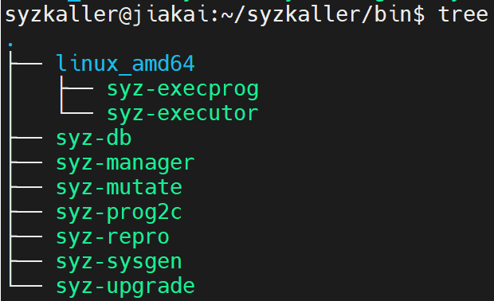

### Linux内核的编译

```
git clone --branch v6.2 git://git.kernel.org/pub/scm/linux/kernel/git/torvalds/linux.git
cd linux
make defconfig
make kvm_guest.config
# 修改.config中的值，一定要删除相应的注释之后再修改
# CONFIG_KCOV=y
# CONFIG_DEBUG_INFO_DWARF4=y
# CONFIG_KASAN=y
# CONFIG_KASAN_INLINE=y
# CONFIG_CONFIGFS_FS=y
# CONFIG_SECURITYFS=y
make olddefconfig
make -j`nproc`
```

编译成功后，可以得到vmlinux和bzImage。

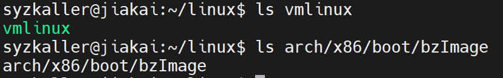

### Image的创建

```
sudo apt install debootstrap
mkdir images
cd images
wget https://raw.githubusercontent.com/google/syzkaller/master/tools/create-image.sh -O create-image.sh
chmod +x create-image.sh
./create-image.sh
```

执行成功后，可以看到bullseye.img文件。


查看image信息：`qemu-img info bullseye.img`

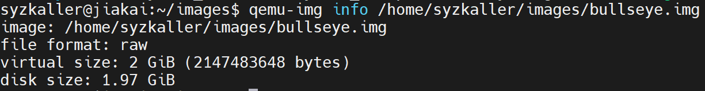

image扩容：修改create-image.sh中SEEK的值

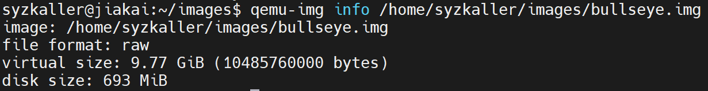

### Qemu启动

```
# 其中kernel、drive参数的路径需要自行设置
# 因为不支持kvm，所以就没有加上-enable-kvm选项
qemu-system-x86_64 \
        -m 2G \
        -smp 2 \
        -kernel /home/syzkaller/linux/arch/x86/boot/bzImage \
        -append "console=ttyS0 root=/dev/sda earlyprintk=serial net.ifnames=0" \
        -drive file=/home/syzkaller/images/bullseye.img,format=raw \
        -net user,host=10.0.2.10,hostfwd=tcp:127.0.0.1:10021-:22 \
        -net nic,model=e1000 \
        -nographic \
        -pidfile vm.pid \
        2>&1 | tee vm.log

# 杀掉Qemu的方法
kill $(cat vm.pid)
```

启动过程中应该没有error才视为成功，因为有可能在启动过程中出现error，但是可以进入Qemu，这种情况在后面会出现问题。

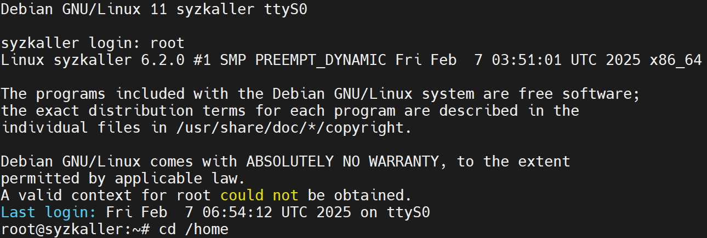

### SSH连接Qemu

在Qemu中，修改/etc/ssh/sshd_config中的 `PubkeyAuthentication、PasswordAuthentication、AllowTcpForwarding`为 `yes`，然后 `sudo systemctl restart sshd`，重启ssh服务。

```
# 在本地生成公私钥对文件
ssh-keygen -t rsa
# 然后，将公钥文件拷贝到Qemu的/root/.ssh/目录下，并重命名为authorized_keys
```

然后运行命令 `ssh -i /home/syzkaller/.ssh/id_rsa -p 10021 -o "StrictHostKeyChecking no" root@localhost`进行测试。

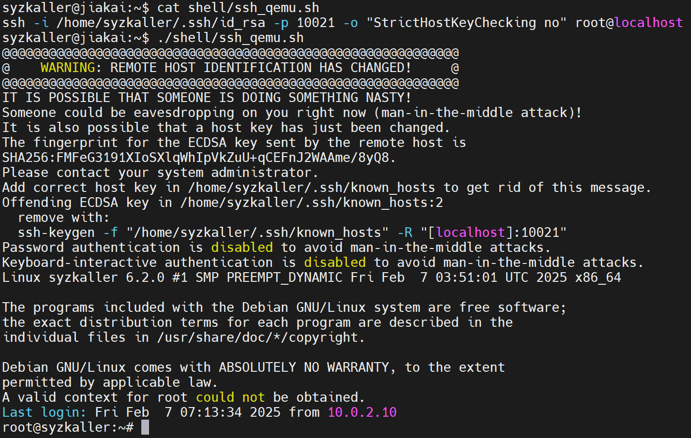

### 开始Fuzz

在Qemu的/home下创建文件夹fuzzdir，在主机的/home/syzkaller/syzkaller下创建文件夹workdir。

在/home/syzkaller/syzkaller下创建fuzz.cfg文件，内容如下：

```
# http参数的值指的是测试结果的网站地址
# sshkey指向私钥
# workdir和target_dir分别指向刚刚创建的两个文件夹
# targets表示Qemu的地址和端口，需要和“Qemu启动”中的内容相同
{
        "target": "linux/amd64",
        "http": "127.0.0.1:56741",
        "rpc": "127.0.0.1:0",
        "sshkey" : "/home/syzkaller/.ssh/id_rsa",
        "workdir": "/home/syzkaller/syzkaller/workdir",
        "kernel_obj": "/home/syzkaller/linux",
        "syzkaller": "/home/syzkaller/syzkaller",
        "sandbox": "setuid",
        "type": "isolated",
        "vm": {
                "targets" : [ "127.0.0.1:10021" ],
                "pstore": false,
                "target_dir" : "/home/fuzzdir",
                "target_reboot" : false
        }
}
```

执行命令 `sudo ./bin/syz-manager -config=fuzz.cfg`，开始测试。

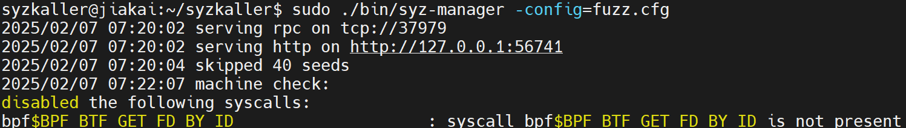

### 查看结果

本地Windows通过跳板机连接服务器Ubuntu，Qemu在Ubuntu中运行，而展示结果的网站是在Qemu中运行。

首先在Windows下的/topath/.ssh/config中添加如下内容：

```
Host tiaoban
    HostName isrc.iscas.ac.cn
    Port 5022
    User jiakai

Host syzkaller
    HostName 192.168.8.82
    Port 22
    User syzkaller
    ProxyCommand ssh tiaoban -W %h:%p
```

然后在Windows下的Powershell中运行 `ssh -L 2226:127.0.0.1:56741 syzkaller`，然后在Windows中打开浏览器，输入 `localhost:2226`，即可查看结果。

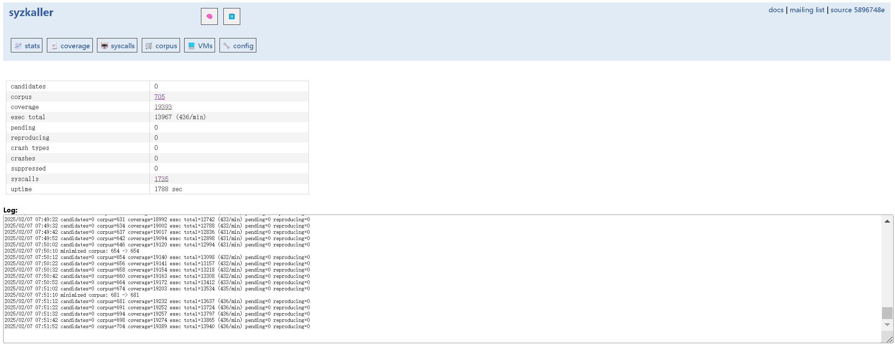

## Syzkaller的源码结构

```
syzkaller@jiakai:~/syzkaller$ tree -L 1
.
├── AUTHORS
├── bin
├── CODE_OF_CONDUCT.md
├── CONTRIBUTORS
├── dashboard		<-和使用syzbot相关
├── docs		<-说明文档
├── executor		<-由manager启动，运行在VM上，通过RPC接收manager的program，返回错误状态、覆盖率等测试结果
├── fuzz.cfg		<-syzkaller进行fuzz的配置文件
├── go.mod
├── go.sum
├── LICENSE
├── Makefile
├── pkg			<-fuzzer、db、manager等包，实现底层功能
├── prog		<-包含analyze, generate, mutate, minimize, validate等程序
├── README.md
├── sys			<-用Syzlang描述的syscall
├── syz-ci		<-和使用syzbot相关
├── syz-cluster
├── syz-hub		<-syz-hub支持运行多个syz-manager
├── syz-manager		<-运行在host上，启动/重启/监控VM，产生输入、变异、最小化等，存储crash
├── syz-verifier	<-通过比较不同版本的Linux内核执行程序的结果来检测语义错误
├── tools		<-封装pkg中的接口，包括其他工具
├── vm			<-对虚拟机相关操作的代码，比如adb，qemu，vmware等，供manager调用
└── workdir
```

---

Syzkaller的运行由命令 `./bin/syz-manager -config=fuzz.cfg`来执行，故而syz-manager二进制可执行程序是分析的入手点。

### syz-manager

```
manager: descriptions
	GOOS=$(HOSTOS) GOARCH=$(HOSTARCH) $(HOSTGO) build $(GOHOSTFLAGS) -o ./bin/syz-manager github.com/google/syzkaller/syz-manager
```

syzkaller下的Makefile文件中的上述命令用于编译syz-manager程序，可知源代码是syzkaller/syz-manager下的代码

```
syz-manager % tree
.
├── hub.go		<-与分布式相关
├── hub_test.go		<-分布式相关的的测试文件
├── manager.go		<-核心部分
├── snapshot.go		<-快照功能
└── stats.go		<-统计信息功能
```

这里先不管分布式相关的代码，先从核心部分manager.go文件入手

* 该文件中main函数为入口函数，经分析可知其核心函数为RunManager
  * RunManager函数会调用preloadCorpus函数
    * preloadCorpus函数会调用LoadSeeds函数来加载corpus.db和调用readInputs函数
      * readInputs函数会加载syzkaller/sys/linux/test下的种子文件
  * RunManager函数会调用fuzzerInstance函数
    * fuzzerInstance函数会调用runInstanceInner函数
      * runInstanceInner函数会调用Run函数来运行syz-executor，参数为runner
  * RunManager函数会调用Loop函数
    * Loop函数会调用runInstance函数
      * runInstance函数会调用job函数

[代码阅读批注](https://github.com/6eanut/syzkaller/commit/70cf61f3f5b48be035a907035319a55d29adae15)

### syz-executor

通过上面的分析，可以知道，syz-manager会通过ssh在虚拟机里面执行syz-executor这个二进制可执行程序，故而这是后续的分析着手点

```
mkdir -p ./bin/$(TARGETOS)_$(TARGETARCH)
$(CXX) -o ./bin/$(TARGETOS)_$(TARGETARCH)/syz-executor$(EXE) executor/executor.cc \
	$(ADDCXXFLAGS) $(CXXFLAGS) $(LDFLAGS) -DGOOS_$(TARGETOS)=1 -DGOARCH_$(TARGETARCH)=1 \
	-DHOSTGOOS_$(HOSTOS)=1 -DGIT_REVISION=\"$(REV)\"
```

syzkaller下的Makefile文件中的上述命令用于编译syz-executor程序，可知源代码是syzkaller/executor/executor.cc

```
executor % tree
.
├── _include
│   └── flatbuffers			<-高效的序列化库，广泛用于高效的数据传输和存储
├── android				<-针对安卓平台的文件
├── common.h				<-通用头文件，定义了跨平台的基本宏、常量和函数声明
├── common_bsd.h			<-针对不同操作系统或特定功能的扩展头文件
├── common_ext.h
├── common_ext_example.h
├── common_fuchsia.h
├── common_kvm_amd64.h
├── common_kvm_arm64.h
├── common_kvm_arm64_syzos.h
├── common_kvm_ppc64.h
├── common_linux.h
├── common_openbsd.h
├── common_test.h
├── common_usb.h
├── common_usb_linux.h
├── common_usb_netbsd.h
├── common_windows.h
├── common_zlib.h
├── conn.h				<-与网络连接相关的接口和数据结构
├── cover_filter.h			<-覆盖率过滤器的实现
├── embed.go
├── executor.cc				<-执行器实现文件
├── executor_bsd.h			<-针对不同操作系统的执行器头文件
├── executor_darwin.h
├── executor_fuchsia.h
├── executor_linux.h
├── executor_runner.h
├── executor_test.h
├── executor_windows.h
├── files.h				<-文件操作相关的接口和数据结构
├── gen_linux_amd64.go
├── gen_linux_ppc64le.go
├── kvm.h				<-与kvm相关的文件
├── kvm_amd64.S
├── kvm_amd64.S.h
├── kvm_gen.cc
├── kvm_ppc64le.S
├── kvm_ppc64le.S.h
├── nocover.h
├── shmem.h				<-共享内存相关的接口和数据结构，用于进程间通信
├── snapshot.h				<-快照机制相关的接口和数据结构，用于保存和恢复虚拟机状态
├── style_test.go
├── subprocess.h			<-子进程管理相关的接口和数据结构
├── test.h
└── test_linux.h
```

下面将从executor.cc的main函数入手

* main函数会根据第一个参数的值做不同的操作，因为syz-manager在执行syz-executor时给出的参数是runner，所以下面先看runner
  * runner函数位于executor_runner.h中，runner函数会实例一个Runner对象，并调用构造函数Runner
    * Runner函数会调用Proc函数
      * Proc函数会调用Start函数
        * Start函数会调用emplace函数，执行syz-executor，并传递参数exec
    * Runner函数会调用Loop函数
      * Loop函数会根据manager发来的消息，进行不同的处理，比如执行请求、信号更新、语料库分类等
        * 执行请求：调用ExecuteBinary或Execute
          * ExecuteBinary会执行二进制程序，并把执行结果返回给manager
          * Execute会执行请求，并和manager通信

[代码阅读批注](https://github.com/6eanut/syzkaller/commit/2a83b033c81962e20668f9bfab84b5eeea4939a1)

至此，syz-manager和syz-executor都会进入各自的Loop函数，等待彼此的RPC消息

---

* MachineChecked函数、setupFuzzer函数、BenchmarkFuzzer函数、TestFuzz函数调用NewFuzzer函数
  * NewFuzzer函数调用newExecQueues函数
    * newExecQueues函数调用genFuzz函数
      * 调用mutateProgRequest来对现有Prog进行变异
      * 调用genProgRequest生成全新的Prog
        * 会调用prog/generation.go中的Generate函数
          * Generate函数会调用generateCall函数
      * 最后调用randomCollide来对前面生成的Prog做处理得到碰撞测试后的Prog

---

prog下的主要文件：

* prio.go

用于计算call-to-call的优先级。对于一个系统调用对(X,Y)，优先级指的是对于包含了X的程序，如果加入了Y，程序出现新的代码覆盖的可能性。当前包含静态和动态两种算法。静态算法基于参数类型的分析，动态算法基于语料库。

* mutation.go

用于对程序进行变异。比如，将当前程序的一部分与语料库中另一个随机选择的程序的部分拼接起来，生成一个新的程序；随机去除程序中的一个call；对程序中的某个随机系统调用的参数进行变异操作等

* generation.go

用于生成一个包含指定数量的系统调用的程序，同时可以指定可选的系统调用集。

* minimization.go

用于对程序进行简化，删除无关的系统调用和对单个系统调用进行简化，并且保持等价。

---

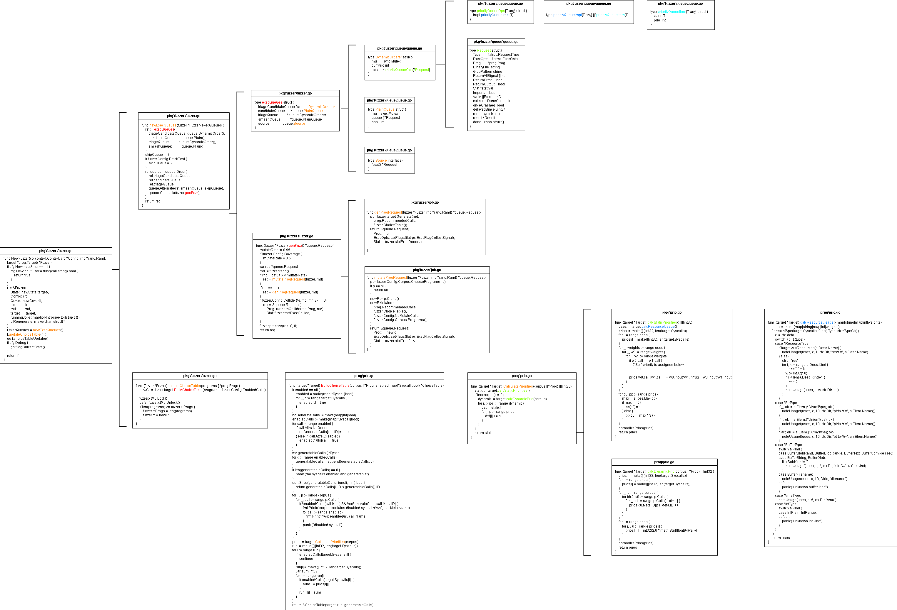

## Syzkaller的工作原理

下图是Syzkaller Github提供的原理示意图以及相关说明。

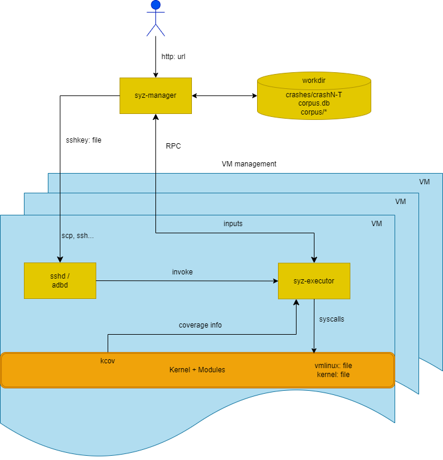

* syz-manager运行在host上，syz-executor运行在VM上
* syz-manager会在每个VM上启动一个syz-executor，两者通过RPC进行通信，前者向后者传递需要执行的程序，后者向前者返回执行结果
* syz-executor会启动subprocess来执行程序
* subprocess会执行一个syscall序列
* syz-manager的功能：1启动、重启、监控VM实例；2输入生成、变异、最小化等；3持久化语料库和crash存储

---

假如人工对内核做测试，一般就是在应用层编写程序，即执行一些系统调用，然后观察执行过程是否报错，最后去做分析。

Syzkaller简化了这一过程，其可以自动地生成测试用例，即系统调用序列，开发者可以指定哪些系统调用不被考虑到测试中或者指定测试某些系统调用，默认情况下是所有支持的系统调用，这需要Syzlang来编写。

整个测试过程不需要人工干预，包括测试用例的生成、编译、程序执行等。、

至于什么样的测试用例拥有更高的优先级，由覆盖率引导，这需要借助内核的KCOV配置选项。

---

Syzkaller需要至少host和vm两台机器，syz-manager运行在host上，其会通过ssh服务把syz-executor等传到vm上。syz-manager负责测试用例的生成、变异和最小化以及语料库、crash的存储，syz-executor负责执行测试用例，将执行结果返回给syz-manager。

整个过程中值得关注的是种子的筛选和排序。这涉及下图三个重要的数据结构，即ChoiceTable、Prog和Corpus。

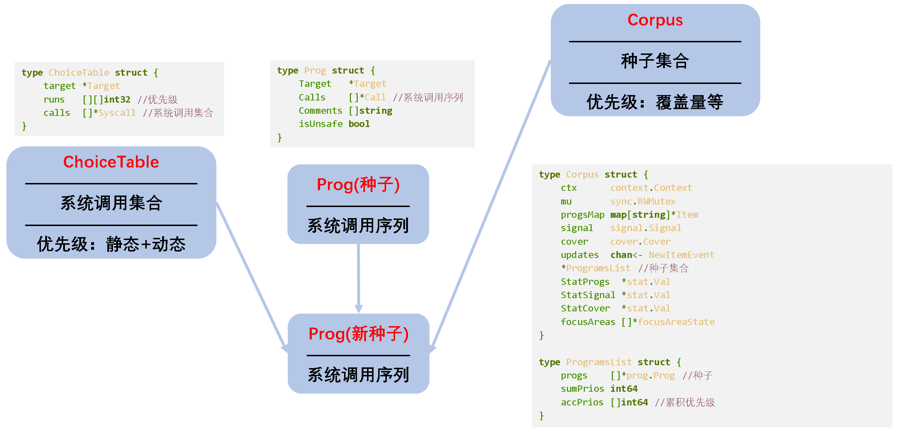

* ChoiceTable
  * 系统调用的集合，可以指定系统调用enable或disable，默认是全部支持的系统调用，即用Syzlang描述的系统调用。
  * 每个系统调用都有自己的优先级，分为静态和动态两部分。
    * 静态是基于系统调用参数类型而决定的。
    * 动态是基于语料库中系统调用对的实际出现频率而决定的。
  * [详细说明](syzkaller/2-ChoiceTable/ChoiceTable.md)
  * [相关代码](syzkaller/2-ChoiceTable/ChoiceTable.drawio.png)
* Corpus
  * 种子的集合，即系统调用序列的集合。
  * 每个种子都有自己的优先级，其考虑的因素不仅仅是覆盖率，还有稳定性。
    * 基本块覆盖或边缘覆盖。
    * 某个种子执行过后，出现新覆盖，但若重现，并不是100%可以发生相同的结果。
  * [详细说明](syzkaller/3-Corpus/Corpus.md)
  * [相关代码](syzkaller/3-Corpus/Corpus.drawio.png)
* Prog
  * 种子，即系统调用序列。
  * 由ChoiceTable、Corpus、Prog和一定的随机数因子决定。
  * 比如可以增删系统调用、和语料库中的某个种子结合等。
  * 会检验有效性。

## Syzlang

Syzkaller自己定义了一套描述系统调用模板的声明式语言Syzlang，这个声明式语言是一个txt，根据Syzlang的语法，在txt中描述接口信息以及参数格式。

语法详见：[这里](syzkaller/1-syzlang/syzlang.md)。
