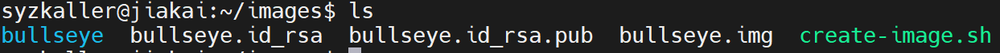

# Syzkaller

Syzkaller是一个内核Fuzz工具，本文记录使用方法、源码结构和工作原理。

## Syzkaller的使用方法

### Go环境搭建

Syzkaller大部分由Go语言编写，其次是C和C++，故而需要准备好这些工具。

```
sudo apt update
sudo apt install make gcc flex bison libncurses-dev libelf-dev libssl-dev

wget https://dl.google.com/go/go1.22.1.linux-amd64.tar.gz
tar -xf go1.22.1.linux-amd64.tar.gz
export GOROOT=`pwd`/go
# 编译syzkaller需要设置GOPATH
export GOPATH=`pwd`/go
export PATH=$GOROOT/bin:$PATH
# 若不设置GOPROXY，编译syzkaller时会出现连接Go模块代理服务器超时的问题
export GOPROXY=https://goproxy.cn,direct
```

通过 `go version、gcc --version、g++ --version`来验证结果。

### Syzkaller的编译

```
git clone https://gitee.com/peeanut/syzkaller.git
cd syzkaller
make
```

make完成后，会在bin目录下看到结果。


### Linux内核的编译

```
git clone --branch v6.2 git://git.kernel.org/pub/scm/linux/kernel/git/torvalds/linux.git
cd linux
make defconfig
make kvm_guest.config
# 修改.config中的值，一定要删除相应的注释之后再修改
# CONFIG_KCOV=y
# CONFIG_DEBUG_INFO_DWARF4=y
# CONFIG_KASAN=y
# CONFIG_KASAN_INLINE=y
# CONFIG_CONFIGFS_FS=y
# CONFIG_SECURITYFS=y
make olddefconfig
make -j`nproc`
```

编译成功后，可以得到vmlinux和bzImage。


### Image的创建

```
sudo apt install debootstrap
mkdir images
cd images
wget https://raw.githubusercontent.com/google/syzkaller/master/tools/create-image.sh -O create-image.sh
chmod +x create-image.sh
./create-image.sh
```

执行成功后，可以看到bullseye.img文件。



### Qemu启动

```
# 其中kernel、drive参数的路径需要自行设置
# 因为不支持kvm，所以就没有加上-enable-kvm选项
qemu-system-x86_64 \
        -m 2G \
        -smp 2 \
        -kernel /home/syzkaller/linux/arch/x86/boot/bzImage \
        -append "console=ttyS0 root=/dev/sda earlyprintk=serial net.ifnames=0" \
        -drive file=/home/syzkaller/images/bullseye.img,format=raw \
        -net user,host=10.0.2.10,hostfwd=tcp:127.0.0.1:10021-:22 \
        -net nic,model=e1000 \
        -nographic \
        -pidfile vm.pid \
        2>&1 | tee vm.log

# 杀掉Qemu的方法
kill $(cat vm.pid)
```

启动过程中应该没有error才视为成功，因为有可能在启动过程中出现error，但是可以进入Qemu，这种情况在后面会出现问题。


### SSH连接Qemu

在Qemu中，修改/etc/ssh/sshd_config中的 `PubkeyAuthentication、PasswordAuthentication、AllowTcpForwarding`为 `yes`，然后 `sudo systemctl restart sshd`，重启ssh服务。

```
# 在本地生成公私钥对文件
ssh-keygen -t rsa
# 然后，将公钥文件拷贝到Qemu的/root/.ssh/目录下，并重命名为authorized_keys
```

然后运行命令 `ssh -i /home/syzkaller/.ssh/id_rsa -p 10021 -o "StrictHostKeyChecking no" root@localhost`进行测试。


### 开始Fuzz

在Qemu的/home下创建文件夹fuzzdir，在主机的/home/syzkaller/syzkaller下创建文件夹workdir。

在/home/syzkaller/syzkaller下创建fuzz.cfg文件，内容如下：

```
# http参数的值指的是测试结果的网站地址
# sshkey指向私钥
# workdir和target_dir分别指向刚刚创建的两个文件夹
# targets表示Qemu的地址和端口，需要和“Qemu启动”中的内容相同
{
        "target": "linux/amd64",
        "http": "127.0.0.1:56741",
        "rpc": "127.0.0.1:0",
        "sshkey" : "/home/syzkaller/.ssh/id_rsa",
        "workdir": "/home/syzkaller/syzkaller/workdir",
        "kernel_obj": "/home/syzkaller/linux",
        "syzkaller": "/home/syzkaller/syzkaller",
        "sandbox": "setuid",
        "type": "isolated",
        "vm": {
                "targets" : [ "127.0.0.1:10021" ],
                "pstore": false,
                "target_dir" : "/home/fuzzdir",
                "target_reboot" : false
        }
}
```

执行命令 `sudo ./bin/syz-manager -config=fuzz.cfg`，开始测试。


### 查看结果

本地Windows通过跳板机连接服务器Ubuntu，Qemu在Ubuntu中运行，而展示结果的网站是在Qemu中运行。

首先在Windows下的/topath/.ssh/config中添加如下内容：

```
Host tiaoban
    HostName isrc.iscas.ac.cn
    Port 5022
    User jiakai

Host syzkaller
    HostName 192.168.8.82
    Port 22
    User syzkaller
    ProxyCommand ssh tiaoban -W %h:%p
```

然后在Windows下的Powershell中运行 `ssh -L 2226:127.0.0.1:56741 syzkaller`，然后在Windows中打开浏览器，输入 `localhost:2226`，即可查看结果。


## Syzkaller的源码结构

```
syzkaller@jiakai:~/syzkaller$ tree -L 1
.
├── AUTHORS
├── bin
├── CODE_OF_CONDUCT.md
├── CONTRIBUTORS
├── dashboard		<-
├── docs		<-
├── executor		<-
├── fuzz.cfg		<-
├── go.mod		<-
├── go.sum		<-
├── LICENSE
├── Makefile
├── my.cfg		<-
├── pkg			<-
├── prog		<-
├── README.md
├── sys			<-
├── syz-ci		<-
├── syz-cluster		<-
├── syz-hub		<-
├── syz-manager		<-
├── syz-verifier	<-
├── tools		<-
├── vm			<-
└── workdir		<-
```

## Syzkaller的工作原理
