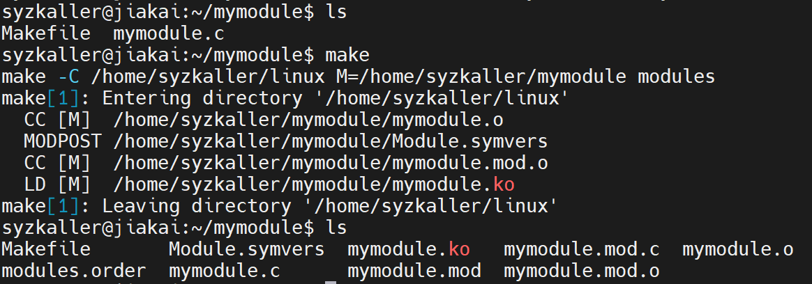

# 定制Linux内核

## 1 定制Linux内核module

怎样在Linux内核中添加自己开发的module？

### 1-1 实验环境

主机+QEMU虚拟机

### 1-2 开发module

在主机上，需要相应的Linux内核源码，然后创建mymodule目录，在该目录下创建[mymodule.c](mymodule/mymodule.c)和[Makefile](mymodule/Makefile)文件。

注意需要把Makefile中的KDIR改成相应的Linux源码路径。

执行make进行编译，获得ko文件。



### 1-3 配置QEMU

可以在启动QEMU的脚本中设置主机和QEMU的共享文件夹，指令如下：

```
qemu-system-x86_64 \
        -m 2G \
        -smp 2 \
        -kernel /home/syzkaller/linux/arch/x86/boot/bzImage \
        -append "console=ttyS0 root=/dev/sda earlyprintk=serial net.ifnames=0" \
        -drive file=/home/syzkaller/images/bullseye.img,format=raw \
        -net user,host=10.0.2.10,hostfwd=tcp:127.0.0.1:10021-:22 \
        -net nic,model=e1000 \
        -nographic \
        -pidfile vm.pid \
        -virtfs local,path=/home/syzkaller/shared,mount_tag=shared,security_model=passthrough \
        2>&1 | tee vm.log
```

相应的，在QEMU中的/mnt下创建shared_folder文件夹，然后执行：

```
sudo mount -t 9p -o trans=virtio,version=9p2000.L shared /mnt/shared_folder
```

之后，可以将编译好的mymodule.ko文件放在主机的shared文件夹下，在QEMU的shared_folder文件夹下便可以看到该文件。

### 1-4 操作module

在QEMU中执行如下命令来对module进行操作：

```
# 查看现有的module
lsmod
# 添加mymodule模块
insmod mymodule.ko
# 移除mymodule模块
rmmod mymodule
# 查看打印信息
dmesg
```

## 2 切换Linux内核

### 2-1 编译新的Linux内核

这里以openEuler为例：

```shell
sudo dnf install -y git make gcc flex bison ncurses-devel openssl-devel elfutils-libelf-devel bc rsync
git clone https://gitee.com/openeuler/kernel.git
cd kernel
git checkout openEuler-24.03-LTS-SP2
cp /boot/config-$(uname -r) .config
make menuconfig

#比如我想打开SMC相关的配置项 
Networking support → Networking options → 
    [*] SMC (Shared Memory Communications) support  
    [*]   SMC-D (DMB based) support  
    [*]   SMC-D diagnostics support (CONFIG_SMC_DIAG)

make -j$(nproc) all  # 编译内核和模块
sudo make modules_install  # 安装模块
sudo make install         # 安装内核
```

### 2-2 切换到新内核

这块一直不成功，暂且搁置了～
