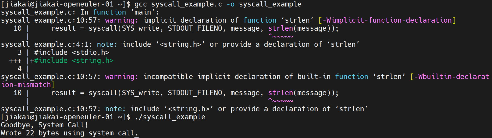
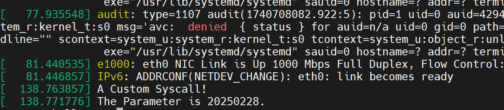

# 定制Linux内核Syscall

> 当人工对Linux Kernel做测试时，一般是在应用层编写一个程序，这个程序会执行一些系统调用，然后观察执行的过程和分析执行的结果。

## step1：观察现有系统调用

### 在应用层，编写一个程序，编译并运行

```c
#include <unistd.h>
#include <sys/syscall.h>
#include <stdio.h>

int main() {
    const char *message = "Goodbye, System Call!\n";
    ssize_t result;

    // 使用 syscall 调用 write 系统调用
    result = syscall(SYS_write, STDOUT_FILENO, message, strlen(message));

    if (result == -1) {
        perror("System call failed");
        return 1;
    }

    printf("Wrote %zd bytes using system call.\n", result);
    return 0;
}
```



程序中用到了 `SYS_write`，并且可以推测出与系统调用相关的头文件是unistd.h和sys/syscall.h

### 查看系统中的unistd.h和sys/syscall.h

可以利用 `find . -name unistd.h`和 `find . -name syscall.h`来找到系统中这两个文件，前者与POSIX(Portable Operating System Interface)有关，这里只看后者

**sys/syscall.h文件的内容：**

```c
#ifndef _SYSCALL_H
#define _SYSCALL_H      1

/* This file should list the numbers of the system calls the system knows.
   But instead of duplicating this we use the information available
   from the kernel sources.  */
#include <asm/unistd.h>

/* The Linux kernel header file defines macros __NR_*, but some
   programs expect the traditional form SYS_*.  <bits/syscall.h>
   defines SYS_* macros for __NR_* macros of known names.  */
#include <bits/syscall.h>

#endif
```

包含asm/unistd.h和bits/syscall.h两个头文件，分别记录了系统调用号和系统调用名称的兼容(SYS_和__NR_)

**asm/unistd.h文件的内容：**

```c
/*
 * AARCH32 interface for ILP32 syscalls.
 */
#if defined(__ILP32__) || defined(__SYSCALL_COMPAT)
#define __ARCH_WANT_SYNC_FILE_RANGE2
#endif

/*
 * AARCH64/ILP32 is introduced after the following syscalls were deprecated.
 */
#if !(defined(__ILP32__) || defined(__SYSCALL_COMPAT))
#define __ARCH_WANT_RENAMEAT
#define __ARCH_WANT_SET_GET_RLIMIT
#endif

#define __ARCH_WANT_NEW_STAT
#define __ARCH_WANT_TIME32_SYSCALLS
#define __ARCH_WANT_SYS_CLONE3
#define __ARCH_WANT_MEMFD_SECRET

#include <asm-generic/unistd.h>
```

包含asm-generic/unistd.h头文件

**asm-generic/unistd.h文件的内容：**

```c
#include <asm/bitsperlong.h>

/*
 * This file contains the system call numbers, based on the
 * layout of the x86-64 architecture, which embeds the
 * pointer to the syscall in the table.
 *
 * As a basic principle, no duplication of functionality
 * should be added, e.g. we don't use lseek when llseek
 * is present. New architectures should use this file
 * and implement the less feature-full calls in user space.
 */

#ifndef __SYSCALL
#define __SYSCALL(x, y)
#endif

#if __BITS_PER_LONG == 32 || defined(__SYSCALL_COMPAT)
#define __SC_3264(_nr, _32, _64) __SYSCALL(_nr, _32)
#else
#define __SC_3264(_nr, _32, _64) __SYSCALL(_nr, _64)
#endif

#ifdef __SYSCALL_COMPAT
#define __SC_COMP(_nr, _sys, _comp) __SYSCALL(_nr, _comp)
#define __SC_COMP_3264(_nr, _32, _64, _comp) __SYSCALL(_nr, _comp)
#else
#define __SC_COMP(_nr, _sys, _comp) __SYSCALL(_nr, _sys)
#define __SC_COMP_3264(_nr, _32, _64, _comp) __SC_3264(_nr, _32, _64)
#endif

#define __NR_io_setup 0
__SC_COMP(__NR_io_setup, sys_io_setup, compat_sys_io_setup)
#define __NR_io_destroy 1
__SYSCALL(__NR_io_destroy, sys_io_destroy)
#define __NR_io_submit 2
__SC_COMP(__NR_io_submit, sys_io_submit, compat_sys_io_submit)
#define __NR_io_cancel 3
__SYSCALL(__NR_io_cancel, sys_io_cancel)
#if defined(__ARCH_WANT_TIME32_SYSCALLS) || __BITS_PER_LONG != 32
#define __NR_io_getevents 4
__SC_3264(__NR_io_getevents, sys_io_getevents_time32, sys_io_getevents)
#endif

/* fs/xattr.c */
#define __NR_setxattr 5
__SYSCALL(__NR_setxattr, sys_setxattr)
#define __NR_lsetxattr 6
__SYSCALL(__NR_lsetxattr, sys_lsetxattr)
#define __NR_fsetxattr 7
__SYSCALL(__NR_fsetxattr, sys_fsetxattr)
#define __NR_getxattr 8
__SYSCALL(__NR_getxattr, sys_getxattr)
#define __NR_lgetxattr 9
__SYSCALL(__NR_lgetxattr, sys_lgetxattr)
#define __NR_fgetxattr 10
__SYSCALL(__NR_fgetxattr, sys_fgetxattr)
#define __NR_listxattr 11
__SYSCALL(__NR_listxattr, sys_listxattr)
#define __NR_llistxattr 12
__SYSCALL(__NR_llistxattr, sys_llistxattr)
#define __NR_flistxattr 13
__SYSCALL(__NR_flistxattr, sys_flistxattr)
#define __NR_removexattr 14
__SYSCALL(__NR_removexattr, sys_removexattr)
#define __NR_lremovexattr 15
__SYSCALL(__NR_lremovexattr, sys_lremovexattr)
#define __NR_fremovexattr 16
__SYSCALL(__NR_fremovexattr, sys_fremovexattr)
...
...
```

记录了每个系统调用的系统调用号，包含的asm/bitsperlong.h头文件用于区分__LP64__和__ILP32__两种不同的编程模型

**bits/syscall.h文件的内容：**

```c
#ifndef _SYSCALL_H
# error "Never use <bits/syscall.h> directly; include <sys/syscall.h> instead."
#endif

#define __GLIBC_LINUX_VERSION_CODE 394240

#ifdef __NR_FAST_atomic_update
# define SYS_FAST_atomic_update __NR_FAST_atomic_update
#endif

#ifdef __NR_FAST_cmpxchg
# define SYS_FAST_cmpxchg __NR_FAST_cmpxchg
#endif
...
...
```

用于兼容系统调用名称

以上，我们知道最初的那个C程序中的 `SYS_write`其实只是一个数字，即系统调用号。

### 将系统调用号和系统调用联系起来

linux-5.4.285/arch/arm/tools/syscall.tbl中记录了系统调用号和系统调用之间的映射，故而可以得到系统调用名称

```c
#
# Linux system call numbers and entry vectors
#
# The format is:
# <num> <abi>   <name>                  [<entry point>                  [<oabi compat entry point>]]
#
# Where abi is:
#  common - for system calls shared between oabi and eabi (may have compat)
#  oabi   - for oabi-only system calls (may have compat)
#  eabi   - for eabi-only system calls
#
# For each syscall number, "common" is mutually exclusive with oabi and eabi
#
0       common  restart_syscall         sys_restart_syscall
1       common  exit                    sys_exit
2       common  fork                    sys_fork
3       common  read                    sys_read
4       common  write                   sys_write
5       common  open                    sys_open
6       common  close                   sys_close
# 7 was sys_waitpid
8       common  creat                   sys_creat
9       common  link                    sys_link
10      common  unlink                  sys_unlink
11      common  execve                  sys_execve
12      common  chdir                   sys_chdir
13      oabi    time                    sys_time32
14      common  mknod                   sys_mknod
15      common  chmod                   sys_chmod
16      common  lchown                  sys_lchown16
# 17 was sys_break
# 18 was sys_stat
...
...
```

### 系统调用实现在哪里

在上面的tbl表中可以找到系统调用名称，具体的实现是在源码的各个目录下，以write系统调用为例，其实现位于fs的read_write.c文件下：

```c
SYSCALL_DEFINE3(write, unsigned int, fd, const char __user *, buf,
		size_t, count)
{
	return ksys_write(fd, buf, count);
}
```

## step2：定制一个系统调用

> 定制系统调用有两种方法：
>
> 1.以内核模块的形式，定制系统调用，并添加到内核中；
>
> 2.将定制的系统调用编写进内核代码中。
>
> 这里采用第二种方式，因为第一种方式在尝试insmod时会出现权限问题，猜测可能和qemu不支持kvm相关。

### 将定制的系统调用编写进内核代码中

#### 编写系统调用代码

在kernel/sys.c文件中实现系统调用代码：

```c
asmlinkage long sys_mysyscall(long num)
{
    printk("A Custom Syscall!\n");
    printk("The Parameter is %ld.\n", num);
    return 0;   
}

SYSCALL_DEFINE1(mysyscall, long, num)
{
    return sys_mysyscall(num);
}

```

> asmlinkage告诉编译器，函数的参数通过栈传递而非寄存器。
>
> 栈传递和寄存器传递的对比：
>
> * 前者兼容性好，几乎所有架构和编译器都支持；后者不同架构的寄存器布局和调用约定可能不同。
> * 前者参数存在栈中，方便调试；后者寄存器内容不易直接观察，调试复杂度较高。
> * 前者适合参数数量可变或不确定的情况。
> * 前者需要内存访问，速度慢；后者寄存器访问速度远快于内存。

#### 分配系统调用号

在arch/x86/entry/syscalls/syscall_64.tbl文件中为系统调用分配系统调用号：

```c
335	64		mysyscall		sys_mysyscall
```

#### 声明系统调用

在include/linux/syscalls.h文件中声明系统调用：

```c
asmlinkage long sys_mysyscall(long num);
```

#### 编译内核

```
make
```

#### 测试结果

在定制的内核中，编写C语言程序：

```c
#include <stdio.h>
#include <unistd.h>
#include <sys/syscall.h>

int main()
{
    syscall(335, 20250228);
}
```

编译并运行，通过 `dmesg`查看运行结果



### 将定制的系统调用编写进内核模块

查看系统调用表在内存中的地址 `sudo cat /proc/kallsyms | grep sys_call_table`

如果启用了Kernel Address Space Layout Randomization (KASLR)，内核符号的地址会在每次启动时随机化。因此，`/proc/kallsyms` 中的地址仅在当前运行的内核实例中有效。

```c
#include <linux/module.h>
#include <linux/kernel.h>
#include <linux/syscalls.h>
#include <linux/linkage.h>

// 定义系统调用号（需要确保未被占用）
#define MY_SYSCALL_NUMBER 335

// 定义系统调用函数
asmlinkage long sys_my_syscall(void) {
    printk(KERN_INFO "Custom syscall invoked from kernel module!\n");
    return 0;
}

// 替换系统调用表中的条目
//extern void *sys_call_table[];

#define SYSCALL_TABLE_ADDR 0xffffffff9a6031a0

static void **sys_call_table = (void **)SYSCALL_TABLE_ADDR;

// 修改系统调用表的函数
static inline void enable_write_to_ro(void) {
    write_cr0(read_cr0() & (~0x10000));
}

static inline void disable_write_to_ro(void) {
    write_cr0(read_cr0() | 0x10000);
}

static int __init my_syscall_init(void) {
    // 允许写入只读内存区域
    enable_write_to_ro();

    // 替换系统调用表中的条目
    sys_call_table[MY_SYSCALL_NUMBER] = (void *)sys_my_syscall;

    // 恢复只读保护
    disable_write_to_ro();

    printk(KERN_INFO "Custom syscall registered with number %d\n", MY_SYSCALL_NUMBER);
    return 0;
}

static void __exit my_syscall_exit(void) {
    // 允许写入只读内存区域
    enable_write_to_ro();

    // 恢复原始系统调用
    sys_call_table[MY_SYSCALL_NUMBER] = NULL;

    // 恢复只读保护
    disable_write_to_ro();

    printk(KERN_INFO "Custom syscall unregistered\n");
}

module_init(my_syscall_init);
module_exit(my_syscall_exit);

MODULE_LICENSE("GPL");
MODULE_DESCRIPTION("A custom system call as a kernel module");
```

编译得到ko文件后，在insmod时出现报错，推测是权限问题。
