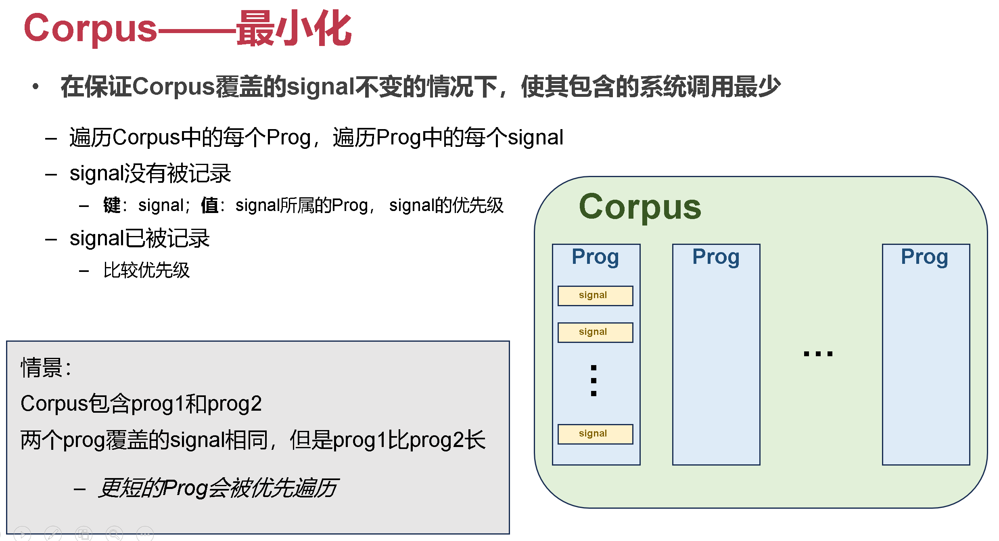
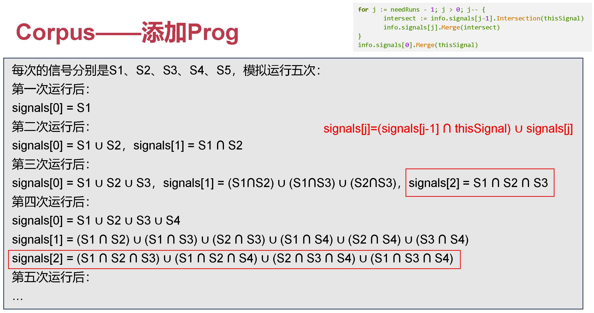

# Corpus

Corpus的内容：由多个focusAreas组成，每个focusArea由多个Prog组成；

Corpus的作用：Corpus是syzkaller生成的一组Prog，这组Prog是当前能够覆盖内核的最大范围的一组Prog。

## 1 优先级

### 1-1 focusArea的优先级

由用户在config文件中指定优先级。

### 1-2 Prog的优先级

由signal的大小决定，即覆盖的多，优先级就高。

### 1-3 Signal的优先级

系统调用执行正确->第二bit位为1，系统调用包含指针类型的参数，第一bit位为1。

Corpus的最小化需要用到signal的优先级。

## 2 更新策略

### Corpus的最小化

遍历Corpus中的每个Prog，遍历Prog中的每个Signal。

如果某Signal没有出现过，则记录该Signal以及其所属的Prog，如果已经记录过该Signal，则更新记录优先级高的Signal及相应的Prog。

最终，如果Corpus中的某个Prog没有被记录，则该Prog被扔掉，实现了最小化。

### Corpus的扩大

出现新的信号->确定新的信号是稳定的(deflake)->添加

deflake：执行程序->得到结果->滑动窗口机制更新signals->检查停止条件

signals数组记录执行结果，窗口大小为三，最多执行五次

## 3 加权选择

* 通过累积优先级加权选择focusArea，然后在该区域内做进一步的选择。
  * focusArea中的ProgramList字段记录了Progs以及累积优先级的信息。
  * 加权选择Prog。
* 如果focusAreas为空，则从Corpus中选择。
  * Corpus中的ProgramsList字段记录了Progs以及累积优先级的信息。
  * 加权选择Prog。

> 读Corpus：返回Corpus中的Progs。
>
> 写Corpus：向Corpus中添加Prog，并更新Progs的累积优先级信息，Prog的优先级等于signal的长度。

---

**Signal**

* signal从 `raw []uint64`和 `prio uint8`转化而来，raw数组中的每个元素都会被赋prio优先级，即 `signal[raw[i]]=prio`。
  * 通过调用FromRaw函数的函数信息可知，`signalPrio`和 `flatrpc.ProgInfo.Extra.Signal、flatrpc.CallInfo.Signal`分别决定 `prio`和 `raw`
  * `signalPrio`:如果系统调用执行正确，第二bit为1；如果包含指针类型的参数，第一bit位为1。
  * `flatrpc`：`ProgInfo.Extra`是一个指向 `CallInfo`的指针，所以只关注 `CallInfo`。该结构体定义在 `flatrpc`包下，通过flatbuffers，实现C++和Go之间的数据交换。signal信号由syz-executor产生，是PC值或两个PC的hash值，这取决于是基本快覆盖还是边覆盖。

**Cover**

* Prog或系统调用覆盖到的PC数组。
