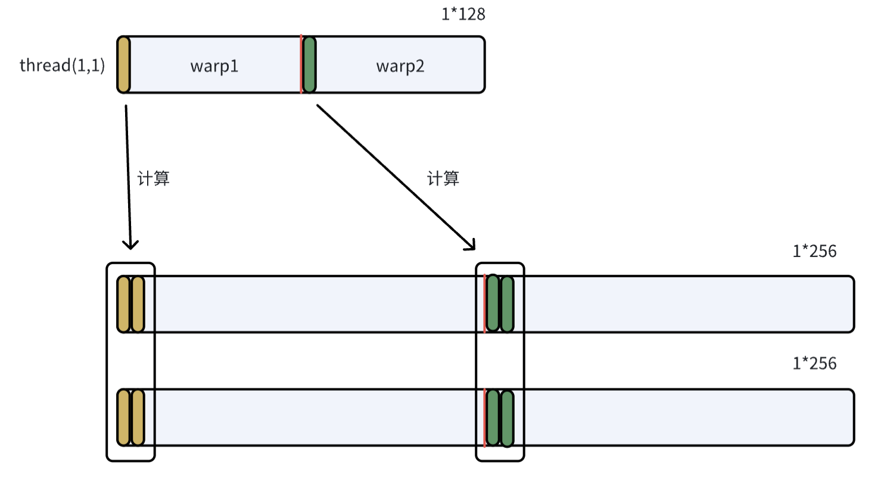
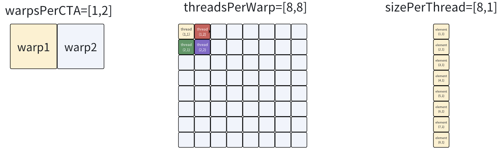
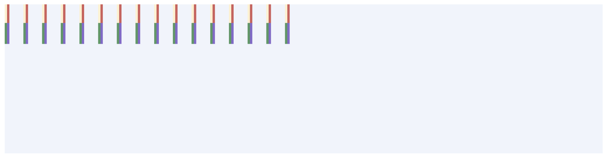
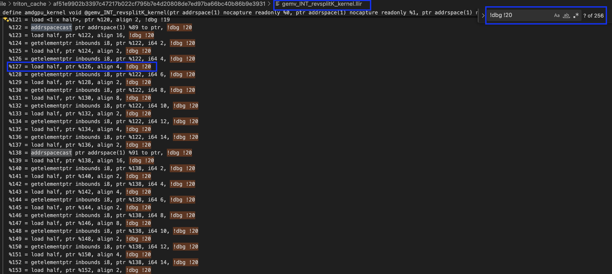
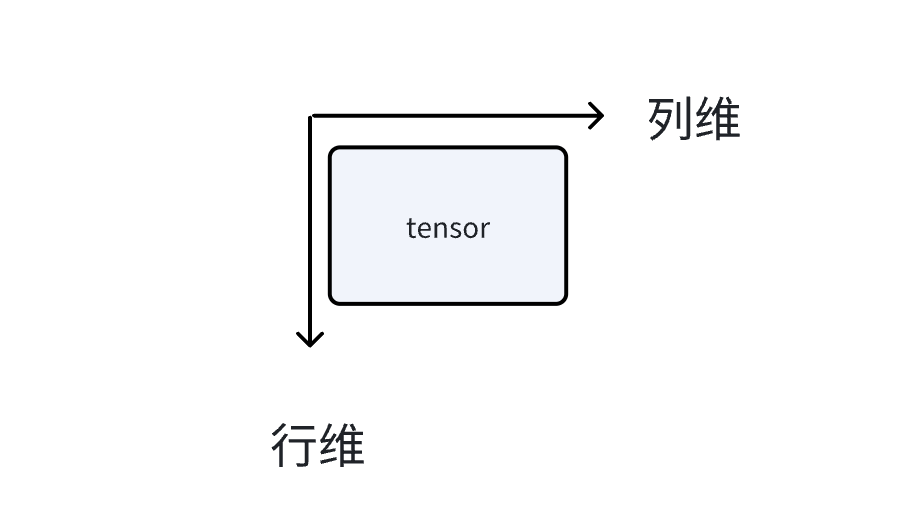

# Triton Startup

> 这篇写得特别乱

标题是Triton上手，但内容其实和Triton编程关系不大，这里先从GPU说起。

想要编写一个能够在GPU上运行的程序，需要先编写一个能在CPU上运行的程序。我想表达的意思是：

* 程序员在写程序时，这个程序是存储在CPU的内存上的，写完之后持久化到本地是放到了磁盘上；
* 这个程序包含两部分，第一部分是运行在CPU上的代码，第二部分是运行在GPU上的代码，第二部分由第一部分launch，即运行程序，先跑的是CPU的代码，然后CPU的代码会把GPU的代码launch到GPU上去执行，这个过程是异步的；

"CPU的代码会把GPU的代码launch到GPU上去执行"这句话其实说的不对，因为在CPU上执行的是编译好的二进制，这个二进制程序不会把GPU代码扔到GPU上去，因为GPU不会编译执行代码，launch指的是把编译好的GPU二进制程序扔到GPU上(以及一些启动参数)，然后GPU执行GPU的二进制，CPU继续执行CPU的二进制。

那么，对于Triton程序而言，是怎么从Triton源码一步步到GPU二进制程序的？以及知道这个过程有啥用？

## 1 Triton

Triton是个开源语言/编译器，它比CUDA写起来要容易，而且它开源，开源很重要，两者差别详细看[这里](https://github.com/6eanut/gpu_learn/blob/main/0-prepare/final.md#4-triton语言相比cuda优缺点是什么)。

用CUDA写GPU程序，每个kernel都是thread-level的；用Triton写GPU程序，每个kernel是block-level的，这对于编写程序而言很省劲，对于优化程序而言有点困难(因为单看Triton程序，不容易看出来每个thread做了什么)。

但是想这么一个事，不管是CUDA还是Triton还是巴拉巴拉，只要是写的GPU程序，那肯定都会被编译成GPU二进制，而这个GPU二进制是thread-level的，所以理论上讲，优化GPU程序，需要知道每个thread做了什么，那就去反汇编GPU二进制就好了。

## 2 Triton kernel的编译过程

用Triton写的kernel，编译完会放在~/.triton/cache下面，可以用llvm-objdump来反汇编得到汇编程序(我不确定GPU ISA程序叫不叫汇编程序)，不过这不好看。

就像写了一个CPU程序，这个CPU程序本身就是thread-level，结合着去看汇编程序，也不容易，更别提Triton写的block-level程序，去看thread-level的汇编程序，那更难看。

好在cache下面不只有GPU二进制程序，还有一些其他的，比如TTIR、TTGIR、LLIR和汇编程序(在海光上面叫AMDGCN)，这给了我们从block-level的Triton程序到thread-level的汇编程序之间，多了几个过渡阶段。

> GPU在AI领域很常用，AI领域比较火的是LLM，LLM在推理/训练时比较耗时的是GEMM/GEMV，社区里有不少开源实现，这里以[gemlite](https://github.com/6eanut/gemlite/blob/af6f07c07d60a2bc257a426ad2de311221b7fd49/gemlite/triton_kernels/gemv_revsplitK_kernels.py#L256)为例，说明下Triton kernel的编译过程，例子不重要。

### 2-1 Triton

运行Triton程序，可以在~/.triton/cache下面看到编译过程的一些中间产物，当然也有GPU二进制程序：

```shell
root@h01r4n18:~/.triton/cache# tree
.
├── 59f5f5022c214acc7a65c351366f27d49e16a7cafc7173cbd955202e635c8d0f
│   └── hip_utils.so                        # CPU端的库，hip基础工具库，不关心
├── a5132e2ae49b39161ba2431c5769840a3e679b1b2f8c42f361d5ca461ad71c7d
│   └── __triton_launcher.so                # CPU端的库，负责把kernel/参数交到GPU，不关心
└── af51e9902b3397c47217b022cf795b7e4d20808de7ed97ba66bc40b86b9e3931
    ├── gemv_INT_revsplitK_kernel.amdgcn
    ├── gemv_INT_revsplitK_kernel.hsaco
    ├── gemv_INT_revsplitK_kernel.json
    ├── gemv_INT_revsplitK_kernel.llir
    ├── gemv_INT_revsplitK_kernel.ttgir
    ├── gemv_INT_revsplitK_kernel.ttir
    └── __grp__gemv_INT_revsplitK_kernel.json

3 directories, 9 files
```

下面就从高层到低层，分别看看这些编译中间产物。

### 2-2 TTIR

TTIR是TrTion Intermediate Representation的缩写。可以看到，在这个文件里面，有Triton和TTIR的对应表。

```txt
# triton语言
pid   = tl.program_id(axis=0)                                # line293
pid_k = tl.program_id(axis=1) * 2                            # line294
offs_k = pid_k * BLOCK_SIZE_K + tl.arange(0, BLOCK_SIZE_K)   # line298

# triton ir语言
%0 = tt.get_program_id x : i32 loc(#loc2)
%1 = tt.get_program_id y : i32 loc(#loc3)
%2 = arith.muli %1, %c128_i32 : i32 loc(#loc4)
%3 = tt.make_range {end = 64 : i32, start = 0 : i32} : tensor<64xi32> loc(#loc5)
%4 = tt.splat %2 : i32 -> tensor<64xi32> loc(#loc6)
%5 = arith.addi %4, %3 : tensor<64xi32> loc(#loc6)
  
# triton语言和triton ir语言的对应关系
#loc2 = loc("/workspace/gemlite/gemlite/triton_kernels/gemv_revsplitK_kernels.py":293:26)
#loc3 = loc("/workspace/gemlite/gemlite/triton_kernels/gemv_revsplitK_kernels.py":294:26)
#loc4 = loc("/workspace/gemlite/gemlite/triton_kernels/gemv_revsplitK_kernels.py":298:21)
#loc5 = loc("/workspace/gemlite/gemlite/triton_kernels/gemv_revsplitK_kernels.py":298:49)
#loc6 = loc("/workspace/gemlite/gemlite/triton_kernels/gemv_revsplitK_kernels.py":298:36)
```

在Triton程序中有这么两条语句，因为M和BLOCK_SIZE_M都是1，所以编译器给它们优化掉了：

```txt
pid_m, pid_n = pid % M, pid // M
offs_m = pid_m * BLOCK_SIZE_M + tl.arange(0, BLOCK_SIZE_M) 
```

这个文件对了解thread做了什么没帮助，但是可以知道Triton里面哪些语句被优化掉了。

### 2-3 TTGIR

TTGIR是TriTon Gpu Intermediate Representation的缩写。这部分已经可以看到一些thread-level的信息了，比如triton.gpu_blocked属性。

```txt
# Triton GPU IR
#blocked1 = #triton_gpu.blocked<{sizePerThread = [1, 2], threadsPerWarp = [1, 64], warpsPerCTA = [1, 2], order = [1, 0]}>

%54 = tt.addptr %53, %52 : tensor<1x256x!tt.ptr<f16>, #blocked1>, tensor<1x256xi32, #blocked1> loc(#loc39)

#loc39 = loc("/workspace/gemlite/gemlite/triton_kernels/gemv_revsplitK_kernels.py":328:23)

# Triton
c_ptrs  = c_ptr + (offs_cm[:, None] * stride_cm + offs_cn[None, :] * stride_cn)    # line328
```

triton.gpu_blocked属性说明了对于给定形状的张量，这个张量应该被如何分配到每个线程上去做计算/访存操作。

* sizePerThread：每个线程处理多少个元素，这个值在[gluon](https://github.com/triton-lang/triton/blob/33e7dc2d799ae6442e8b6a7a73c64a8ecbca2124/python/tutorials/gluon/01-intro.py)中可以指定，在triton中会由编译器静态分析得到；
* threadsPerWarp：每个warp有多少个线程，这个值由硬件决定；
* warpPerCTA：每个block有多少个warp，这个值由num_warps决定；
* order：表示张量在全局内存中以哪个维度连续存储。

#### 2-3-1 计算例子

在blocked1这样的分配策略下，两个形状是1*256的张量做指针加法操作，是如何分配给不同的warp和thread的？

* sizePerThread=[1,2]表示每个thread处理两列相邻元素，order=[1,0]表示张量是按列维连续存储的；
* threadsPerWarp=[1,64], warpsPerCTA=[1,2]表示一个block内有2个warp，每个warp内有64个thread，且都是沿列方向排列；



#### 2-3-2 访存例子

```txt
# Triton程序
b = tl.load(b_ptrs, eviction_policy='evict_first')     # line311

# Triton程序与TTGIR程序的对应
#loc20 = loc("/workspace/gemlite/gemlite/triton_kernels/gemv_revsplitK_kernels.py":311:16)

# TTGIR程序
#blocked2 = #triton_gpu.blocked<{sizePerThread = [8, 1], threadsPerWarp = [8, 8], warpsPerCTA = [1, 2], order = [0, 1]}>
%30 = tt.load %27 evictionPolicy = evict_first : tensor<64x256x!tt.ptr<f16>, #blocked2> loc(#loc20)
```

如何理解sizePerThread, threadsPerWarp, warpsPerCTA



Tensor 64*256



* 一个block内有2个warp(1,2)，一个warp内有64个thread(8,8)，一个thread处理8个元素(8,1)，那么一个block能处理1024个元素(64,16)
* tensor一共有(64,256)个元素，这意味着每个warp/thread需要load 16轮，即在Triton/TTIR/TTGIR程序中是一条load指令(block-level)，但是在LLIR/AMDGCN程序中是16*8=128条load指令(thread-level)，怎么验证这个事情的正确性？需要看下一层LLIR。

### 2-4 LLIR

LLIR是LLvm Intermediate Representation的缩写。

#### 2-4-1 计算例子

可以看到thread-level的LLIR程序，每个线程只计算两个元素。

```text
# sext是符号扩展
# addrspace(1)表示全局内存，addrspace(3)表示共享内存
# getelementptr half, ptr p, i64 n 等价于 p + n * sizeof(half)
%1833 = sext i32 %1832 to i64, !dbg !40
%1834 = getelementptr half, ptr addrspace(1) %2, i64 %1833, !dbg !40
%1835 = sext i32 %1831 to i64, !dbg !40
%1836 = getelementptr half, ptr addrspace(1) %2, i64 %1835, !dbg !40
  
!40 = !DILocation(line: 328, column: 23, scope: !4)

c_ptrs  = c_ptr + (offs_cm[:, None] * stride_cm + offs_cn[None, :] * stride_cn)    # line328
```

#### 2-4-2 访存例子

```txt
# Triton程序
b = tl.load(b_ptrs, eviction_policy='evict_first')     # line311

# LLIR（thread-level），下面这行表示Tritoin程序的第311行对应着LLIR程序的第20
!20 = !DILocation(line: 311, column: 16, scope: !4)
```

下图是在LLIR程序中全局搜索 `!dbg !20`得到的结果，可以看到共有256个，其中 `getelementptr`用于计算指针偏移，`load`用于读2B的元素。



上图展示了两轮读的指令，每一轮读包含8个load，除了第一个load之外，其余每个load之前都会有一个对指针的偏移操作

第一轮读是在%89上load，第二轮读是在%91上load，下面追踪一下这两个值：

```txt
# LLIR
define amdgpu_kernel void @gemv_INT_revsplitK_kernel(... i32 %8, i32 %9) local_unnamed_addr #0 !dbg !4 {
%22 = and i32 %21, 15, !dbg !13
# %22和%23差16
%23 = or disjoint i32 %22, 16, !dbg !13

# %38和%39差16
%38 = or disjoint i32 %22, %20, !dbg !14
%39 = or disjoint i32 %23, %20, !dbg !14

# %89和%91的差值就是%56和%57的差值
# %8在参数表中定义，对应查看triton端的参数表，确定%8是K（4096）
%56 = mul i32 %38, %8, !dbg !16
%57 = mul i32 %39, %8, !dbg !16

%72 = add i32 %56, %19, !dbg !17
%73 = add i32 %57, %19, !dbg !17

%88 = sext i32 %72 to i64, !dbg !18
%89 = getelementptr half, ptr addrspace(1) %1, i64 %88, !dbg !18
%90 = sext i32 %73 to i64, !dbg !18
%91 = getelementptr half, ptr addrspace(1) %1, i64 %90, !dbg !18
```

所以可以算出来%89和%91差了4096*16/2=(4096，8)个元素，这与前面的图是对应的，即一个thread会跨(4096,8)个元素做多轮load。

张量在逻辑上是二维的，但其在global memory中是沿行维/列维连续是不一定的，因为这个逻辑上二维的张量只是一个视图，而通过转置就可以改变这个视图，但转置并不会改变其在global memory中的布局，order的作用就是告诉编译器，这个张量是沿哪个维度连续的，order[0,1]表示沿行维连续。



### 2-5 AMDGCN

能读的最low-level的语言：

* 向量指令v_*，标量指令s_*；
* 全局内存访问buffer_*/global_*，共享内存访问ds_*；

十分难看。

### 2-6 HSACO

用于跑在GPU上的二进制，可以用llvm-objdump反汇编得到amdgcn语言程序，gpu架构可以在.triton/cache的json文件里看：

```shell
llvm-objdump -d --triple=amdgcn-amd-amdhsa --mcpu=gfx906 gemv_INT_revsplitK_kernel.hsaco
```

## 3 其他

### 3-1 eviction_policy

eviction_policy是程序员在编写代码时给编译器的一个提示，它告诉编译器：当我把一个张量load进共享内存/寄存器后，应该以什么样的策略来管理这个张量，即当共享内存/寄存器空间不足时，需要为新数据腾出空间时，应该优先丢掉哪些旧数据。

对于gemv，v是复用性高的数据，所以在load时会给编译器提示 `evict_last`，即程序员希望这个张量尽可能长时间地保留在共享内存/寄存器中；对于一次性/低复用性数据，可以用 `evict_first`。

### 3-2 or disjoint

`or disjoint x, y<span class="Apple-converted-space"> </span>`<->** **`z = x + y`

按位或且保证两操作数按位与是0

### 3-3 transpose/contiguous

Triton中，一个张量的形状确定后，其在global memory中的布局就确定了，即按列维连续存储。

如果做了transpose之后，其在global memory中的存储布局不变，但是视图变了，即逻辑上列维连续但实际上在global memory里面是不连续的。

如果做了contiguous之后，triton会分配一块新的内存，并按新的视图在global memory中布局数据。

### 3-4 load指令在编译阶段的变化

Triton中一个对元素类型是fp16的形状为64*256的张量的load(block-level)指令在编译到LLIR时，会变成128个2Byte的load(thread-level)指令

单看llir程序，会有一个问题，即load指令太多且每次只load 2Byte(每八个连续的load其所访问的地址是连续的)，硬件在执行时真是这么做的吗？需要看AMDGCN程序，发现不是的

```Plain
# triton，一个load处理64*256
b = tl.load(b_ptrs, eviction_policy=b_evict) 

# llir，128个load，每个load处理2Byte
%122 = addrspacecast ptr addrspace(1) %89 to ptr, !dbg !20
%123 = load half, ptr %122, align 16, !dbg !20
%124 = getelementptr inbounds i8, ptr %122, i64 2, !dbg !20
%125 = load half, ptr %124, align 2, !dbg !20
%126 = getelementptr inbounds i8, ptr %122, i64 4, !dbg !20
%127 = load half, ptr %126, align 4, !dbg !20
%128 = getelementptr inbounds i8, ptr %122, i64 6, !dbg !20
%129 = load half, ptr %128, align 2, !dbg !20
%130 = getelementptr inbounds i8, ptr %122, i64 8, !dbg !20
%131 = load half, ptr %130, align 8, !dbg !20
%132 = getelementptr inbounds i8, ptr %122, i64 10, !dbg !20
%133 = load half, ptr %132, align 2, !dbg !20
%134 = getelementptr inbounds i8, ptr %122, i64 12, !dbg !20
%135 = load half, ptr %134, align 4, !dbg !20
%136 = getelementptr inbounds i8, ptr %122, i64 14, !dbg !20
%137 = load half, ptr %136, align 2, !dbg !20
...(共128个)

# amdgcn，16个load，每个load处理16Byte
global_load_dwordx4 v[65:68], v[94:95], off
...(共16个)
```

从llir到amdgcn所做的这种优化，不仅减少了访存请求次数还减少了地址计算的次数

在理解这个事情的时候，要和合并访存(memory coalescing)区分开，合并访存指的是：

* 同一个warp内的线程对全局内存进行访问时，不同的线程所访问的地址连续且对齐，硬件会把多次分散的小访问合并成少数几次大的访问(内存事物transaction)，这样是为了最大化带宽利用率
* 这是硬件做的事情

而在编译阶段，是软件(编译器)做的事情，即编译器看到LLIR中的线程级指令存在多个连续的对低位宽的load/store，则其会把这些load给优化成高位宽的load/store(就像上面的LLIR的8个load指令变成AMDGCN的1个global_load_dwordx4指令)

### 3-5 sizePerThread由啥来决定

在看llgir代码时，重点关注了triton_gpu.blocked，其决定了对于给定形状的张量，张量中的元素怎么被分配到thread上去计算/读写

blocked有四个参数，sizePerThread表示每个线程处理多少个元素，threadsPerWarp表示每个warp有多少个thread(由硬件决定)，warpsPerCTA表示每个block有多少个warp(由num_warps来决定)，order表示张量在全局内存中是沿哪个维度连续存储的

```Plain
triton_gpu.blocked<{sizePerThread = [8, 1], threadsPerWarp = [8, 8], warpsPerCTA = [1, 2], order = [0, 1]}>
```

上面这个例子指的是一个block有2个warp，一个warp有64个thread，一个thread处理8个元素，即一个block可以处理1024个元素

有一个问题是8和1024哪个是因变量哪个是自变量，现在回答，8是自变量，1024是因变量

在Triton编程中，每个线程处理多少元素其实是可以指定的（在软件层面），即[gluon](https://github.com/triton-lang/triton/blob/33e7dc2d799ae6442e8b6a7a73c64a8ecbca2124/python/tutorials/gluon/01-intro.py)，但是对于@triton.jit的kernel，这个值由编译器静态分析得到：

* 寄存器压力：一个线程处理多少个元素直接和寄存器数量相关，如果sizePerThread太大，会寄存器溢出，导致部分数据被迫放到shared memory；
* 计算/访存比：如果是计算瓶颈，那么sizePerThread应该大一点，因为这意味着更多的数据可以留在寄存器中进行计算；如果是访存瓶颈，那么sizePerThread应该小一些，因为小一些意味着有更多的线程数/每个线程执行更多轮，即可以更好地隐藏内存访问延迟。

blocked的sizePerThread是相对低层的属性，在一般的triton编程中是无法指定的，会由编译器来决定，但是triton提供了gluon模块，以支持程序员自定义sizePerThread的大小，Gluon相比于Triton，给了程序员更多的控制权限，以适配特定的硬件，下面是一个例子：

主要看第13到23行，这是在创建一个16*16的张量，每个元素的值都是一个true，类型是1bit的int，除此之外，其还指定了blocked(gl.BlockedLayout)，即原本是编译器决定的sizePerThread，现在可以由程序员手动指定size_per_thread；不过也可以让编译器来决定，比如第25、26行用的gl.AutoLayout

```Python

#!/usr/bin/env python3

import torch
import triton.experimental.gluon as gluon
import triton.experimental.gluon.language as gl

@gluon.jit
def test():
        BLOCK: gl.constexpr = 16
        SIZE: gl.constexpr = 10

        mask = gl.full(
            (BLOCK, BLOCK),         # 形状：16×16
            True,                   # 填充值：全部为True
            gl.int1,                # 数据类型：1位整数（布尔）
            gl.BlockedLayout(       # 关键：显式指定内存布局
                size_per_thread=[1, 1],     # 每个线程处理1×1个元素
                threads_per_warp=[1, 32],   # 每个warp有1×32=32个线程
                warps_per_cta=[1, 4],       # 每个CTA有1×4=4个warps
                order=[1, 0],               # 列优先存储
            ),
        )

        a = gl.arange(0, BLOCK, gl.AutoLayout()) < SIZE
        b = gl.arange(0, BLOCK, gl.AutoLayout()) < SIZE

        mask &= a.expand_dims(0).broadcast_to(mask.shape) & b.expand_dims(1).broadcast_to(
                mask.shape
        )
        print("", mask)

if __name__ == "__main__":
        test[(1,)]()
```
