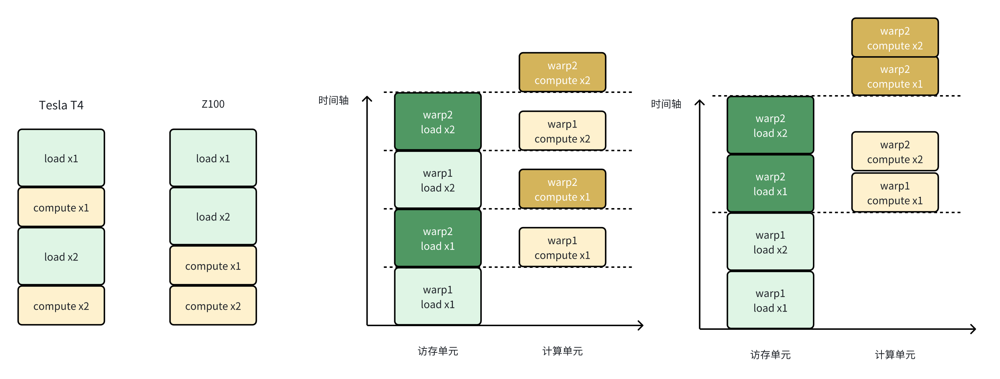

# Triton Startup v2

> 这一篇记录了研究gemlite这个开源的gemv库为什么在某AI加速卡上性能不好

## 1 gemlite是怎么做gemv的

> gemlite是怎么做gemv的，以1·4096@4096·7168的输入规模，256·64的分块策略来从block-level说明其实现逻辑

### 1-1 参数说明

* 输入向量 x：shape = (M, K) = (1, 4096)
* 权重 W_q：shape = (K, N) = (4096, 7168)
* 分块策略：`BLOCK_SIZE_M = 1`, `BLOCK_SIZE_N = 256`**,** `BLOCK_SIZE_K = 64`
* Triton kernel 的 grid 定义：
  * grid.x = cdiv(M, BM) * cdiv(N, BN) = 1 * cdiv(7168,256) = 28
  * grid.y = cdiv(K, BK * 2) = cdiv(4096, 128) = 32
  * 所以总的 grid = (28, 32)

解释：grid.x=28 表示把 N 的 7168 列切成 28 个 256 列的 tile（每个 tile 算出 1×256 的输出子向量）。grid.y=32 表示把 K 的 4096 长度按 128（=BK*2）分成 32 段；注意 kernel 内用了 `pid_k = program_id(axis=1) * 2`，因此每个 `pid_k` 实际处理两个连续的 BK 段。

### 1-2 概述

每个 block 负责计算输出向量 C 上的一个 `BLOCK_SIZE_M × BLOCK_SIZE_N` 的子块(每个 block 计算结果向量中的256个元素的三十二分之一的结果)。

### 1-3 Block-level 执行流程

看一个具体的 block：`pid = p`（axis0）对应 `pid_m=0, pid_n = p`，`pid_k_index = q`（axis1），kernel 内 `pid_k = q * 2`。说明这个 block 在 K 方向会处理两段连续的 K-block（`pid_k` 和 `pid_k+1`），每段长度是 `BLOCK_SIZE_K`。

1. 计算 tile 的 index 与偏移

* `pid_m = pid % M`，对 M=1 总是 0。`pid_n = pid // M` 标识第几个 N-tile（0..27）。
* offs_m = pid_m * BM + arange(0,BM) → 只含一个元素，对应 x 的那一行。
* offs_n = pid_n * BN + arange(0,BN) → 256 个 column indices（该 block 要写的 C 列）。
* `pid_k = pid_k_from_axis1 * 2`：每个 program_id(axis=1) 被倍增，这是因为 kernel 在单次发射中做两次 K-block 的 load/compute。

2. 计算 A、B 的地址 (a_ptrs, b_ptrs)

* `a_ptrs = a_ptr + offs_am[:, None] * stride_am + offs_k[None, :] * stride_ak`
  * 对于 BM=1，a_ptrs shape = (1, BK)。表示为该输出行在当前 K-block 上的 BK 个连续元素地址（x 的一段）。
* `b_ptrs = b_ptr + (offs_k[:, None] * stride_bk + offs_bn[None, :] * stride_bn)`
  * b_ptrs shape = (BK, BN)。

3. 第一次 load + compute

* `a = tl.load(a_ptrs, eviction_policy=a_evict).reshape((BLOCK_SIZE_K, 1))`
* `b = tl.load(b_ptrs, eviction_policy=b_evict)` → b 的 shape = (BK, BN)
* `product = a.to(float32) * b.to(float32)` → 按位相乘，得到 (BK, BN)
* `acc = tl.sum(product, axis=0, keep_dims=True)` → 对 K 轴求和，得到 (1, BN) 的部分和

4. 指针滑动并第二次 load + compute

* `a_ptrs += BLOCK_SIZE_K * stride_ak`：将 a 指针跳到下一个 K-block
* `b_ptrs += BLOCK_SIZE_K * stride_bk`：b 指针同样跳到下一个块
* 再次 load a, b、做乘、累加到 `acc`（`acc += ...`）
* 也就是说单次 kernel 发射处理了两个 BK 段（共 `2*BLOCK_SIZE_K = 128` 长度的 K）并将它们相加到 acc 中。

5. 写回（累加到 C）

* 计算出 `c_ptrs`（基于 offs_cm, offs_cn 与 stride_cm, stride_cn）
* `tl.atomic_add(c_ptrs, acc_fp32, sem=atomic_mode)`： 对 C 的对应 `1×256` 位置做原子加

为什么需要 atomic？

* 因为不同的 `pid_k` 会计算同一组 `offs_cm, offs_cn` 的部分和（每个 pid_k 只负责 K 的一段）。所有这些部分和需要被累加到同一个 C 元素上。由于 kernel 是并行发射的，多个线程/blocks 并发写同一地址时必须用原子操作保证正确性。

## 2 gemlite在z100上的效果如何

> 在z100上执行gemlite，计算得到一个带宽利用率，较低

在Z100上利用gemlite来做一个1·4096@4096·7168的gemv，其kernel的执行时间通过 `hipprof --pmc`测出是：0.000294s

做一个这个规模的gemv所需要的访存Byte有：(1·4096+4096·7168+1·7168)*2=58742784B

所以可以计算出实际的访存带宽：58742784/1024/1024/1024/0.000294=186GB/s

这个实际访存带宽是理论值（600GB/s）的百分之三十，效率极低。

## 3 为什么效果不好

> 想搞清楚原因，仅停留在理解block-level的执行逻辑是不够的，需要理解thread-level的执行逻辑；借助编译kernel产生的中间产物(llir)来了解thread-level的执行过程；发现计算和访存overlap做的不好；做的好的样子是什么样的，以nvidia的机器为例，说明overlap做得好是什么样的。

### 3-1 了解thread-level的执行逻辑

用triton编写的kernel是block-level的，想要搞明白为什么这个kernel效率不行，需要了解其thread-level的执行逻辑。

在用 `python xxx.py`来执行含有triton kernel的程序时，可以在 `～/.triton/cache`下面看到编译triton kernel的中间产物：

```Plain
root@h01r4n18:~/.triton/cache# tree
.
├── 59f5f5022c214acc7a65c351366f27d49e16a7cafc7173cbd955202e635c8d0f
│   └── hip_utils.so                        # CPU端的库，hip基础工具库，不关心
├── a5132e2ae49b39161ba2431c5769840a3e679b1b2f8c42f361d5ca461ad71c7d
│   └── __triton_launcher.so                # CPU端的库，负责把kernel/参数交到GPU，不关心
└── af51e9902b3397c47217b022cf795b7e4d20808de7ed97ba66bc40b86b9e3931
    ├── gemv_INT_revsplitK_kernel.amdgcn
    ├── gemv_INT_revsplitK_kernel.hsaco
    ├── gemv_INT_revsplitK_kernel.json
    ├── gemv_INT_revsplitK_kernel.llir
    ├── gemv_INT_revsplitK_kernel.ttgir
    ├── gemv_INT_revsplitK_kernel.ttir
    └── __grp__gemv_INT_revsplitK_kernel.json

3 directories, 9 files
```

可以看到有五种文件类型，其中hsaco是gpu的二进制文件，ttir和ttgir是block-level的程序(由triton编译器编译得到)，llir和amdgcn是thread-level的程序(llir由triton编译器生成，amdgcn由llvm后端生成)，所以看这两个文件能知道这个kernel在thread-level的执行逻辑。

下面以llir程序为例，看看其thread-level的执行逻辑：

```YAML
# load x1
%75=loadhalf,ptr%74,align16,!dbg!20
%76=getelementptrinboundsi8,ptr%74,i642,!dbg!20
...
# load x2
%246=addrspacecastptraddrspace(1)%236toptr,!dbg!25
%247=loadhalf,ptr%246,align16,!dbg!25
...
# compute x1, compute x2
%430=fmul<2xfloat>%408,%384,!dbg!21
%444=fadd<2xfloat>%443,%437,!dbg!29
...
```

前面在分析gemlite的block-level执行逻辑时说到：每个block会进行两轮load+compute，即load x1, compute x1, load x2, compute x2。

上面llir的thread-level执行逻辑是load x1, load x2, compute x1, compute x2。

### 3-2 overlap做的不好

了解了thread-level的执行逻辑后，可以发现其计算和访存的overlap做的并不好，如下图：



对于load+load+compute+compute这样的执行逻辑，其warp间的overlap是不如load+compute+load+compute的，上面的图片是一个示例。

同样的kernel，在同样的config下(除num_warps不同之外)，其在tesla t4上的表现会更好，下面看一下其llir程序：

```Shell
# load x1
  %72 = tail call { i32, i32, i32, i32 } asm sideeffect "mov.u32 $0, 0x0;\0A\09mov.u32 $1, 0x0;\0A\09mov.u32 $2, 0x0;\0A\09mov.u32 $3, 0x0;\0A\09ld.global.L1::evict_last.v4.b32 { $0, $1, $2, $3 }, [ $4 + 0 ];", "=r,=r,=r,=r,l"(ptr addrspace(1) %39) #3, !dbg !21
  %89 = tail call { i32, i32, i32, i32 } asm sideeffect "mov.u32 $0, 0x0;\0A\09mov.u32 $1, 0x0;\0A\09mov.u32 $2, 0x0;\0A\09mov.u32 $3, 0x0;\0A\09ld.global.L1::evict_first.v4.b32 { $0, $1, $2, $3 }, [ $4 + 0 ];", "=r,=r,=r,=r,l"(ptr addrspace(1) %57) #3, !dbg !22
...
# compute x1
  %297 = fmul float %225, %233, !dbg !25
  %361 = fadd float %297, %298, !dbg !26
...
# load x2
  %522 = tail call { i32, i32, i32, i32 } asm sideeffect "mov.u32 $0, 0x0;\0A\09mov.u32 $1, 0x0;\0A\09mov.u32 $2, 0x0;\0A\09mov.u32 $3, 0x0;\0A\09ld.global.L1::evict_last.v4.b32 { $0, $1, $2, $3 }, [ $4 + 0 ];", "=r,=r,=r,=r,l"(ptr addrspace(1) %513) #3, !dbg !34
  %556 = tail call { i32, i32, i32, i32 } asm sideeffect "mov.u32 $0, 0x0;\0A\09mov.u32 $1, 0x0;\0A\09mov.u32 $2, 0x0;\0A\09mov.u32 $3, 0x0;\0A\09ld.global.L1::evict_first.v4.b32 { $0, $1, $2, $3 }, [ $4 + 0 ];", "=r,=r,=r,=r,l"(ptr addrspace(1) %515) #3, !dbg !35
...
# compute x2
  %747 = fmul float %675, %683, !dbg !38
  %811 = fadd float %747, %748, !dbg !39
...
```

可以看到其这样的执行逻辑可以更好的做到warp间的计算和访存overlap。

## 4 为什么会这样

> 为什么z100上的计算和访存overlap做的不好，问题出在哪个环节；介绍从triton到二进制的编译过程以及每个过程由谁负责(triton编译器/llvm)，从而确定是哪的问题。

从triton编写的kernel到可以在gpu上执行的二进制，其经过了这样的几个阶段：

```Plain
Python Kernel (via @triton.jit)
        │
        ▼
┌──────────────────────────┐
│ Triton Frontend          │  ← 捕获 Python AST 并生成 TTIR
│ (Python -> TTIR)         │
└──────────────────────────┘
        │
        ▼
┌──────────────────────────┐
│ TTIR Passes              │  ← Triton 自身 Pass 优化
│ (TTIR -> TTGIR)          │
└──────────────────────────┘
        │
        ▼
┌──────────────────────────┐
│ CodeGen (Triton)         │  ← 生成标准 LLVM IR (LLIR)
│ (TTGIR -> LLVM IR)       │
└──────────────────────────┘
        │
        ▼
┌──────────────────────────┐
│ LLVM Backend             │  ← 使用 amdgpu 后端
│ (LLVM IR -> AMDGCN)      │
└──────────────────────────┘
        │
        ▼
┌──────────────────────────┐
│ LLVM Linker/Assembler    │  ← 生成 hsaco (HSA Code Object)
│ (AMDGCN -> HSACO)        │
└──────────────────────────┘
```

其中从Triton->TTIR->TTGIR->LLIR是由Triton编译器来编译实现的，由LLIR->AMDGCN->HSACO是由LLVM后端来编译实现的。

从前面的分析可以看到，Z100的LLIR层代码已经出现了load+load+compute+compute的情况，而Tesla T4的LLIR层代码却可以做到load+compute+load+compute，所以可以确定是Triton编译器对Z100/AMD的支持不够好。
