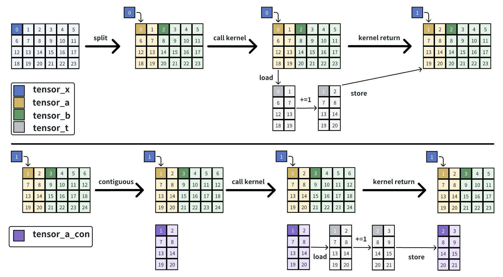
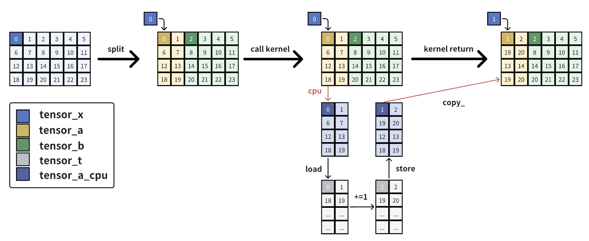

# Interpreter Mode in Triton

## 1 Triton的解释执行模式

Triton社区资料：[triton/debug/using-the-interpreter](https://triton-lang.org/main/programming-guide/chapter-3/debugging.html#using-the-interpreter)

调试Triton程序的一个比较直接和有效的方法是解释器模式。它允许程序员在CPU上运行Triton kernels，并且可以看到kernel中每个操作执行完成后的中间结果。为了使能解释器执行模式，需要设置环境变量 `TRITON_INTERPRET`为 `1`。这个设置会让Triton kernels不被编译，而是被解释器通过等价于Triton操作的numpy操作模拟执行。解释器会顺序处理每个kernel实例，同一时刻只会执行一个操作。

基本用法分为两步：1.设置环境变量，`export TRITON_INTERPRET=1`；2.在Triton kernel中插入print语句，打印想要观察的中间结果。

目前Triton的解释器模式有两个局限：1.不支持bf16，如果原kernel中有bf16，在解释模式下需要转成f32先；2.不支持间接内存访问模式，比如先 `ptr = tl.load(ptr)`后 `x = tl.load(ptr)`。

## 2 一个demo和引发的探究

### 2-1 demo

先来看一个demo，这个demo程序做的事情是：

* 在GPU上创建一个tensor_x，shape是(4,6)，stride是(6,1)；
* 通过split方法把tensor_x分为tensor_a和tensor_b，shape分别是(4,2)和(4,4)，stride分别是(6,1)和(6,1)；
* 定义了一个kernel，接收一个tensor的起始地址和其stride信息。在kernel内，通过tensor起始地址和其stride信息，把数据load到tensor_t内，而后对tensor_t内的每个元素做加一操作，最后写回tensor;
* 对tensor_a和tensor_b分别调用该kernel，执行完毕后观察tensor_x, tensor_a, tensor_b的内容变化；
* 对tensor_a和tensor_b分别执行contiguous操作得到tensor_a_con和tensor_b_con，然后观察tensor_a和tensor_b的元信息变化；
* 对tensor_a_con和tensor_b_con分别调用该kernel，执行完毕后观察tensor_x, tensor_a, tensor_b, tensor_a_con, tensor_b_con的内容变化。

```Python
import torch
import triton
import triton.language as tl

def to_cpu_preserve_stride(tensor):
    """完整保留 stride 信息的 CPU 拷贝"""
    cpu_tensor = tensor.new_empty(0, device='cpu')
    cpu_tensor.set_(
        tensor.untyped_storage().cpu(),  # 拷贝存储
        tensor.storage_offset(),         # 保留偏移
        tensor.size(),                   # 保留 shape
        tensor.stride()                  # 保留 stride（包括 0）
    )
    return cpu_tensor

@triton.jit
def add_one_kernel(
    ptr,           # 张量指针
    stride_0,      # 第0维步长
    stride_1,      # 第1维步长
    block_size_0,  # 第0维分块大小
    block_size_1,  # 第1维分块大小
    BLOCK_SIZE_0: tl.constexpr,
    BLOCK_SIZE_1: tl.constexpr,
):
    # 获取当前program的id
    pid = tl.program_id(0)
  
    # 计算偏移量
    offset_0 = pid * BLOCK_SIZE_0 + tl.arange(0, BLOCK_SIZE_0)
    offset_1 = tl.arange(0, BLOCK_SIZE_1)
  
    # 创建mask
    mask_0 = offset_0 < block_size_0
    mask_1 = offset_1 < block_size_1
  
    # 计算每个元素的地址偏移
    offsets = offset_0[:, None] * stride_0 + offset_1[None, :] * stride_1
    mask = mask_0[:, None] & mask_1[None, :]
  
    # 加载数据
    data = tl.load(ptr + offsets, mask=mask, other=0.0)
  
    # print(f"data = {data}")
    # 加1
    data = data + 1.0

    # 存储回去
    tl.store(ptr + offsets, data, mask=mask)

def print_tensor_info(name, tensor):
    """打印张量的元数据信息"""
    print(f"\n{name}:")
    print(f"  Shape: {tensor.shape}")
    print(f"  Stride: {tensor.stride()}")
    print(f"  Data pointer: {tensor.data_ptr():#x}")
    print(f"  Is contiguous: {tensor.is_contiguous()}")

def call_kernel(tensor, block_size_0, block_size_1):
    """调用kernel处理张量"""
    stride_0, stride_1 = tensor.stride()
    num_programs = (tensor.shape[0] + block_size_0 - 1) // block_size_0
  
    add_one_kernel[(num_programs,)](
        tensor,
        stride_0,
        stride_1,
        tensor.shape[0],
        tensor.shape[1],
        BLOCK_SIZE_0=block_size_0,
        BLOCK_SIZE_1=block_size_1,
    )

def main():
    # 创建原始张量
    # original = torch.zeros((4, 6), device='cuda', dtype=torch.float32)
    original = torch.arange(24, dtype=torch.float32).reshape(4, 6).cuda()
    # original = torch.arange(24, dtype=torch.float32).reshape(4, 6)
    # original_cpu = original.cpu()
    print("=" * 60)
    print("原始张量:")
    print(original)
    print_tensor_info("原始张量元数据", original)
    # print_tensor_info("原始张量元数据(CPU版)", original_cpu)
  
    # ========== 第一阶段：Split后直接使用 ==========
    print("\n" + "=" * 60)
    print("第一阶段：Split后直接使用")
    print("=" * 60)
  
    # Split成两个张量
    tensor1, tensor2 = torch.split(original, [2, 4], dim=1)
    # tensor1_cpu = tensor1.cpu()
    # tensor2_cpu = tensor2.cpu()
    # tensor1_cpu_preserve = to_cpu_preserve_stride(tensor1)
    # tensor2_cpu_preserve = to_cpu_preserve_stride(tensor2)
    print("\n--- Split后的元数据 ---")
    print_tensor_info("tensor1 (4x2)", tensor1)
    # print_tensor_info("tensor1_cpu (4x2)", tensor1_cpu)
    # print_tensor_info("tensor1_cpu_preserve (4x2)", tensor1_cpu_preserve)
    print_tensor_info("tensor2 (4x4)", tensor2)
    # print_tensor_info("tensor2_cpu (4x4)", tensor2_cpu)
    # print_tensor_info("tensor2_cpu_preserve (4x4)", tensor2_cpu_preserve)
    print_tensor_info("原始张量", original)
  
    print("\n--- Split后的内容 ---")
    print("tensor1 (4x2):")
    print(tensor1)
    # print("tensor1_cpu (4x2):")
    # print(tensor1_cpu)
    # print("tensor1_cpu_preserve (4x2):")
    # print(tensor1_cpu_preserve)
    print("\ntensor2 (4x4):")
    print(tensor2)
    # print("tensor2_cpu (4x4):")
    # print(tensor2_cpu)
    # print("tensor2_cpu_preserve (4x4):")
    # print(tensor2_cpu_preserve)
  
    # 调用kernel处理两个张量
    print("\n--- 调用kernel处理 tensor1 ---")
    call_kernel(tensor1, block_size_0=4, block_size_1=2)
  
    print("--- 调用kernel处理 tensor2 ---")
    call_kernel(tensor2, block_size_0=4, block_size_1=4)
  
    print("\n--- Kernel执行后的内容 ---")
    print("tensor1 (4x2):")
    print(tensor1)
    print("\ntensor2 (4x4):")
    print(tensor2)
    print("\n原始张量:")
    print(original)
  
    # ========== 第二阶段：Contiguous后使用 ==========
    print("\n" + "=" * 60)
    print("第二阶段：Contiguous后使用")
    print("=" * 60)
  
    # 对两个张量做contiguous
    tensor1_cont = tensor1.contiguous()
    tensor2_cont = tensor2.contiguous()
  
    print("\n--- Contiguous后的元数据 ---")
    print_tensor_info("tensor1 (4x2)", tensor1)
    print_tensor_info("tensor2 (4x4)", tensor2)
    print_tensor_info("tensor1_cont (4x2)", tensor1_cont)
    print_tensor_info("tensor2_cont (4x4)", tensor2_cont)
    print_tensor_info("原始张量", original)
  
    print("\n--- Contiguous后的内容 ---")
    print("tensor1 (4x2):")
    print(tensor1)
    print("\ntensor2 (4x4):")
    print(tensor2)
    print("tensor1_cont (4x2):")
    print(tensor1_cont)
    print("\ntensor2_cont (4x4):")
    print(tensor2_cont)
    print("\n原始张量:")
    print(original)
  
    # 再次调用kernel
    print("\n--- 调用kernel处理 tensor1_cont ---")
    call_kernel(tensor1_cont, block_size_0=4, block_size_1=2)
  
    print("--- 调用kernel处理 tensor2_cont ---")
    call_kernel(tensor2_cont, block_size_0=4, block_size_1=4)
  
    print("\n--- Kernel执行后的内容 ---")
    print("tensor1 (4x2):")
    print(tensor1)
    print("\ntensor2 (4x4):")
    print(tensor2)
    print("tensor1_cont (4x2):")
    print(tensor1_cont)
    print("\ntensor2_cont (4x4):")
    print(tensor2_cont)
    print("\n原始张量:")
    print(original)

if __name__ == "__main__":
    main()
```

### 2-2 Pytorch API

docs-pytorch : [split](https://docs.pytorch.org/docs/stable/generated/torch.split.html), [contiguous](https://docs.pytorch.org/docs/stable/generated/torch.Tensor.contiguous.html), [view](https://docs.pytorch.org/docs/stable/generated/torch.Tensor.view.html), [cpu](https://docs.pytorch.org/docs/stable/generated/torch.Tensor.cpu.html), [is_contiguous](https://docs.pytorch.org/docs/stable/generated/torch.Tensor.is_contiguous.html), [stride](https://docs.pytorch.org/docs/stable/generated/torch.Tensor.stride.html), [copy_](https://docs.pytorch.org/docs/stable/generated/torch.Tensor.copy_.html)

看这些API文档，有助于理解tensor在GPU/CPU上的硬件层面内存布局和软件层面视图。

### 2-3 GPU运行Triton kernel

```YAML
============================================================
原始张量:
tensor([[ 0.,  1.,  2.,  3.,  4.,  5.],
        [ 6.,  7.,  8.,  9., 10., 11.],
        [12., 13., 14., 15., 16., 17.],
        [18., 19., 20., 21., 22., 23.]], device='cuda:0')

原始张量元数据:
  Shape: torch.Size([4, 6])
  Stride: (6, 1)
  Data pointer: 0x751830200000
  Is contiguous: True

============================================================
第一阶段：Split后直接使用
============================================================

--- Split后的元数据 ---

tensor1 (4x2):
  Shape: torch.Size([4, 2])
  Stride: (6, 1)
  Data pointer: 0x751830200000
  Is contiguous: False

tensor2 (4x4):
  Shape: torch.Size([4, 4])
  Stride: (6, 1)
  Data pointer: 0x751830200008
  Is contiguous: False

原始张量:
  Shape: torch.Size([4, 6])
  Stride: (6, 1)
  Data pointer: 0x751830200000
  Is contiguous: True

--- Split后的内容 ---
tensor1 (4x2):
tensor([[ 0.,  1.],
        [ 6.,  7.],
        [12., 13.],
        [18., 19.]], device='cuda:0')

tensor2 (4x4):
tensor([[ 2.,  3.,  4.,  5.],
        [ 8.,  9., 10., 11.],
        [14., 15., 16., 17.],
        [20., 21., 22., 23.]], device='cuda:0')

--- 调用kernel处理 tensor1 ---
--- 调用kernel处理 tensor2 ---

--- Kernel执行后的内容 ---
tensor1 (4x2):
tensor([[ 1.,  2.],
        [ 7.,  8.],
        [13., 14.],
        [19., 20.]], device='cuda:0')

tensor2 (4x4):
tensor([[ 3.,  4.,  5.,  6.],
        [ 9., 10., 11., 12.],
        [15., 16., 17., 18.],
        [21., 22., 23., 24.]], device='cuda:0')

原始张量:
tensor([[ 1.,  2.,  3.,  4.,  5.,  6.],
        [ 7.,  8.,  9., 10., 11., 12.],
        [13., 14., 15., 16., 17., 18.],
        [19., 20., 21., 22., 23., 24.]], device='cuda:0')

============================================================
第二阶段：Contiguous后使用
============================================================

--- Contiguous后的元数据 ---

tensor1 (4x2):
  Shape: torch.Size([4, 2])
  Stride: (6, 1)
  Data pointer: 0x751830200000
  Is contiguous: False

tensor2 (4x4):
  Shape: torch.Size([4, 4])
  Stride: (6, 1)
  Data pointer: 0x751830200008
  Is contiguous: False

tensor1_cont (4x2):
  Shape: torch.Size([4, 2])
  Stride: (2, 1)
  Data pointer: 0x751830200200
  Is contiguous: True

tensor2_cont (4x4):
  Shape: torch.Size([4, 4])
  Stride: (4, 1)
  Data pointer: 0x751830200400
  Is contiguous: True

原始张量:
  Shape: torch.Size([4, 6])
  Stride: (6, 1)
  Data pointer: 0x751830200000
  Is contiguous: True

--- Contiguous后的内容 ---
tensor1 (4x2):
tensor([[ 1.,  2.],
        [ 7.,  8.],
        [13., 14.],
        [19., 20.]], device='cuda:0')

tensor2 (4x4):
tensor([[ 3.,  4.,  5.,  6.],
        [ 9., 10., 11., 12.],
        [15., 16., 17., 18.],
        [21., 22., 23., 24.]], device='cuda:0')
tensor1_cont (4x2):
tensor([[ 1.,  2.],
        [ 7.,  8.],
        [13., 14.],
        [19., 20.]], device='cuda:0')

tensor2_cont (4x4):
tensor([[ 3.,  4.,  5.,  6.],
        [ 9., 10., 11., 12.],
        [15., 16., 17., 18.],
        [21., 22., 23., 24.]], device='cuda:0')

原始张量:
tensor([[ 1.,  2.,  3.,  4.,  5.,  6.],
        [ 7.,  8.,  9., 10., 11., 12.],
        [13., 14., 15., 16., 17., 18.],
        [19., 20., 21., 22., 23., 24.]], device='cuda:0')

--- 调用kernel处理 tensor1_cont ---
--- 调用kernel处理 tensor2_cont ---

--- Kernel执行后的内容 ---
tensor1 (4x2):
tensor([[ 1.,  2.],
        [ 7.,  8.],
        [13., 14.],
        [19., 20.]], device='cuda:0')

tensor2 (4x4):
tensor([[ 3.,  4.,  5.,  6.],
        [ 9., 10., 11., 12.],
        [15., 16., 17., 18.],
        [21., 22., 23., 24.]], device='cuda:0')
tensor1_cont (4x2):
tensor([[ 2.,  3.],
        [ 8.,  9.],
        [14., 15.],
        [20., 21.]], device='cuda:0')

tensor2_cont (4x4):
tensor([[ 4.,  5.,  6.,  7.],
        [10., 11., 12., 13.],
        [16., 17., 18., 19.],
        [22., 23., 24., 25.]], device='cuda:0')

原始张量:
tensor([[ 1.,  2.,  3.,  4.,  5.,  6.],
        [ 7.,  8.,  9., 10., 11., 12.],
        [13., 14., 15., 16., 17., 18.],
        [19., 20., 21., 22., 23., 24.]], device='cuda:0')

```



* 对tensor_x做split得到tensor_a和tensor_b：在GPU上只有一块数据，tensor_x, tensor_a, tensor_b都指向这一块数据；三者shape不同、stride相同；
* 对tensor_a调用kernel：在kernel内会把tensor_a的数据load到tensor_t，然后对tensor_t做加一操作，而后store回tensor_a；
* 观察：对tensor_a调用kernel，tensor_x所指的那块数据变化了。
* 对tensor_a调用contiguous：在GPU上会把tensor_a的数据复制一份，shape不变，stride由(6,1)变为(2,1)，得到tensor_a_con；
* 对tensor_a_con调用kernel：在kernel内会把tensor_a_con的数据load到tensor_t，然后对tensor_t做加一操作，而后store回tensor_a_con；
* 观察：可以看到tensor_x所指的那块数据没有变化。

### 2-4 CPU解释执行Triton kernel



* 对tensor_x做split得到tensor_a和tensor_b：在GPU上只有一块数据，tensor_x, tensor_a, tensor_b都指向这一块数据；三者shape不同、stride相同；
* 对tensor_a调用kernel：在调用kernel之前，会把位于GPU的tensor_a通过.cpu()方法复制一份到CPU得到tensor_a_cpu，tensor_a和tensor_a_cpu的区别在于后者是contiguous的，即二者stride不同，当计算完毕后，会通过.copy_方法把位于CPU的tensor_a_cpu写回到tensor_a上。在kernel内，会按照tensor_a的stride把tensor_a_cpu给load进tensor_t，然后对tensor_t做加一操作，并按照tensor_a的stride进行store，从而写入tensor_a_cpu，当kernel执行完毕后，会把tensor_a_cpu的值写回tensor_a。copy_方法可以正确处理src和self的stride不同的情况，而copy不行。

contiguous的部分就不说了，和在GPU上执行差别不大。

### 2-5 总结

当使用Triton的Interpret模式去执行kernel时，且该kernel中的某个tensor参数是非contiguous的，那么在triton的b99a3006d8e45bc3a588aad82a513e1cc9c7c692之前都是会出现上述问题的，这是由.cpu()方法导致的，该commit对这个问题做了修复。

```Python
.cpu()

->

def to_cpu_preserve_stride(tensor):
    cpu_tensor = tensor.new_empty(0, device='cpu')
    cpu_tensor.set_(
        tensor.untyped_storage().cpu(),  # 拷贝存储
        tensor.storage_offset(),         # 保留偏移
        tensor.size(),                   # 保留 shape
        tensor.stride()                  # 保留 stride
    )
    return cpu_tensor
```
