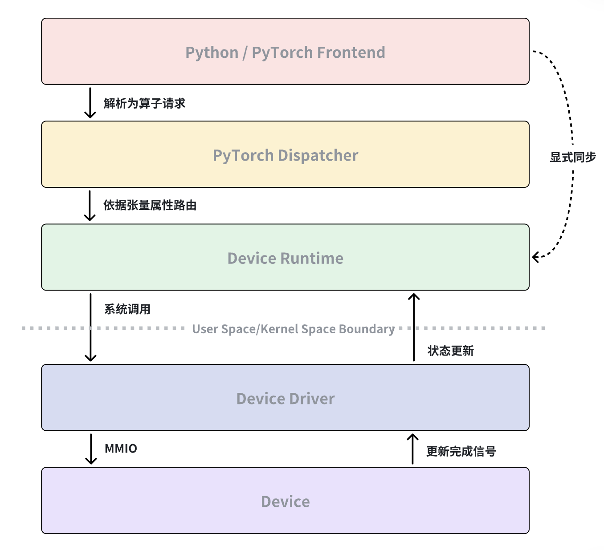

# 执行一行 PyTorch 代码会发生什么？

> 本篇博客希望能讲清楚执行一行PyTorch代码会发生什么。从PyTorch代码通过PyTorch Dispatcher路由到目标Device的Runtime，再从Device Runtime借助OS提供的Syscall来实现和OS内Device Driver的通信，最后OS中的Device Driver通过MMIO来向Device提交命令。当Device执行完具体操作后会更新完成信号，之后Device Driver/Runtime会通过中断或轮询观察该信号变化进而推进执行流，PyTorch会在需要同步时通过Device Runtime来确认计算是否完成。

当我们在 Python 中执行一行 PyTorch 代码时，计算并不是“直接发生”的。这行代码会首先被 PyTorch 框架解析和调度，经由 Dispatcher 路由到对应设备的 Runtime，再由 Runtime 通过系统调用与操作系统中的设备驱动交互。设备驱动负责向硬件提交命令，而设备在执行完成后会通过完成信号表明状态变化。最终，驱动和 Runtime 通过中断或轮询感知这一变化，并在需要同步语义时由 PyTorch 主动确认计算是否完成。

下面我们按时间顺序，逐层拆解这个过程。

## 1 PyTorch Dispatcher：决定由哪个设备来处理这次计算

当执行 `z = x + y` 这样的 PyTorch 代码时，PyTorch 本身并不会立刻进行计算。它首先将这行代码解析为一个算子（operator）请求，并交给 PyTorch Dispatcher 处理。Dispatcher[[1]](https://blog.ezyang.com/2020/09/lets-talk-about-the-pytorch-dispatcher/) 会根据张量的 device、数据类型等信息，选择合适的后端实现，例如 CUDA、ROCm，或自定义设备后端。

这一阶段的核心工作不是“执行”，而是决策与路由 **，** PyTorch 只是确定这次计算应该由哪个 Device Runtime 来完成。

## 2 Device Runtime：把算子请求转换成设备可执行的命令

被 Dispatcher 选中的 Device Runtime（如 CUDA Runtime, HIP Runtime[[2]](https://github.com/ROCm/rocm-systems/blob/develop/projects/hip/README-doc.md)[[3]](https://github.com/ROCm/rocm-systems/blob/develop/projects/rocr-runtime/README.md)）接管执行流程。在这一层，算子已经不再以“Tensor 运算”的形式存在，而是被拆解为 kernel 调用、内存访问和同步关系。Runtime 的职责是将高层的计算请求，转换成一系列设备相关但仍处于用户态的操作，例如：

* 准备 kernel 参数
* 配置执行网格和线程布局
* 组织命令队列和执行流（stream）等

此时，Runtime 并不会直接操作硬件，它仍然运行在用户态，必须借助操作系统才能与真实设备交互。

## 3 Syscall：Runtime 通过操作系统请求设备服务

由于硬件资源受操作系统统一管理，用户态的 Runtime 无法直接访问设备寄存器或物理内存。因此，Runtime 必须通过系统调用（如 `ioctl`[[4]](https://man7.org/linux/man-pages/man2/ioctl.2.html)、`mmap` 等）向内核发起请求，由操作系统代为完成设备相关操作。这些系统调用通常用于：

* 建立和管理设备队列
* 映射设备内存
* 提交执行命令或同步请求等

从这一刻起，执行流程正式跨越了用户态与内核态的边界。

## 4 Device Driver：通过 MMIO 向设备提交命令

在内核态，设备驱动[[5]](https://github.com/torvalds/linux/tree/master/drivers/gpu/drm/amd)接管了来自 Runtime 的请求。驱动的核心职责不是执行计算，而是安全、正确地管理硬件资源，并将命令提交给设备。对于 GPU 等设备而言，这通常意味着：

* 将命令写入设备的命令队列
* 通过 MMIO（Memory-Mapped I/O）向设备寄存器写入控制信息
* 触发设备开始执行等

此时，命令已经脱离了操作系统和 Runtime 的控制，真正进入了设备自身的执行流程。

## 5 Device 执行完成：更新完成信号，而不是返回结果

当设备完成具体计算操作后，它并不会“把结果返回给 PyTorch”。从硬件的角度看，完成计算只意味着三件事：

* 将计算结果写回设备内存
* 更新一个完成信号（如 fence 或 signal[[6]](http://hsafoundation.com/wp-content/uploads/2021/02/HSA-Runtime-1.2.pdf)）
* （可选）触发一个硬件中断

这个完成信号通常只是内存中的一个状态值。设备不会主动通知用户态程序，所有“完成”的语义都需要由软件层去观察和解释。

## 6 从完成信号到 Python：同步是被动发生的

设备完成计算后，内核驱动或 Runtime 会通过两种方式感知状态变化，硬件中断和主动轮询完成信号。一旦确认操作完成，Runtime 会更新内部执行状态，释放资源，并允许后续操作继续提交。然而，PyTorch 并不会在每次 kernel 完成后立即同步。只有在以下场景中，PyTorch 才会通过 Device Runtime 确认计算是否已经完成：

* 显式调用同步接口[[7]](https://docs.pytorch.org/docs/stable/generated/torch.cuda.synchronize.html)
* 将数据从设备拷回主机
* 执行依赖结果的后续操作

换句话说，结果一直存在于设备内存中，变化的只是“现在是否可以安全使用它”。

执行一行 PyTorch 代码，并不是一次简单的函数调用，而是一次跨越语言、运行时、操作系统和硬件的协作过程。

理解这一流程，有助于解释 GPU 计算的异步性、同步成本，以及为什么性能和正确性问题往往隐藏在框架之外。

## 参考资料

[1] Let's talk about the PyTorch dispatcher, [https://blog.ezyang.com/2020/09/lets-talk-about-the-pytorch-dispatcher/](https://blog.ezyang.com/2020/09/lets-talk-about-the-pytorch-dispatcher/)

[2] HIP Runtime, [https://github.com/ROCm/rocm-systems/blob/develop/projects/hip/README-doc.md](https://github.com/ROCm/rocm-systems/blob/develop/projects/hip/README-doc.md)

[3] ROCr Runtime, [https://github.com/ROCm/rocm-systems/blob/develop/projects/rocr-runtime/README.md](https://github.com/ROCm/rocm-systems/blob/develop/projects/rocr-runtime/README.md)

[4] ioctl Linux manual page, [https://man7.org/linux/man-pages/man2/ioctl.2.html](https://man7.org/linux/man-pages/man2/ioctl.2.html)

[5] ROCk, [https://github.com/torvalds/linux/tree/master/drivers/gpu/drm/amd](https://github.com/torvalds/linux/tree/master/drivers/gpu/drm/amd)

[6] HSA Runtime Programmer’s Reference Manual, [http://hsafoundation.com/wp-content/uploads/2021/02/HSA-Runtime-1.2.pdf](http://hsafoundation.com/wp-content/uploads/2021/02/HSA-Runtime-1.2.pdf)

[7] torch.cuda.synchronize, [https://docs.pytorch.org/docs/stable/generated/torch.cuda.synchronize.html](https://docs.pytorch.org/docs/stable/generated/torch.cuda.synchronize.html)
