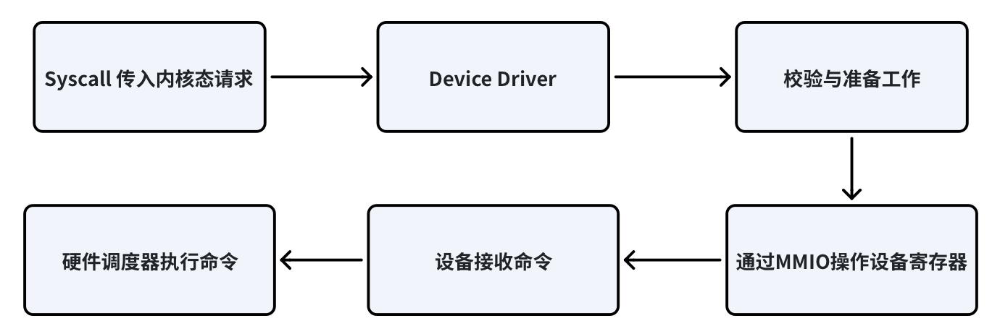
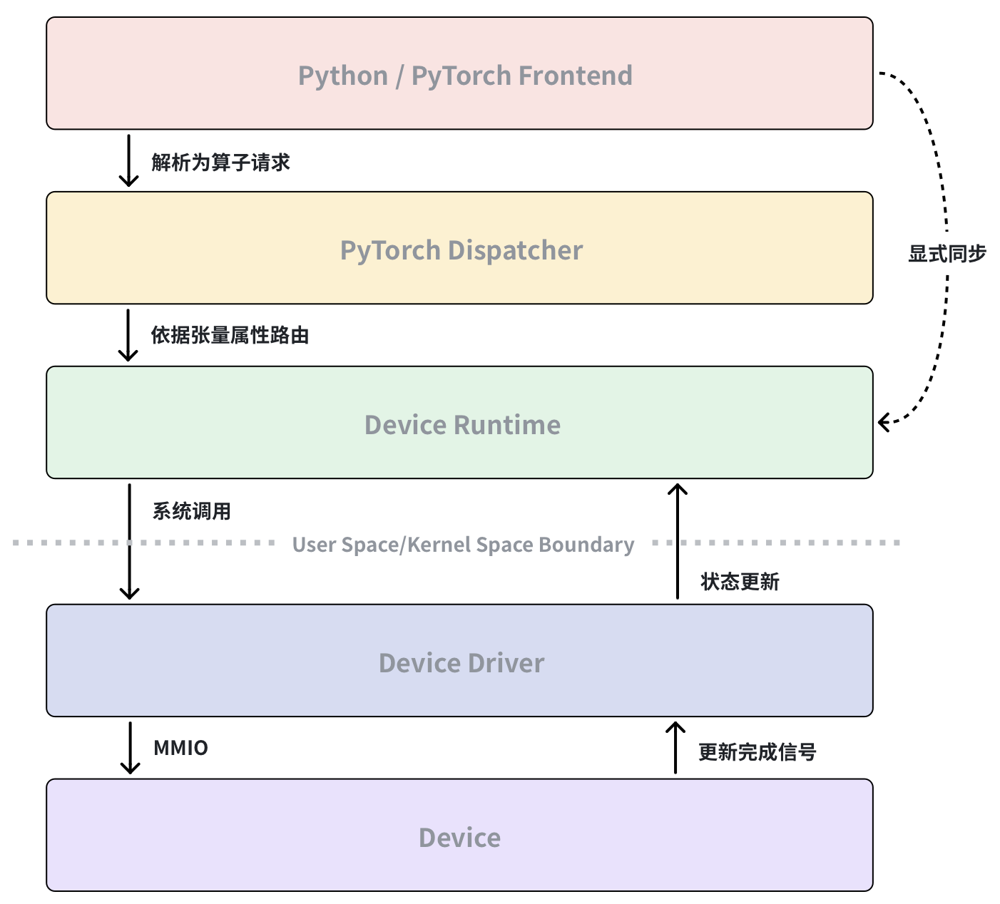

# 执行一行 PyTorch 代码会发生什么？

> 本篇博客希望能讲清楚执行一行PyTorch代码会发生什么。从PyTorch代码通过PyTorch Dispatcher路由到目标Device的Runtime，再从Device Runtime借助OS提供的Syscall来实现和OS内Device Driver的通信，最后OS中的Device Driver通过MMIO来向Device提交命令。当Device执行完具体操作后会更新完成信号，之后Device Driver/Runtime 会通过轮询该信号，或在设备触发中断时由驱动响应，来感知任务完成，从而推进执行流，PyTorch会在需要同步时通过Device Runtime来确认计算是否完成。

当我们在 Python 中执行一行 PyTorch 代码时，计算并不是“直接发生”的。这行代码会首先被 PyTorch 框架解析和调度，经由 Dispatcher 路由到对应设备的 Runtime，再由 Runtime 通过系统调用与操作系统中的设备驱动交互。设备驱动负责向硬件提交命令，而设备在执行完成后会通过完成信号表明状态变化。最终，驱动和 Runtime 通过中断或轮询感知这一变化，并在需要同步语义时由 PyTorch 主动确认计算是否完成。

下面我们按时间顺序，逐层拆解这个过程，并且会在每一步介绍完后，附带一个小问题，以及对应的解答。

## 1 PyTorch Dispatcher：决定由哪个设备来处理这次计算

当执行 `z = x + y` 这样的 PyTorch 代码时，PyTorch 本身并不会立刻进行计算。它首先将这行代码解析为一个算子（operator）请求，并交给 PyTorch Dispatcher 处理。

Dispatcher[[1]](https://blog.ezyang.com/2020/09/lets-talk-about-the-pytorch-dispatcher/) 的核心是一个为每个算子维护的“分发表”（dispatch table）。这个表类似于 C++ 的虚函数表，但更灵活。表中包含了一系列“分发键”（Dispatch Key，如 CPU、CUDA、Autograd、Tracing）及其对应的内核（kernel）函数指针。Dispatcher 的职责是根据输入张量的属性（如设备类型、是否需要梯度等）以及当前的线程局部状态（如是否正在跟踪计算图），计算出一个最高优先级的 Dispatch Key，然后通过该键在分发表中查找并跳转到对应的内核函数去执行。

Dispatcher 的决策过程可以看作一个动态的、基于优先级的筛选过程。它首先收集所有输入张量所关联的 Dispatch Key（例如，一个在 CUDA 上且需要梯度的张量会贡献 CUDA和 Autograd等键），并合并线程本地状态引入的键（如启用 Tracing时）。然后，它会根据一个预定义的优先级顺序（例如，Tracing的优先级通常高于** **`Autograd`，而 Autograd又高于 CUDA），从合并后的键集中选出优先级最高的一个，作为本次调度的目标。这种设计使得像自动求导、跟踪这样的横切关注点（cross-cutting concerns）能够透明地插入到执行流程中，而无需修改算子的核心实现代码。

这一阶段的核心工作不是“执行”，而是决策与路由，PyTorch 只是确定这次计算应该由哪个 Device Runtime 来完成。

```C++
/**
 * launch_legacy_kernel:
 * 当 Dispatcher 决定使用 CUDA 后，程序会运行到这里。
 * 它的任务是：计算 GPU 的线程布局，并将计算任务正式发射给Device Runtime。
 */
template <int nt, int vt, typename func_t>
static void launch_legacy_kernel(int64_t N, const func_t& f) {
  // 1. 安全检查：确保元素数量 N 在 32 位整数范围内（CUDA 索引限制）
  TORCH_INTERNAL_ASSERT(N >= 0 && N <= std::numeric_limits<int32_t>::max());
  if (N == 0) return;

  // 2. 设置线程块 (Thread Block) 大小
  // nt (num_threads) 通常是 128, 256 或 512
  dim3 block(nt);

  // 3. 计算网格 (Grid) 大小：即需要启动多少个 Block 才能覆盖 N 个元素
  // vt (values_per_thread) 是每个线程负责处理的元素个数，用于优化性能
  dim3 grid((N + block.x * vt - 1) / (block.x * vt));

  // 4. 获取当前的 CUDA 流 (Stream)
  // 这是为了保证计算在正确的异步队列中执行，不会阻塞其他任务
  auto stream = at::cuda::getCurrentCUDAStream();

  // 5. 调用真正的 CUDA 核函数 (Kernel Launch)
  // <<<grid, block...>>> 是 CUDA 专有语法，表示在 GPU 上启动数千个线程并行执行 f
  // 此处的 f 就是具体的算子/kernel
  elementwise_kernel<nt, vt, func_t><<<grid, block, 0, stream>>>(N, f);

  // 6. 错误检查：确保内核发射成功，没有出现显存溢出或硬件错误
  C10_CUDA_KERNEL_LAUNCH_CHECK();
}
```

> **小问题：为什么要设计 Dispatcher，没有它会怎样？**
>
> 如果没有 Dispatcher，PyTorch 的代码将变得难以维护且极度臃肿。
>
> 想象一下，如果写一个 `z = x + y`，代码里必须充斥着大量的 `if-else` 判断：`if x.is_cuda(): call_cuda_add(); elif x.is_xpu(): call_xpu_add()...`。Dispatcher 的存在实现了解耦：它通过一种分发机制（基于 Dispatch Key），根据张量的属性动态查找并调用正确的函数。这使得 PyTorch 能够支持数十种后端（CPU, CUDA, MPS, XPU 等）和复杂的特性（如 Autograd, Tracing），而用户感知的接口始终简洁如一。

## 2 Device Runtime：把算子请求转换成设备可执行的命令

被 Dispatcher 选中的 Device Runtime（如 CUDA Runtime, HIP Runtime[[2]](https://github.com/ROCm/rocm-systems/blob/develop/projects/hip/README-doc.md)[[3]](https://github.com/ROCm/rocm-systems/blob/develop/projects/rocr-runtime/README.md)）接管执行流程。在这一层，算子已经不再以“Tensor 运算”的形式存在，而是被拆解为 kernel 调用、内存访问和同步关系。Device Runtime 处于用户态和内核态之间的关键位置，它的主要工作包括：

* Kernel 准备与配置：当一个算子到达 Runtime 层时，Runtime 需要选择 kernel 和配置执行参数。比如根据输入张量形状、数据类型选择最优的 kernel 实现和设置Grid/Block等；
* 内存管理：Runtime 需要管理设备内存的分配、释放以及 Host 和 Device 之间的数据传输；
* 执行流管理：Stream 是 GPU 执行的核心抽象，它代表一个命令队列。不同流上的操作可以并发执行从而实现计算和传输重叠进而最大化硬件利用率；
* 命令打包与提交：Runtime 会将多个操作打包成命令序列以减少提交开销。

此时，Runtime 并不会直接操作硬件，它仍然运行在用户态，必须借助操作系统才能与真实设备交互。因此，Runtime 的最终产物并不是“执行结果”，而是一组对设备的请求描述：包括要启动的 kernel、涉及的设备内存地址、执行顺序以及同步约束。这些请求会通过系统调用进入内核态，由设备驱动将其转换为具体的硬件命令，并写入设备可见的命令队列中，计算才真正开始在硬件上执行。

> **小问题：** **以 ROCm 为例，Device Runtime是什么？**
>
> 在 ROCm 软件栈中，Device Runtime 主要由 HIP Runtime 和 ROCr Runtime组成：
>
> HIP Runtime：提供类似 CUDA 的编程接口，负责管理设备、内存和流（Stream）。
>
> ROCr Runtime(HSA Runtime + libhsakmt/ROCt)：它是更底层的运行时，负责与内核驱动交互。它会将算子请求打包成符合 HSA（异构系统架构）规范的 AQL 包（Architected Queuing Language packet）。可以把它理解为“翻译官”，将高级的计算意图翻译成硬件能读懂的指令包。
>
> 

## 3 Syscall：Runtime 通过操作系统请求设备服务

由于硬件资源受操作系统统一管理，用户态的 Runtime 无法直接访问设备寄存器或物理内存。这是操作系统安全模型的基本要求：只有内核态代码才能访问硬件，用户态程序必须通过系统调用请求服务。

```C++
/**
 * hsakmt_ioctl: 跨越内核边界的“传送门”
 * 当 PyTorch 或其他 Runtime 准备好计算任务后，
 * 最终会调用此类底层函数，通过操作系统的 ioctl 请求驱动程序执行任务。
 */
int hsakmt_ioctl(int fd, unsigned long request, void *arg)
{
    // 1. 模拟器支持（可选）：如果是模型仿真模式，直接走软件逻辑
    if (hsakmt_use_model)
        return model_kfd_ioctl(request, arg);

    int ret;

    // 2. 核心系统调用：ioctl (Input/Output Control)
    // 这是用户态与字符设备驱动（如 /dev/kfd）交互的标准方式。
    // request: 操作指令（如提交任务、分配内存等）
    // arg: 参数结构体指针（包含任务的详细描述）
    do {
        ret = ioctl(fd, request, arg);
        // 如果系统调用被中断（EINTR）或资源暂时不可用（EAGAIN），则进行重试
        // 确保跨越边界的请求能够“稳稳地”传达到内核
    } while (ret == -1 && (errno == EINTR || errno == EAGAIN));

    // 3. 安全与异常处理
    if (ret == -1 && errno == EBADF) {
        // 处理 Fork 异常：如果当前进程是 fork 出来的子进程，
        // 原有的文件描述符（fd）可能失效。为了硬件访问安全，内核会拦截此类请求。
        pr_err("KFD file descriptor not valid in this process\n");
        hsakmt_is_forked_child();
    }

    return ret;
}
```

Runtime 与设备驱动交互主要使用以下系统调用：

* ioctl[[4]](https://man7.org/linux/man-pages/man2/ioctl.2.html) 通用设备控制；
* mmap 内存映射，用于将设备内存映射到用户态地址空间；
* 其他系统调用，如open/close， read/write，poll/select等。

从这一刻起，执行流程正式跨越了用户态与内核态的边界。值得一提的是，系统调用是昂贵的操作，因为它涉及上下文切换(保存寄存器)、参数拷贝(将用户态数据拷贝到内核空间)等。一次系统调用的开销可能看起来不多，但是对于每秒需要提交大量 kernel 的场景，这个开销是不可接受的。

正因为系统调用代价高昂，Device Runtime 通常不会为每一个 kernel 启动或内存操作单独发起一次系统调用，而是尽可能在用户态完成批量组织与合并。例如，Runtime 会在用户态维护命令缓冲区，先将多个操作顺序写入其中，再通过一次 ioctl 将整批命令提交给驱动；或者通过 mmap 映射共享的命令队列，由内核与用户态协作消费。这样，系统调用从“每个算子一次”退化为“一批算子一次”，上下文切换的成本被摊薄，GPU 才能维持高吞吐运行。

> **小问题：什么时候必须真正触发系统调用？**
>
> 对于 kernel 提交这种高频路径，Runtime 会尽量在用户态批量组织命令，通过一次系统调用将多条任务提交给内核，从而减少上下文切换的开销；但在设备初始化、地址空间建立、内存映射，或需要内核参与的同步和异常处理场景中，每次操作都必须通过系统调用进入内核执行。这是因为这些操作涉及资源分配、权限检查或全局执行语义，必须在内核受控上下文中完成。虽然这类操作发生频率低，但语义重要，正是操作系统必须介入的地方。

## 4 Device Driver：通过 MMIO 向设备提交命令

在内核态，设备驱动[[5]](https://github.com/torvalds/linux/tree/master/drivers/gpu/drm/amd)接管了来自 Runtime 的请求。驱动的核心职责不是执行计算，而是安全、正确地管理硬件资源，并将命令提交给设备。对于 GPU 等设备而言，这通常意味着：

* 将用户态准备好的命令缓冲区（如 AQL 包）提交给设备的相应队列；
* 通过 MMIO（Memory-Mapped I/O）操作，向设备上特定的控制寄存器写入指令，比如“敲响门铃”（ringing the doorbell）来通知设备有新任务到达。

在提交命令之前，设备驱动通常还需要完成一系列校验与准备工作，例如检查用户态提供的命令缓冲区是否合法、相关内存是否已正确映射并固定（pin）在物理内存中，以及当前进程是否拥有访问该设备队列的权限。这些步骤并不直接参与计算，但它们是操作系统介入硬件执行的关键防线，防止错误或恶意的用户态代码破坏系统稳定性。完成这些检查后，驱动才会通过 MMIO 更新设备可见的状态，触发硬件调度器开始解析并执行命令。

此时，命令已经脱离了操作系统和 Runtime 的控制，真正进入了设备自身的执行流程。



> **小问题：如果想要学习 Device Driver 的代码，应该去哪看？**
>
> 对于 ROCm 用户，可以直接在 Linux 内核源码中找到 AMD 的 GPU 驱动，路径通常在** **`drivers/gpu/drm/amd/amdgpu`。
>
> 这里的代码负责处理显存管理、电源管理以及门铃机制等。当看到代码中操作某个内存地址来通知硬件“有新活干了”时，那就是在进行 MMIO 操作。学习这部分代码可以理解操作系统是如何在底层守卫硬件安全的同时，又为上层提供高性能通道的。

## 5 Device 执行完成：更新完成信号，而不是返回结果

当设备完成具体计算操作后，它并不会“把结果返回给 PyTorch”。从硬件的角度看，完成计算只意味着三件事：

* 将计算结果写回设备内存；
* 更新一个完成信号，这通常是一个在设备内存中特定地址的值，例如 HSA 架构中的 Signal[[6]](http://hsafoundation.com/wp-content/uploads/2021/02/HSA-Runtime-1.2.pdf) 或 CUDA 中的 Event；
* （可选）触发一个硬件中断，通知主机端。

这个完成信号通常只是内存中的一个状态值。设备不会主动通知用户态程序，所有“完成”的语义都需要由软件层去观察和解释。

因此，所谓“计算完成”本身只是一个被动的事实，而不是一个主动的事件。设备只负责更新内存中的状态，而不会理解“哪个 Runtime 在等待”“哪个算子可以继续执行”。主机侧的软件必须通过轮询该完成信号，或在中断触发后由驱动唤醒等待队列，才能将这一硬件层面的状态变化翻译为可被 Runtime 感知的完成事件。随后，Runtime 才会在用户态更新 Stream 的执行进度，解除相关同步原语，计算结果才能在更高层的框架中“显现出来”。

> **小问题：Device 已经计算完毕，为什么 Python 还不知道？**
>
> 因为 GPU 默认是异步执行的。
>
> 当 Python 代码执行完 `z = x + y` 时，它只是成功地把“计算任务”投递到了硬件队列中。此时 Python 的执行流已经继续往后走了，而 GPU 可能还在排队或者刚开始计算。Python 只知道“指令发出了”，并不关心硬件何时真正擦出火花。除非试图打印 `z` 的值（这会触发同步），否则 Python 和 GPU 就像两个在不同轨道上运行的火车，互不干扰。

## 6 从完成信号到 Python：同步是被动发生的

设备完成计算后，内核驱动或 Runtime 会通过两种方式感知状态变化，硬件中断和主动轮询完成信号。一旦确认操作完成，Runtime 会更新内部执行状态，释放资源，并允许后续操作继续提交。然而，PyTorch 并不会在每次 kernel 完成后立即同步。只有在以下场景中，PyTorch 才会通过 Device Runtime 确认计算是否已经完成：

* 显式调用同步接口[[7]](https://docs.pytorch.org/docs/stable/generated/torch.cuda.synchronize.html)；
* 将数据从设备拷回主机。

换句话说，结果一直存在于设备内存中，变化的只是“现在是否可以安全使用它”。

这种“默认不同步”的设计并不是为了隐藏复杂性，而是为了最大化并行性和吞吐率。如果每个 kernel 完成后都立即等待设备确认，CPU 线程将频繁阻塞，GPU 也难以形成足够深的执行队列，计算和数据传输就无法重叠。通过将同步推迟到真正需要结果的时刻，PyTorch 得以把一连串算子提交为连续的异步命令流，让硬件调度器自行决定执行时序。

> **小问题：** **PyTorch 提供的同步接口有哪些？**
>
> 常见的同步接口包括：
>
> 显式同步：`torch.cuda.synchronize()`，它会阻塞 CPU 直到该设备上所有任务完成。
>
> 
>
> 数据拷贝同步：`.cpu()<span class="Apple-converted-space"> </span>`或 `.item()`。当要把数据从显存搬回内存时，PyTorch 会自动触发同步，确保拷贝的是最终计算结果。



执行一行 PyTorch 代码，并不是一次简单的函数调用，而是一次跨越语言、运行时、操作系统和硬件的协作过程。

理解这一流程，有助于解释 GPU 计算的异步性、同步成本，以及为什么性能和正确性问题往往隐藏在框架之外。

## 参考资料

[1] Let's talk about the PyTorch dispatcher, https://blog.ezyang.com/2020/09/lets-talk-about-the-pytorch-dispatcher/

[2] HIP Runtime, https://github.com/ROCm/rocm-systems/blob/develop/projects/hip/README-doc.md

[3] ROCr Runtime, https://github.com/ROCm/rocm-systems/blob/develop/projects/rocr-runtime/README.md

[4] ioctl Linux manual page, https://man7.org/linux/man-pages/man2/ioctl.2.html

[5] ROCk, https://github.com/torvalds/linux/tree/master/drivers/gpu/drm/amd

[6] HSA Runtime Programmer’s Reference Manual, http://hsafoundation.com/wp-content/uploads/2021/02/HSA-Runtime-1.2.pdf

[7] torch.cuda.synchronize, https://docs.pytorch.org/docs/stable/generated/torch.cuda.synchronize.html
