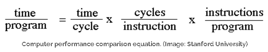

# RISC and CISC

你说你是做RISC-V的，那你给我讲讲RISC和CISC的区别吧...

首先，RISC指的是Reduced Instruction Set Computer，CISC指的是Complex Instruction Set Computer

这里的Reduced指的是指令数量少、每条指令做的事情简单以及指令格式统一

下面给一个具体的例子：同样是做两个数的乘法操作

* 在CISC里面：

只需要一条指令 `MUL ADDR1, ADDR2`即可

`MUL`指令可以直接对内存进行操作，它会把位于 `ADDR1`的数和 `ADDR2`的数做乘法而后写入 `ADDR1`中

而这件事，在RISC上就无法一条指令来完成

* 在RISC里面：

想要做两个数的乘法操作，需要:

```
LOAD A, ADDR1
LOAD B, ADDR2
MUL A, B
STORE ADDR1, A
```

RISC要求只有 `LOAD`/`STORE`指令可以访问内存，算术指令只能操作寄存器

除此之外，两者在Power和Performance方面也有差异：



人们关注的是执行一个program所需要的time越小越好，这个时间由三方面因素决定：

* A: 每个程序所包含的指令数量
* B: 每个指令所需要的平均时钟周期
* C: 每个时钟周期的时间是多少

RISC相较于CISC在B方面有优势，在A方面有劣势

ARM通过增加复杂指令来提高性能，X86通过将部分复杂指令拆分为RISC微操作来降低功耗
