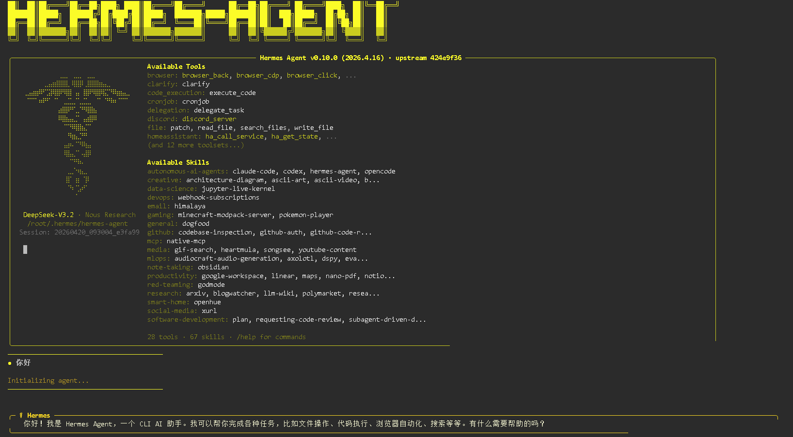

# Hermes Startup

[https://hermes-agent.nousresearch.com/](https://hermes-agent.nousresearch.com/)

```
docker pull ubuntu:26.04
docker run -it \
--privileged \
--network=host \
--ipc=host \
--cap-add=SYS_ADMIN \
--security-opt seccomp=unconfined \
ubuntu:26.04 \
/bin/bash

apt update
apt upgrade
apt install sudo curl build-essential systemd vim git -y

curl -fL https://hermes-agent.nousresearch.com/install.sh | bash
```



感觉是claude code的外观，openclaw的运行模式？

不知道是配置本身友好，还是我配置多了感觉配置起来很容易
